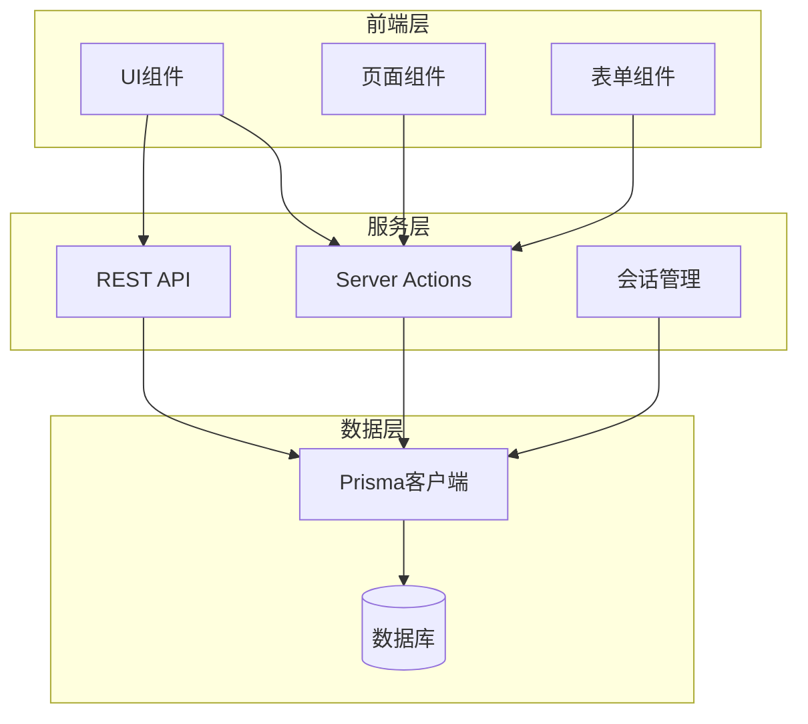
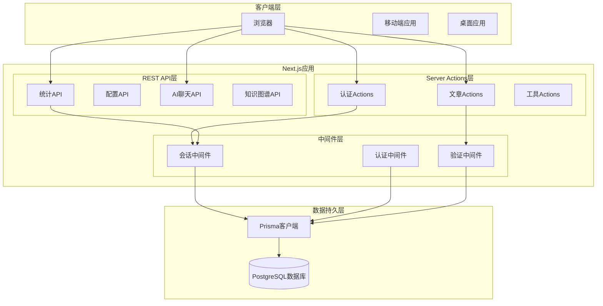
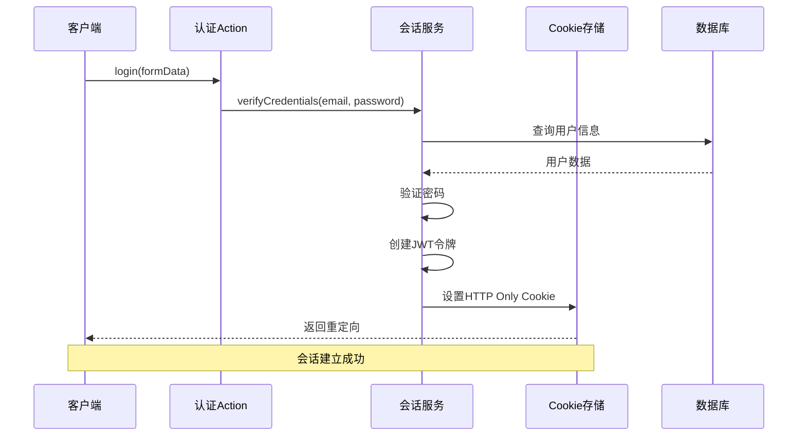
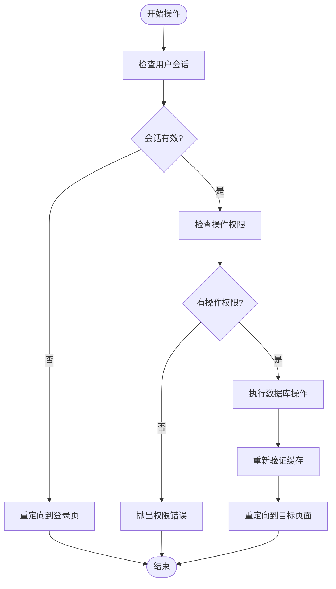
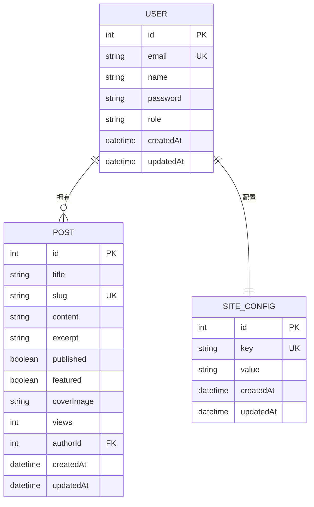
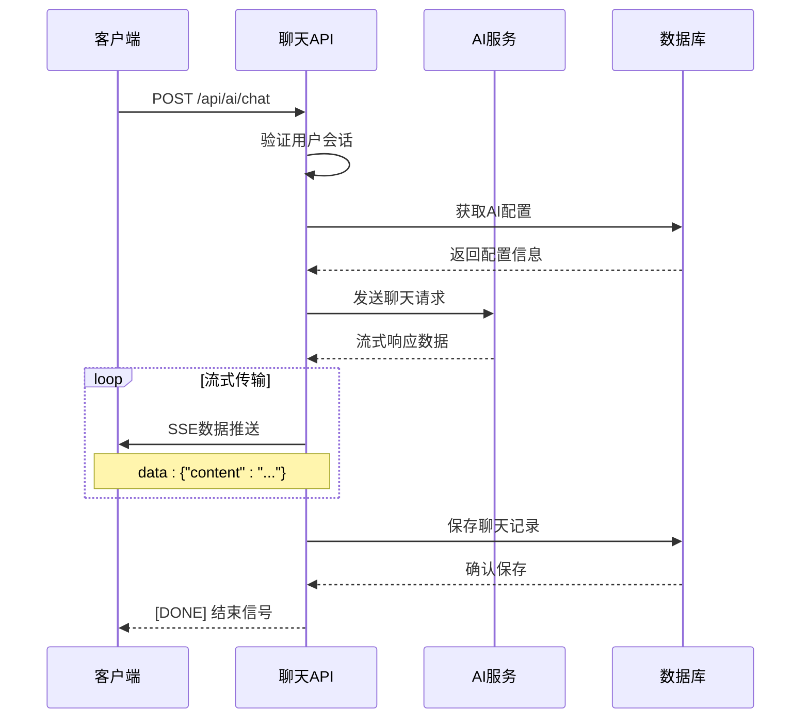
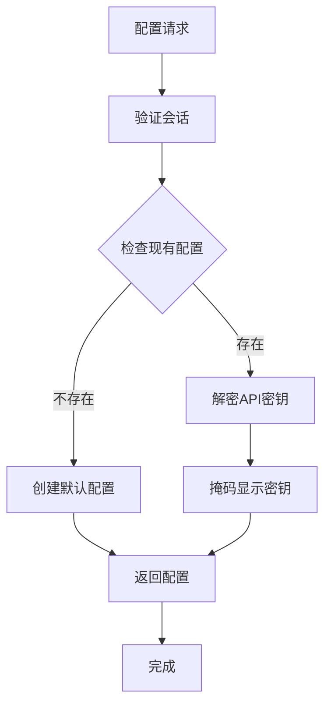
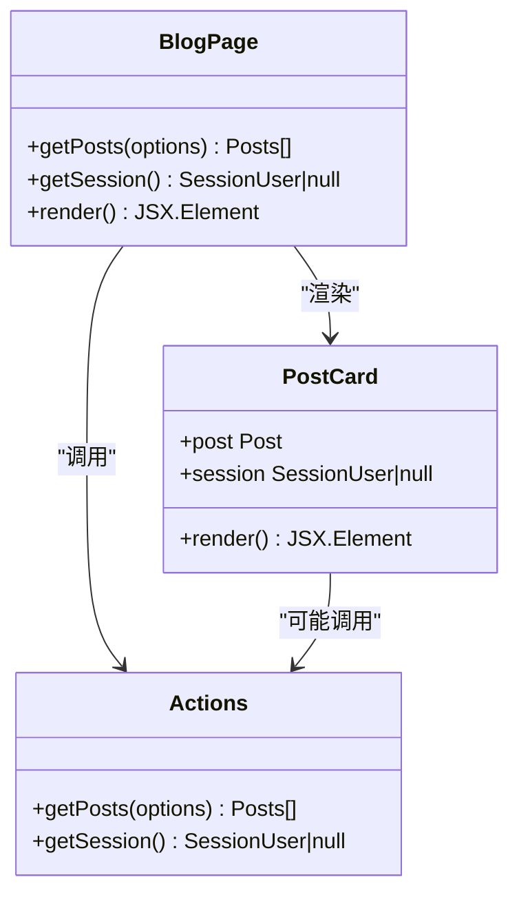
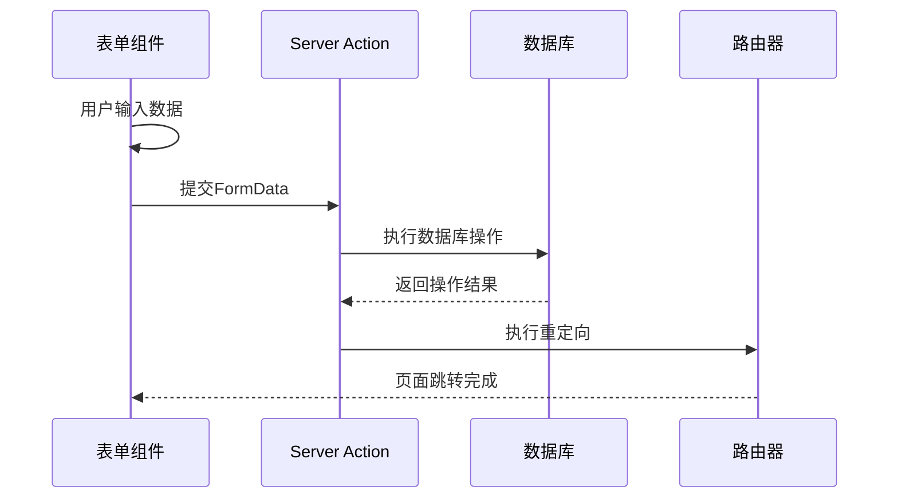
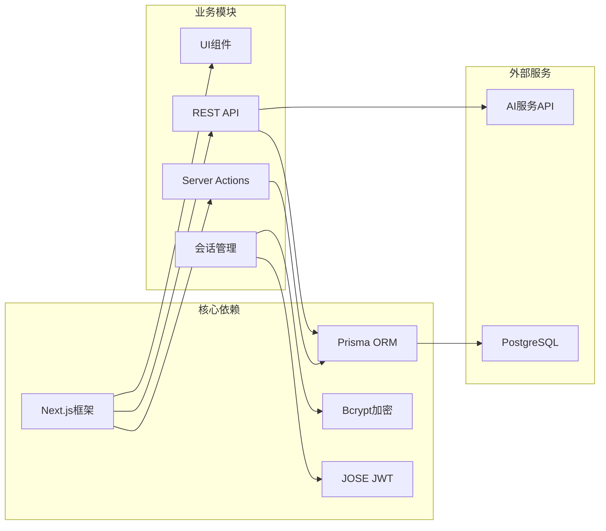

# API参考文档

<cite>
**本文档中引用的文件**
- [src/lib/actions.ts](file://src/lib/actions.ts)
- [src/lib/session.ts](file://src/lib/session.ts)
- [src/lib/prisma.ts](file://src/lib/prisma.ts)
- [prisma/schema.prisma](file://prisma/schema.prisma)
- [src/app/api/stats/route.ts](file://src/app/api/stats/route.ts)
- [src/app/api/site-config/route.ts](file://src/app/api/site-config/route.ts)
- [src/app/api/ai/chat/route.ts](file://src/app/api/ai/chat/route.ts)
- [src/app/api/ai/config/route.ts](file://src/app/api/ai/config/route.ts)
- [src/app/api/knowledge-map/route.ts](file://src/app/api/knowledge-map/route.ts)
- [src/app/blog/page.tsx](file://src/app/blog/page.tsx)
- [src/app/blog/[slug]/page.tsx](file://src/app/blog/[slug]/page.tsx)
- [src/app/blog/new/page.tsx](file://src/app/blog/new/page.tsx)
- [src/app/blog/edit/[id]/page.tsx](file://src/app/blog/edit/[id]/page.tsx)
- [src/app/login/login-form.tsx](file://src/app/login/login-form.tsx)
</cite>

## 目录
1. [简介](#简介)
2. [项目结构](#项目结构)
3. [核心组件](#核心组件)
4. [架构概览](#架构概览)
5. [详细组件分析](#详细组件分析)
6. [依赖关系分析](#依赖关系分析)
7. [性能考虑](#性能考虑)
8. [故障排除指南](#故障排除指南)
9. [结论](#结论)
10. [附录](#附录)

## 简介
本项目是一个基于Next.js的博客系统，采用Server Actions与REST API相结合的架构设计。系统提供完整的博客管理功能，包括用户认证、文章管理、统计信息、站点配置以及AI聊天功能。本文档详细记录了所有API接口的规范，包括Server Actions的函数签名和行为，以及REST API的HTTP方法、URL模式、请求/响应格式和身份验证机制。

## 项目结构
项目采用模块化组织方式，主要分为以下层次：

**图表来源**
- [src/lib/actions.ts:1-200](file://src/lib/actions.ts#L1-L200)
- [src/lib/session.ts:1-79](file://src/lib/session.ts#L1-L79)
- [src/lib/prisma.ts:1-16](file://src/lib/prisma.ts#L1-L16)

**章节来源**
- [src/lib/actions.ts:1-200](file://src/lib/actions.ts#L1-L200)
- [src/lib/session.ts:1-79](file://src/lib/session.ts#L1-L79)
- [src/lib/prisma.ts:1-16](file://src/lib/prisma.ts#L1-L16)

## 核心组件

### Server Actions组件
系统实现了完整的Server Actions接口，用于处理客户端与服务器之间的安全交互：

#### 认证相关Actions
- `login(formData: FormData)` - 用户登录
- `register(formData: FormData)` - 用户注册  
- `logout()` - 用户登出

#### 博客管理Actions
- `getPosts(options: GetPostsOptions)` - 获取文章列表
- `getPostBySlug(slug: string)` - 按Slug获取文章
- `createPost(formData: FormData)` - 创建新文章
- `updatePost(id: number, formData: FormData)` - 更新文章
- `deletePost(id: number)` - 删除文章
- `incrementViews(slug: string)` - 增加文章浏览量

#### 统计与配置Actions
- `getStats()` - 获取系统统计信息
- `getSiteConfig()` - 获取站点配置
- `searchPosts(query: string)` - 搜索文章

**章节来源**
- [src/lib/actions.ts:13-200](file://src/lib/actions.ts#L13-L200)

### REST API组件
系统提供了多个REST API端点，支持独立的客户端集成：

#### 统计信息API
- `GET /api/stats` - 获取博客统计信息

#### 站点配置API  
- `GET /api/site-config` - 获取站点配置
- `POST /api/site-config` - 更新站点配置

#### AI聊天API
- `POST /api/ai/chat` - AI聊天对话（流式响应）
- `GET /api/ai/config` - 获取AI配置
- `POST /api/ai/config` - 设置AI配置

#### 知识图谱API
- `GET /api/knowledge-map` - 获取知识图谱配置
- `POST /api/knowledge-map` - 更新知识图谱配置

**章节来源**
- [src/app/api/stats/route.ts:1-21](file://src/app/api/stats/route.ts#L1-L21)
- [src/app/api/site-config/route.ts:1-35](file://src/app/api/site-config/route.ts#L1-L35)
- [src/app/api/ai/chat/route.ts:1-134](file://src/app/api/ai/chat/route.ts#L1-L134)
- [src/app/api/ai/config/route.ts:1-66](file://src/app/api/ai/config/route.ts#L1-L66)
- [src/app/api/knowledge-map/route.ts:1-19](file://src/app/api/knowledge-map/route.ts#L1-L19)

## 架构概览

**图表来源**
- [src/lib/actions.ts:1-200](file://src/lib/actions.ts#L1-L200)
- [src/lib/session.ts:1-79](file://src/lib/session.ts#L1-L79)
- [src/app/api/stats/route.ts:1-21](file://src/app/api/stats/route.ts#L1-L21)

## 详细组件分析

### 认证系统

#### 会话管理架构
系统采用JWT令牌结合HTTP Only Cookie的安全认证机制：

**图表来源**
- [src/lib/actions.ts:13-24](file://src/lib/actions.ts#L13-L24)
- [src/lib/session.ts:36-65](file://src/lib/session.ts#L36-L65)

#### 身份验证流程
认证系统支持多种身份验证方式：

| 认证方式 | 实现方式 | 安全特性 |
|---------|----------|----------|
| JWT令牌 | HS256算法加密 | 7天有效期，自动过期 |
| HTTP Only Cookie | 服务器端存储 | 防止XSS攻击 |
| 密码哈希 | bcrypt算法 | 10轮成本因子 |
| 会话加密 | AES对称加密 | 敏感数据保护 |

**章节来源**
- [src/lib/session.ts:16-47](file://src/lib/session.ts#L16-L47)

### 博客管理系统

#### 文章操作流程
系统提供完整的CRUD操作，支持多角色权限控制：

**图表来源**
- [src/lib/actions.ts:102-143](file://src/lib/actions.ts#L102-L143)

#### 数据模型关系
博客系统采用清晰的数据模型设计：

**图表来源**
- [prisma/schema.prisma:10-41](file://prisma/schema.prisma#L10-L41)

**章节来源**
- [src/lib/actions.ts:60-150](file://src/lib/actions.ts#L60-L150)
- [prisma/schema.prisma:10-86](file://prisma/schema.prisma#L10-L86)

### AI聊天系统

#### 流式响应架构
AI聊天系统支持实时流式响应，提供良好的用户体验：

**图表来源**
- [src/app/api/ai/chat/route.ts:6-134](file://src/app/api/ai/chat/route.ts#L6-L134)

#### 配置管理流程
AI配置采用加密存储，确保敏感信息的安全性：

**图表来源**
- [src/app/api/ai/config/route.ts:6-28](file://src/app/api/ai/config/route.ts#L6-L28)

**章节来源**
- [src/app/api/ai/chat/route.ts:1-134](file://src/app/api/ai/chat/route.ts#L1-L134)
- [src/app/api/ai/config/route.ts:1-66](file://src/app/api/ai/config/route.ts#L1-L66)

### 页面组件集成

#### 博客列表页面
博客列表页面展示了Server Actions的实际应用场景：

**图表来源**
- [src/app/blog/page.tsx:7-89](file://src/app/blog/page.tsx#L7-L89)
- [src/lib/actions.ts:60-67](file://src/lib/actions.ts#L60-L67)

#### 表单组件设计
表单组件通过Server Actions实现无刷新提交：

**图表来源**
- [src/app/blog/new/page.tsx:23-89](file://src/app/blog/new/page.tsx#L23-L89)
- [src/lib/actions.ts:76-100](file://src/lib/actions.ts#L76-L100)

**章节来源**
- [src/app/blog/page.tsx:1-89](file://src/app/blog/page.tsx#L1-L89)
- [src/app/blog/[slug]/page.tsx](file://src/app/blog/[slug]/page.tsx#L1-L107)
- [src/app/blog/new/page.tsx:1-93](file://src/app/blog/new/page.tsx#L1-L93)
- [src/app/blog/edit/[id]/page.tsx](file://src/app/blog/edit/[id]/page.tsx#L1-L99)

## 依赖关系分析

**图表来源**
- [src/lib/actions.ts:1-8](file://src/lib/actions.ts#L1-L8)
- [src/lib/session.ts:1-4](file://src/lib/session.ts#L1-L4)
- [src/lib/prisma.ts:1-10](file://src/lib/prisma.ts#L1-L10)

**章节来源**
- [src/lib/actions.ts:1-8](file://src/lib/actions.ts#L1-L8)
- [src/lib/session.ts:1-79](file://src/lib/session.ts#L1-L79)
- [src/lib/prisma.ts:1-16](file://src/lib/prisma.ts#L1-L16)

## 性能考虑

### 缓存策略
系统采用了多层次的缓存机制来提升性能：

1. **Next.js缓存**: 使用`revalidatePath`实现智能缓存失效
2. **数据库索引**: 为常用查询字段建立索引
3. **CDN支持**: 图片资源通过CDN加速

### 数据库优化
- 使用`Promise.all`并发执行统计查询
- 合理的索引设计优化查询性能
- 分页查询避免大量数据传输

### 安全最佳实践
- 使用HTTP Only Cookie防止XSS攻击
- JWT令牌设置合理过期时间
- 密码使用bcrypt哈希存储
- 输入参数严格验证

## 故障排除指南

### 常见错误及解决方案

#### 认证相关错误
| 错误类型 | 症状 | 解决方案 |
|---------|------|----------|
| 会话过期 | 401未授权 | 检查Cookie设置和令牌有效性 |
| 密码错误 | 登录失败 | 验证密码哈希匹配 |
| 权限不足 | 操作被拒绝 | 检查用户角色和文章所有权 |

#### 数据库连接错误
| 错误类型 | 症状 | 解决方案 |
|---------|------|----------|
| 连接超时 | 查询失败 | 检查数据库连接字符串和网络配置 |
| 索引缺失 | 查询缓慢 | 为查询字段添加适当索引 |
| 事务冲突 | 并发写入失败 | 实现重试机制和乐观锁 |

#### API响应错误
| 错误类型 | HTTP状态 | 处理方式 |
|---------|----------|----------|
| 参数错误 | 400 Bad Request | 验证请求参数格式和必需字段 |
| 权限不足 | 403 Forbidden | 检查用户认证状态和权限级别 |
| 服务器错误 | 500 Internal Server Error | 查看服务器日志和数据库状态 |

**章节来源**
- [src/lib/session.ts:67-78](file://src/lib/session.ts#L67-L78)
- [src/lib/actions.ts:13-24](file://src/lib/actions.ts#L13-L24)

## 结论
本博客系统采用现代化的Next.js架构，结合Server Actions和REST API提供了完整的内容管理解决方案。系统具有良好的安全性、可扩展性和用户体验。通过合理的数据模型设计和缓存策略，系统能够在保证安全性的前提下提供优秀的性能表现。

## 附录

### API端点规范

#### Server Actions端点
所有Server Actions都位于`src/lib/actions.ts`文件中，采用直接导入的方式在客户端组件中使用。

#### REST API端点
| 端点 | 方法 | 功能 | 认证要求 |
|------|------|------|----------|
| `/api/stats` | GET | 获取系统统计信息 | 无需认证 |
| `/api/site-config` | GET | 获取站点配置 | 无需认证 |
| `/api/site-config` | POST | 更新站点配置 | 无需认证 |
| `/api/ai/chat` | POST | AI聊天对话 | 需要认证 |
| `/api/ai/config` | GET | 获取AI配置 | 需要认证 |
| `/api/ai/config` | POST | 设置AI配置 | 需要认证 |
| `/api/knowledge-map` | GET | 获取知识图谱配置 | 无需认证 |
| `/api/knowledge-map` | POST | 更新知识图谱配置 | 无需认证 |

### 安全配置
- **会话密钥**: 32位字符长度的随机密钥
- **Cookie安全**: HTTP Only, Secure, SameSite=Lax
- **JWT配置**: HS256算法, 7天有效期
- **密码哈希**: bcrypt, 10轮成本因子

### 监控和调试
- **开发环境**: 启用Prisma查询日志
- **生产环境**: 仅记录错误和警告
- **SSE调试**: 使用浏览器开发者工具查看事件流
- **性能监控**: Next.js内置性能指标