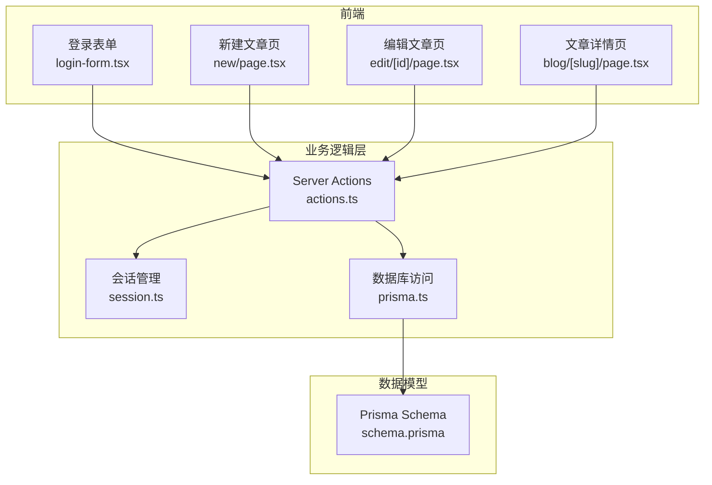
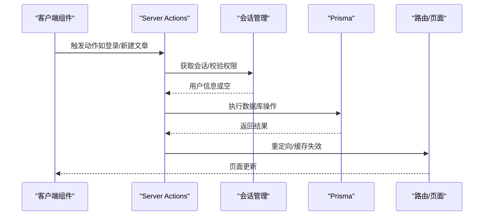
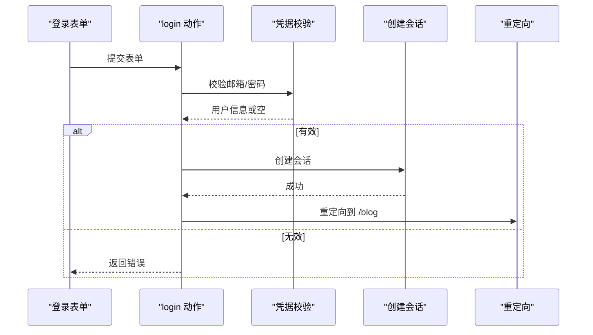
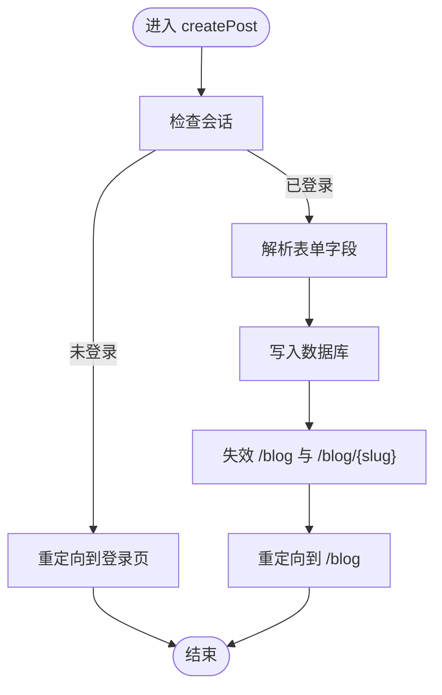
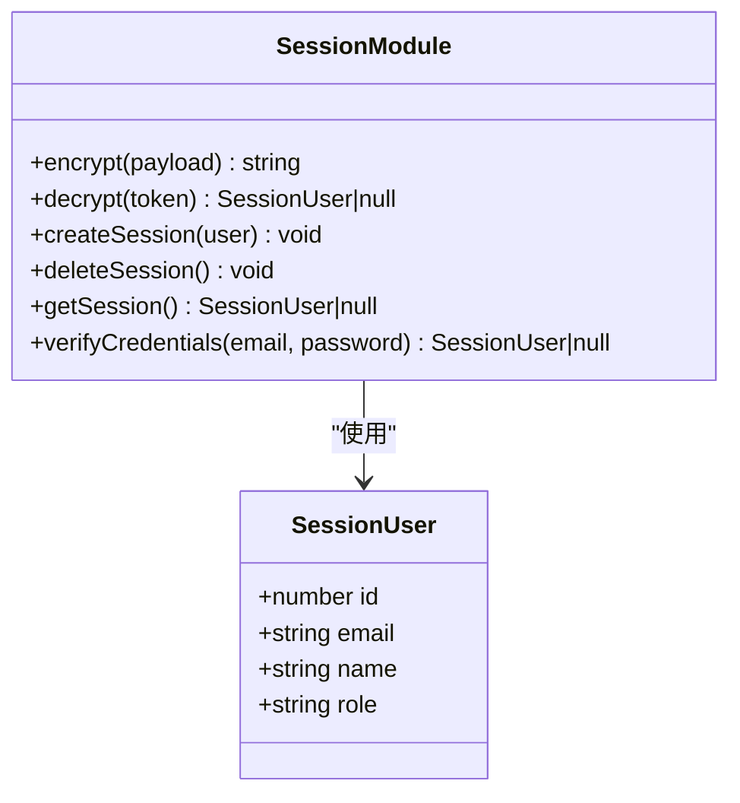
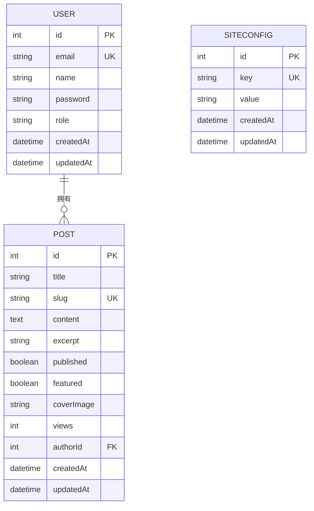
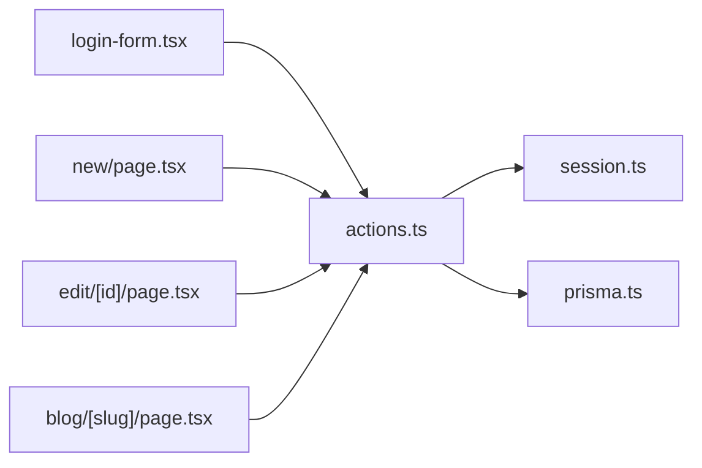

# 业务逻辑层

<cite>
**本文引用的文件**
- [actions.ts](file://src/lib/actions.ts)
- [session.ts](file://src/lib/session.ts)
- [prisma.ts](file://src/lib/prisma.ts)
- [schema.prisma](file://prisma/schema.prisma)
- [login-form.tsx](file://src/app/login/login-form.tsx)
- [new/page.tsx](file://src/app/blog/new/page.tsx)
- [edit/[id]/page.tsx](file://src/app/blog/edit/[id]/page.tsx)
- [blog/[slug]/page.tsx](file://src/app/blog/[slug]/page.tsx)
- [providers.tsx](file://src/components/providers.tsx)
- [package.json](file://package.json)
</cite>

## 目录
1. [简介](#简介)
2. [项目结构](#项目结构)
3. [核心组件](#核心组件)
4. [架构总览](#架构总览)
5. [详细组件分析](#详细组件分析)
6. [依赖分析](#依赖分析)
7. [性能考虑](#性能考虑)
8. [故障排除指南](#故障排除指南)
9. [结论](#结论)

## 简介
本文件聚焦于业务逻辑层，系统性阐述 Server Actions 的实现与使用方式，覆盖认证、文章管理、统计查询、站点配置与搜索等核心功能。文档从架构视角解析各模块职责、调用关系与数据流，并结合实际代码路径给出参数、返回值与错误处理策略，帮助初学者快速上手，同时为有经验的开发者提供足够的技术深度。

## 项目结构
业务逻辑层主要由以下部分组成：
- 会话与认证：负责用户登录、注册、登出与权限校验
- 文章管理：负责文章的增删改查、浏览量统计与权限控制
- 统计与配置：负责站点统计数据聚合与站点配置读取
- 搜索：负责基于标题与摘要的模糊检索
- 前端集成：通过客户端组件触发 Server Actions 并处理结果

图表来源
- [login-form.tsx:1-120](file://src/app/login/login-form.tsx#L1-L120)
- [new/page.tsx:1-93](file://src/app/blog/new/page.tsx#L1-L93)
- [edit/[id]/page.tsx](file://src/app/blog/edit/[id]/page.tsx#L1-L99)
- [blog/[slug]/page.tsx](file://src/app/blog/[slug]/page.tsx#L1-L107)
- [actions.ts:1-200](file://src/lib/actions.ts#L1-L200)
- [session.ts:1-79](file://src/lib/session.ts#L1-L79)
- [prisma.ts:1-16](file://src/lib/prisma.ts#L1-L16)
- [schema.prisma:1-86](file://prisma/schema.prisma#L1-L86)

章节来源
- [login-form.tsx:1-120](file://src/app/login/login-form.tsx#L1-L120)
- [new/page.tsx:1-93](file://src/app/blog/new/page.tsx#L1-L93)
- [edit/[id]/page.tsx](file://src/app/blog/edit/[id]/page.tsx#L1-L99)
- [blog/[slug]/page.tsx](file://src/app/blog/[slug]/page.tsx#L1-L107)
- [actions.ts:1-200](file://src/lib/actions.ts#L1-L200)
- [session.ts:1-79](file://src/lib/session.ts#L1-L79)
- [prisma.ts:1-16](file://src/lib/prisma.ts#L1-L16)
- [schema.prisma:1-86](file://prisma/schema.prisma#L1-L86)

## 核心组件
- 认证动作（login/register/logout）
  - 输入：FormData（邮箱、密码、昵称等）
  - 输出：重定向或错误对象
  - 关键点：凭据校验、密码哈希、会话创建/删除
- 文章动作（getPosts/getPostBySlug/createPost/updatePost/deletePost/incrementViews）
  - 输入：查询参数/表单数据/权限上下文
  - 输出：实体数据或重定向
  - 关键点：权限校验（作者或管理员）、缓存失效、视图计数
- 统计与配置（getStats/getSiteConfig）
  - 输入：无或查询条件
  - 输出：聚合数据或配置映射
- 搜索（searchPosts）
  - 输入：查询字符串
  - 输出：匹配的文章片段列表

章节来源
- [actions.ts:13-54](file://src/lib/actions.ts#L13-L54)
- [actions.ts:60-150](file://src/lib/actions.ts#L60-L150)
- [actions.ts:155-180](file://src/lib/actions.ts#L155-L180)
- [actions.ts:185-199](file://src/lib/actions.ts#L185-L199)

## 架构总览
业务逻辑层采用“服务端动作 + 数据访问 + 会话管理”的分层设计：
- 前端通过客户端组件触发 Server Actions
- Server Actions 调用会话管理进行身份校验与权限判断
- Server Actions 使用 Prisma 进行数据库操作
- 完成后进行缓存失效与页面重定向

图表来源
- [login-form.tsx:11-21](file://src/app/login/login-form.tsx#L11-L21)
- [new/page.tsx:23-23](file://src/app/blog/new/page.tsx#L23-L23)
- [actions.ts:13-24](file://src/lib/actions.ts#L13-L24)
- [actions.ts:76-100](file://src/lib/actions.ts#L76-L100)
- [session.ts:54-65](file://src/lib/session.ts#L54-L65)
- [prisma.ts:1-16](file://src/lib/prisma.ts#L1-L16)

## 详细组件分析

### 认证动作（login/register/logout）
- login
  - 参数：FormData（邮箱、密码）
  - 流程：校验凭据 -> 创建会话 -> 重定向到博客首页
  - 错误：凭据无效时返回错误对象
- register
  - 参数：FormData（昵称、邮箱、密码）
  - 流程：检查邮箱唯一 -> 哈希密码 -> 创建用户 -> 创建会话 -> 重定向
  - 错误：邮箱已存在时返回错误对象
- logout
  - 流程：删除会话 -> 重定向到首页

图表来源
- [login-form.tsx:11-21](file://src/app/login/login-form.tsx#L11-L21)
- [actions.ts:13-24](file://src/lib/actions.ts#L13-L24)
- [session.ts:67-78](file://src/lib/session.ts#L67-L78)
- [session.ts:36-47](file://src/lib/session.ts#L36-L47)

章节来源
- [login-form.tsx:1-120](file://src/app/login/login-form.tsx#L1-L120)
- [actions.ts:13-54](file://src/lib/actions.ts#L13-L54)
- [session.ts:67-78](file://src/lib/session.ts#L67-L78)
- [session.ts:36-47](file://src/lib/session.ts#L36-L47)

### 文章管理动作（CRUD + 视图计数）
- getPosts
  - 参数：可选过滤（published）、限制数量（limit）
  - 返回：文章列表（包含作者信息）
- getPostBySlug
  - 参数：slug
  - 返回：单篇文章（包含作者信息）
- createPost
  - 参数：FormData（标题、内容、摘要、是否发布、slug）
  - 权限：必须登录；自动设置作者ID
  - 行为：创建文章 -> 失效相关路径 -> 重定向
- updatePost
  - 参数：id + FormData
  - 权限：作者或管理员
  - 行为：更新文章 -> 失效相关路径 -> 重定向
- deletePost
  - 参数：id
  - 权限：作者或管理员
  - 行为：删除文章 -> 失效相关路径 -> 重定向
- incrementViews
  - 参数：slug
  - 行为：原子性增加浏览量（fire-and-forget）

图表来源
- [actions.ts:76-100](file://src/lib/actions.ts#L76-L100)
- [session.ts:54-65](file://src/lib/session.ts#L54-L65)

章节来源
- [actions.ts:60-150](file://src/lib/actions.ts#L60-L150)
- [new/page.tsx:1-93](file://src/app/blog/new/page.tsx#L1-L93)
- [edit/[id]/page.tsx](file://src/app/blog/edit/[id]/page.tsx#L1-L99)
- [blog/[slug]/page.tsx](file://src/app/blog/[slug]/page.tsx#L30-L31)

### 统计与配置
- getStats
  - 返回：已发布文章数、总浏览量、用户数
- getSiteConfig
  - 返回：站点配置键值映射

章节来源
- [actions.ts:155-180](file://src/lib/actions.ts#L155-L180)

### 搜索
- searchPosts
  - 参数：查询字符串
  - 返回：最多6条匹配文章（标题或摘要包含查询词）

章节来源
- [actions.ts:185-199](file://src/lib/actions.ts#L185-L199)

### 会话管理与权限控制
- SessionUser 接口
  - 字段：id、email、name、role
- getSession
  - 从 Cookie 中读取 JWT，解密并返回用户信息
- verifyCredentials
  - 查询用户并比对密码
- createSession/deleteSession
  - 设置/删除安全 Cookie，包含过期时间与 SameSite 等策略

图表来源
- [session.ts:9-14](file://src/lib/session.ts#L9-L14)
- [session.ts:16-34](file://src/lib/session.ts#L16-L34)
- [session.ts:36-52](file://src/lib/session.ts#L36-L52)
- [session.ts:54-78](file://src/lib/session.ts#L54-L78)

章节来源
- [session.ts:1-79](file://src/lib/session.ts#L1-L79)

### 数据模型与关系
- User：邮箱唯一、默认角色为 user
- Post：与 User 多对一关联，带索引优化查询
- SiteConfig：键值配置表

图表来源
- [schema.prisma:10-41](file://prisma/schema.prisma#L10-L41)
- [schema.prisma:79-85](file://prisma/schema.prisma#L79-L85)

章节来源
- [schema.prisma:1-86](file://prisma/schema.prisma#L1-L86)

## 依赖分析
- 外部依赖
  - bcryptjs：密码哈希与校验
  - jose：JWT 加密与校验
  - @prisma/client：数据库访问
- 内部依赖
  - actions.ts 依赖 session.ts 与 prisma.ts
  - 各页面组件通过客户端入口调用 actions.ts

图表来源
- [actions.ts:1-8](file://src/lib/actions.ts#L1-L8)
- [session.ts:1-4](file://src/lib/session.ts#L1-L4)
- [prisma.ts:1-1](file://src/lib/prisma.ts#L1-L1)
- [login-form.tsx:1-5](file://src/app/login/login-form.tsx#L1-L5)
- [new/page.tsx:1-3](file://src/app/blog/new/page.tsx#L1-L3)
- [edit/[id]/page.tsx](file://src/app/blog/edit/[id]/page.tsx#L1-L6)
- [blog/[slug]/page.tsx](file://src/app/blog/[slug]/page.tsx#L1-L9)

章节来源
- [package.json:13-31](file://package.json#L13-L31)
- [actions.ts:1-8](file://src/lib/actions.ts#L1-L8)
- [session.ts:1-4](file://src/lib/session.ts#L1-L4)
- [prisma.ts:1-1](file://src/lib/prisma.ts#L1-L1)

## 性能考虑
- 缓存失效
  - 在文章创建/更新/删除后，对列表页与详情页路径执行缓存失效，确保数据一致性
- 异步视图计数
  - 文章详情页在渲染后异步增加浏览量，避免阻塞主渲染路径
- 数据库索引
  - Post 模型对 slug 与 (published, createdAt) 建立索引，提升查询效率
- 日志级别
  - 开发环境开启更详细的查询日志，便于调试

章节来源
- [actions.ts:97-99](file://src/lib/actions.ts#L97-L99)
- [actions.ts:126-128](file://src/lib/actions.ts#L126-L128)
- [actions.ts:141-142](file://src/lib/actions.ts#L141-L142)
- [blog/[slug]/page.tsx](file://src/app/blog/[slug]/page.tsx#L30-L31)
- [schema.prisma:39-41](file://prisma/schema.prisma#L39-L41)
- [prisma.ts:8-10](file://src/lib/prisma.ts#L8-L10)

## 故障排除指南
- 登录失败
  - 现象：返回“邮箱或密码错误”
  - 排查：确认邮箱是否存在、密码是否正确
  - 参考路径：[actions.ts:17-20](file://src/lib/actions.ts#L17-L20)
- 注册失败
  - 现象：返回“邮箱已存在”
  - 排查：检查数据库中邮箱唯一约束
  - 参考路径：[actions.ts:31-34](file://src/lib/actions.ts#L31-L34)
- 无权限操作
  - 现象：抛出“无权限”错误或被重定向
  - 排查：确认当前用户是否为作者或管理员
  - 参考路径：[actions.ts:107-109](file://src/lib/actions.ts#L107-L109)、[actions.ts:136-138](file://src/lib/actions.ts#L136-L138)
- 会话异常
  - 现象：无法获取会话或登录状态丢失
  - 排查：检查 SESSION_SECRET 是否配置、Cookie 安全属性（Secure/SameSite/HttpOnly）
  - 参考路径：[session.ts:6-7](file://src/lib/session.ts#L6-L7)、[session.ts:40-46](file://src/lib/session.ts#L40-L46)
- 数据库连接问题
  - 现象：查询失败或日志报错
  - 排查：确认 DATABASE_URL 配置、Prisma 客户端初始化
  - 参考路径：[prisma.ts:7-11](file://src/lib/prisma.ts#L7-L11)、[schema.prisma:5-8](file://prisma/schema.prisma#L5-L8)

章节来源
- [actions.ts:17-20](file://src/lib/actions.ts#L17-L20)
- [actions.ts:31-34](file://src/lib/actions.ts#L31-L34)
- [actions.ts:107-109](file://src/lib/actions.ts#L107-L109)
- [actions.ts:136-138](file://src/lib/actions.ts#L136-L138)
- [session.ts:6-7](file://src/lib/session.ts#L6-L7)
- [session.ts:40-46](file://src/lib/session.ts#L40-L46)
- [prisma.ts:7-11](file://src/lib/prisma.ts#L7-L11)
- [schema.prisma:5-8](file://prisma/schema.prisma#L5-L8)

## 结论
业务逻辑层以 Server Actions 为核心，围绕认证、文章管理、统计与配置构建了清晰的职责边界。通过会话管理实现统一的身份与权限控制，借助 Prisma 提供稳定的数据库访问能力，并配合缓存失效与异步处理保障用户体验与性能。建议在生产环境中严格配置会话密钥与数据库连接，持续关注查询性能与缓存策略，以支撑业务增长。