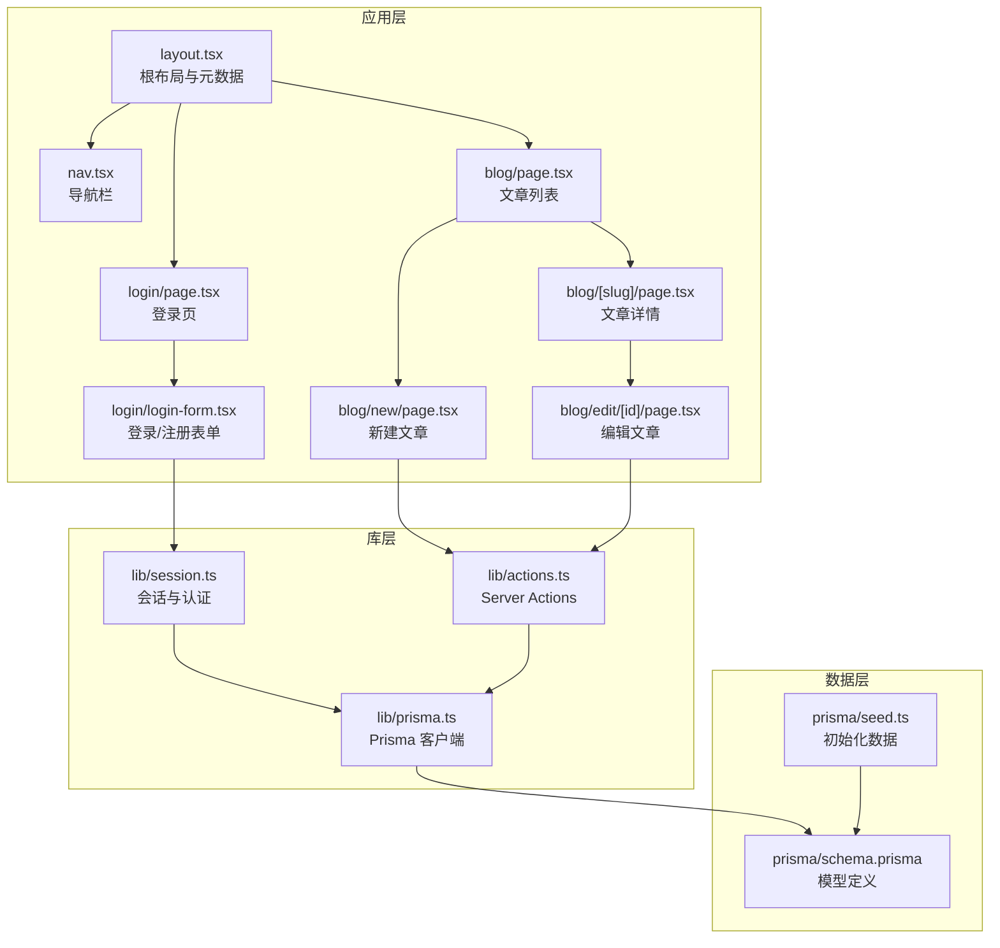
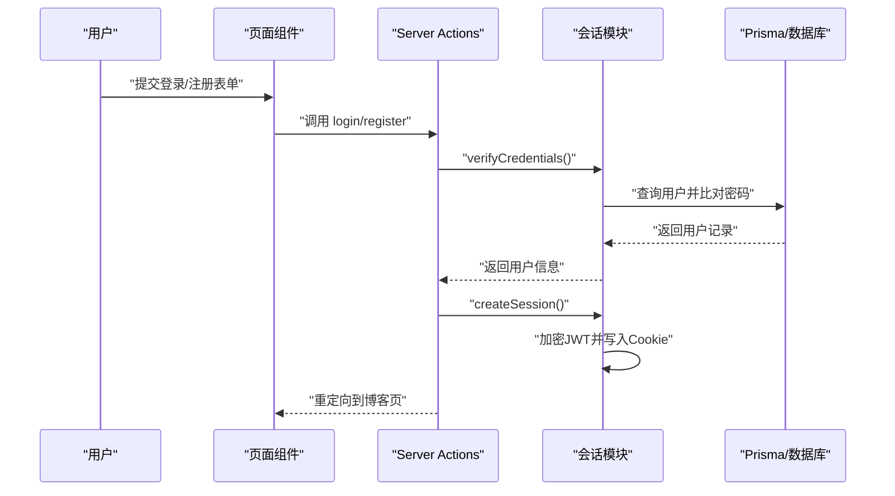
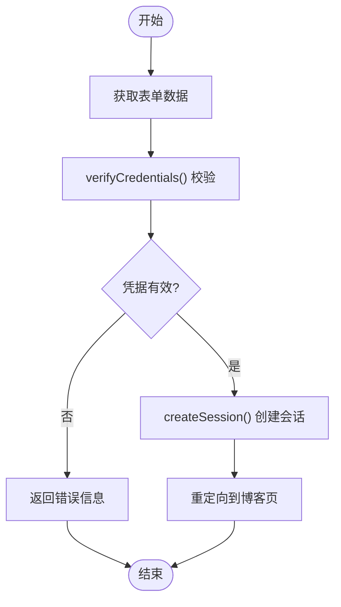
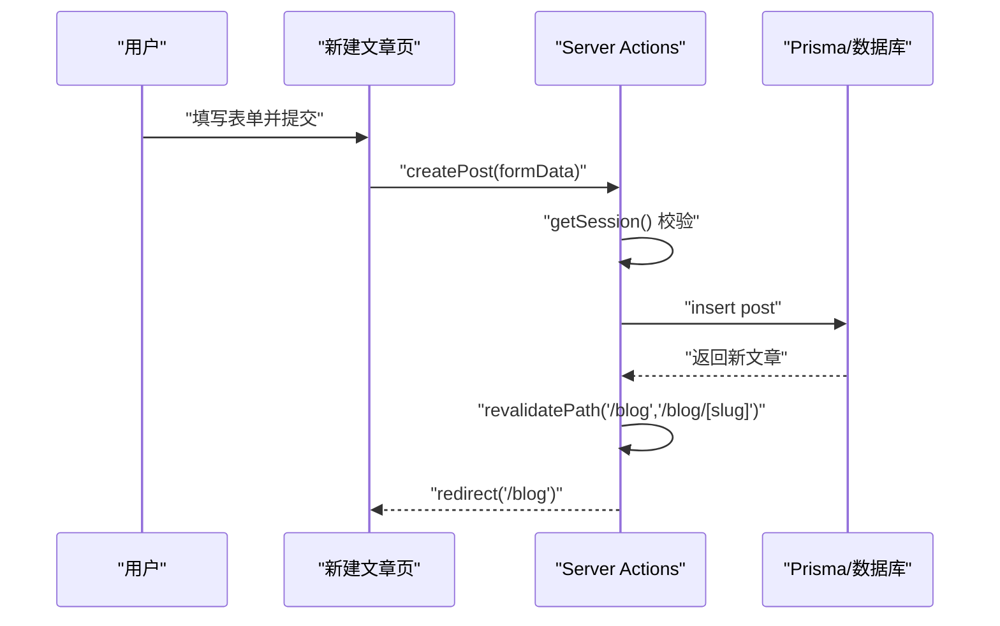
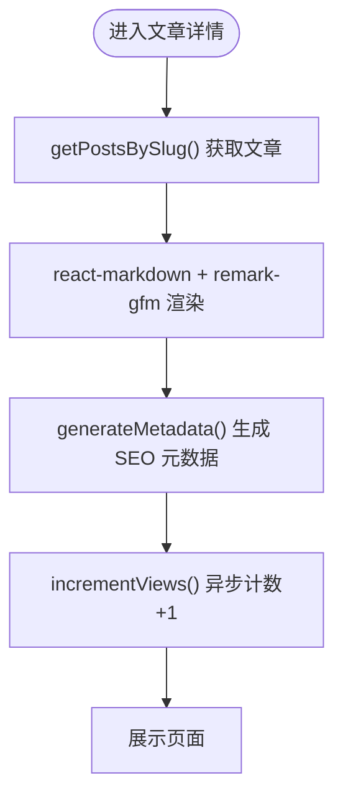
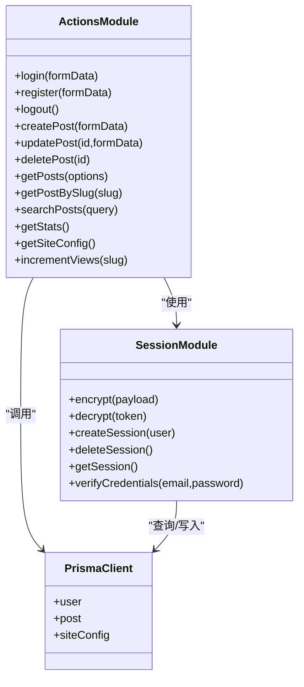
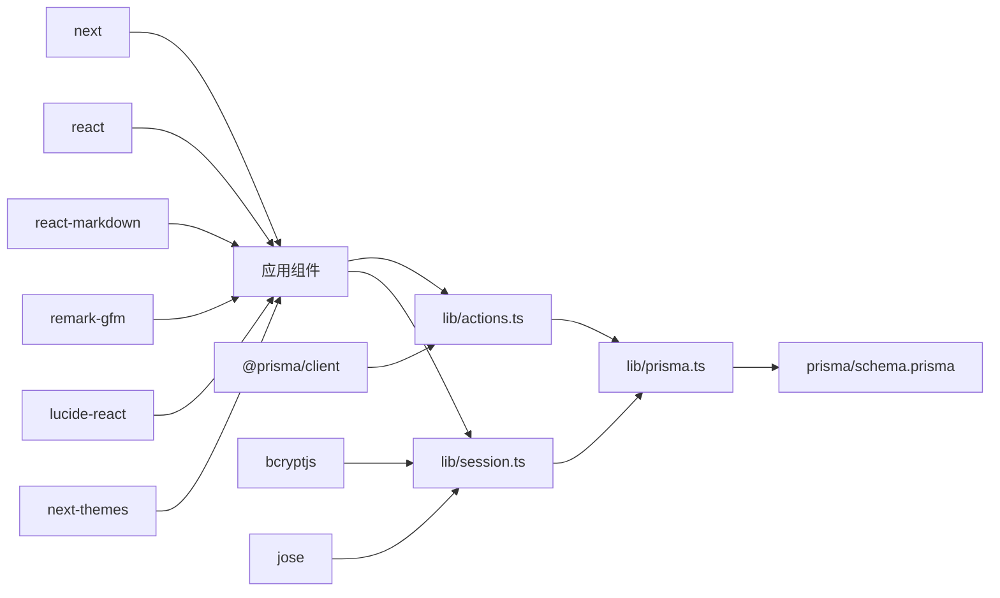

# 博客系统

<cite>
**本文引用的文件**
- [README.md](file://README.md)
- [package.json](file://package.json)
- [src/lib/prisma.ts](file://src/lib/prisma.ts)
- [src/lib/session.ts](file://src/lib/session.ts)
- [src/lib/actions.ts](file://src/lib/actions.ts)
- [prisma/schema.prisma](file://prisma/schema.prisma)
- [prisma/seed.ts](file://prisma/seed.ts)
- [src/app/blog/page.tsx](file://src/app/blog/page.tsx)
- [src/app/blog/[slug]/page.tsx](file://src/app/blog/[slug]/page.tsx)
- [src/app/blog/edit/[id]/page.tsx](file://src/app/blog/edit/[id]/page.tsx)
- [src/app/blog/new/page.tsx](file://src/app/blog/new/page.tsx)
- [src/app/login/page.tsx](file://src/app/login/page.tsx)
- [src/app/login/login-form.tsx](file://src/app/login/login-form.tsx)
- [src/app/layout.tsx](file://src/app/layout.tsx)
- [src/components/nav.tsx](file://src/components/nav.tsx)
- [src/components/providers.tsx](file://src/components/providers.tsx)
</cite>

## 目录
1. [简介](#简介)
2. [项目结构](#项目结构)
3. [核心组件](#核心组件)
4. [架构总览](#架构总览)
5. [详细组件分析](#详细组件分析)
6. [依赖关系分析](#依赖关系分析)
7. [性能考量](#性能考量)
8. [故障排查指南](#故障排查指南)
9. [结论](#结论)
10. [附录](#附录)

## 简介
本项目是一个基于 Next.js App Router 的博客系统，采用 React Server Components 与 Server Actions 实现前后端逻辑分离，结合 Prisma ORM 进行数据持久化，提供用户认证、文章管理、内容展示（Markdown/GFM 支持）、阅读统计与 SEO 优化等完整功能。系统通过 JWT 会话与 Cookie 实现登录态管理，支持管理员与作者权限控制。

## 项目结构
项目采用按功能分层的组织方式：应用层（pages 与路由）、组件层（UI 组件与通用组件）、库层（Prisma 客户端、会话与动作封装）、配置层（Prisma Schema、种子数据、包依赖）。

**图表来源**
- [src/app/layout.tsx:19-43](file://src/app/layout.tsx#L19-L43)
- [src/components/nav.tsx:26-81](file://src/components/nav.tsx#L26-L81)
- [src/app/login/page.tsx:5-18](file://src/app/login/page.tsx#L5-L18)
- [src/app/login/login-form.tsx:7-119](file://src/app/login/login-form.tsx#L7-L119)
- [src/app/blog/page.tsx:7-88](file://src/app/blog/page.tsx#L7-L88)
- [src/app/blog/[slug]/page.tsx](file://src/app/blog/[slug]/page.tsx#L25-L106)
- [src/app/blog/new/page.tsx:7-92](file://src/app/blog/new/page.tsx#L7-L92)
- [src/app/blog/edit/[id]/page.tsx](file://src/app/blog/edit/[id]/page.tsx#L12-L98)
- [src/lib/actions.ts:1-200](file://src/lib/actions.ts#L1-L200)
- [src/lib/session.ts:1-79](file://src/lib/session.ts#L1-L79)
- [src/lib/prisma.ts:1-16](file://src/lib/prisma.ts#L1-L16)
- [prisma/schema.prisma:10-86](file://prisma/schema.prisma#L10-L86)
- [prisma/seed.ts:6-107](file://prisma/seed.ts#L6-L107)

**章节来源**
- [README.md:1-37](file://README.md#L1-L37)
- [package.json:1-49](file://package.json#L1-L49)
- [src/app/layout.tsx:19-43](file://src/app/layout.tsx#L19-L43)
- [src/components/nav.tsx:26-81](file://src/components/nav.tsx#L26-L81)

## 核心组件
- 会话与认证模块（lib/session.ts）
  - 提供加密与解密 JWT、创建/删除会话 Cookie、校验凭据、获取当前用户信息等能力。
  - 会话有效期 7 天，生产环境启用安全 Cookie 属性。
- Server Actions（lib/actions.ts）
  - 封装认证动作（登录、注册、登出）、文章 CRUD（创建、更新、删除）、查询（文章列表、按 Slug 查询、搜索）、统计（文章数、总阅读量、用户数）、站点配置读取与阅读计数增量。
- 数据模型（prisma/schema.prisma）
  - User、Post、AiConfig、ChatSession、ChatMessage、SiteConfig 六个模型，Post 与 User 多对一关系，Post 建有索引以优化查询。
- 页面与组件
  - 文章列表、文章详情（含 Markdown/GFM 渲染与 SEO 元数据）、新建/编辑文章（含发布状态控制）、登录/注册表单、全局导航与主题切换。

**章节来源**
- [src/lib/session.ts:9-79](file://src/lib/session.ts#L9-L79)
- [src/lib/actions.ts:13-200](file://src/lib/actions.ts#L13-L200)
- [prisma/schema.prisma:10-86](file://prisma/schema.prisma#L10-L86)
- [src/app/blog/page.tsx:7-88](file://src/app/blog/page.tsx#L7-L88)
- [src/app/blog/[slug]/page.tsx](file://src/app/blog/[slug]/page.tsx#L15-L23)
- [src/app/blog/new/page.tsx:23-89](file://src/app/blog/new/page.tsx#L23-L89)
- [src/app/blog/edit/[id]/page.tsx](file://src/app/blog/edit/[id]/page.tsx#L38-L95)
- [src/app/login/login-form.tsx:11-21](file://src/app/login/login-form.tsx#L11-L21)

## 架构总览
系统采用“页面组件负责 UI 与交互，Server Actions 负责业务与数据”的分层设计。页面通过表单或链接触发 Server Actions，后者通过 Prisma 访问数据库，再由页面进行重定向或重新验证缓存，确保数据一致性与性能。

**图表来源**
- [src/app/login/login-form.tsx:11-21](file://src/app/login/login-form.tsx#L11-L21)
- [src/lib/actions.ts:13-49](file://src/lib/actions.ts#L13-L49)
- [src/lib/session.ts:67-78](file://src/lib/session.ts#L67-L78)
- [src/lib/session.ts:36-52](file://src/lib/session.ts#L36-L52)

## 详细组件分析

### 用户认证机制（登录、注册、会话管理）
- 凭据校验
  - 通过 Prisma 查询用户并使用 bcrypt 比对密码，成功则返回用户信息。
- 会话创建
  - 使用 HS256 签发 JWT，设置过期时间、主体与 Cookie 属性（httpOnly、secure、sameSite、path），并写入客户端。
- 会话销毁
  - 删除 session Cookie 并重定向至首页。
- 页面保护
  - 新建/编辑/删除文章需先获取会话；若未登录则重定向至登录页。

**图表来源**
- [src/lib/actions.ts:13-24](file://src/lib/actions.ts#L13-L24)
- [src/lib/session.ts:67-78](file://src/lib/session.ts#L67-L78)
- [src/lib/session.ts:36-52](file://src/lib/session.ts#L36-L52)

**章节来源**
- [src/lib/session.ts:16-79](file://src/lib/session.ts#L16-L79)
- [src/lib/actions.ts:13-54](file://src/lib/actions.ts#L13-L54)
- [src/app/blog/new/page.tsx:8-9](file://src/app/blog/new/page.tsx#L8-L9)
- [src/app/blog/edit/[id]/page.tsx](file://src/app/blog/edit/[id]/page.tsx#L14-L22)

### 文章管理流程（创建、编辑、删除、发布状态控制）
- 列表与详情
  - 列表页加载已发布文章并展示封面、摘要、作者与阅读量；详情页渲染 Markdown 内容并生成 SEO 元数据。
- 新建文章
  - 表单提交后，Server Action 校验会话、生成 Slug（可选）、计算摘要、写入数据库，并触发路径缓存重建与重定向。
- 编辑文章
  - 仅作者或管理员可编辑；Server Action 校验权限、更新字段并重建缓存。
- 删除文章
  - 仅作者或管理员可删除；删除后重建缓存并重定向。

**图表来源**
- [src/app/blog/new/page.tsx:23-89](file://src/app/blog/new/page.tsx#L23-L89)
- [src/lib/actions.ts:76-100](file://src/lib/actions.ts#L76-L100)
- [src/lib/prisma.ts:1-16](file://src/lib/prisma.ts#L1-L16)

**章节来源**
- [src/app/blog/page.tsx:42-84](file://src/app/blog/page.tsx#L42-L84)
- [src/app/blog/[slug]/page.tsx](file://src/app/blog/[slug]/page.tsx#L15-L23)
- [src/app/blog/[slug]/page.tsx](file://src/app/blog/[slug]/page.tsx#L25-L106)
- [src/app/blog/new/page.tsx:23-89](file://src/app/blog/new/page.tsx#L23-L89)
- [src/app/blog/edit/[id]/page.tsx](file://src/app/blog/edit/[id]/page.tsx#L38-L95)
- [src/lib/actions.ts:76-143](file://src/lib/actions.ts#L76-L143)

### 内容展示功能（Markdown 支持、阅读统计、SEO 优化）
- Markdown 支持
  - 使用 react-markdown 与 remark-gfm 插件渲染文章正文，支持表格、任务列表等 GFM 特性。
- 阅读统计
  - 文章详情页进入时异步触发阅读计数增量（fire-and-forget），避免阻塞首屏渲染。
- SEO 优化
  - 动态生成页面标题与描述，详情页基于文章标题与摘要生成页面元信息。

**图表来源**
- [src/app/blog/[slug]/page.tsx](file://src/app/blog/[slug]/page.tsx#L25-L106)
- [src/lib/actions.ts:145-150](file://src/lib/actions.ts#L145-L150)

**章节来源**
- [src/app/blog/[slug]/page.tsx](file://src/app/blog/[slug]/page.tsx#L98-L102)
- [src/app/blog/[slug]/page.tsx](file://src/app/blog/[slug]/page.tsx#L30-L31)
- [src/app/blog/[slug]/page.tsx](file://src/app/blog/[slug]/page.tsx#L15-L23)

### Server Actions 工作原理与安全考虑
- 工作原理
  - 使用严格模式的“use server”声明，使函数在服务端执行；通过 FormData 接收前端表单数据；通过 Prisma 执行数据库操作；通过 redirect/revalidatePath 控制导航与缓存。
- 安全考虑
  - 会话使用 HS256 JWT，密钥来自环境变量；Cookie 设置 httpOnly、secure、sameSite 等属性；凭据校验使用 bcrypt；权限校验区分作者与管理员；输入参数在服务端校验与转换。
- 性能与可靠性
  - 详情页阅读计数采用 fire-and-forget，不影响首屏；批量统计使用 Promise.all；缓存重建仅针对必要路径。

**图表来源**
- [src/lib/session.ts:16-79](file://src/lib/session.ts#L16-L79)
- [src/lib/actions.ts:13-200](file://src/lib/actions.ts#L13-L200)
- [src/lib/prisma.ts:1-16](file://src/lib/prisma.ts#L1-L16)

**章节来源**
- [src/lib/actions.ts:1-200](file://src/lib/actions.ts#L1-L200)
- [src/lib/session.ts:6-52](file://src/lib/session.ts#L6-L52)
- [src/lib/session.ts:16-34](file://src/lib/session.ts#L16-L34)

### 权限控制与角色模型
- 角色字段：User 模型包含 role，默认为 user；Admin 可绕过作者限制进行编辑/删除。
- 权限判定：编辑/删除操作中，若非作者本人且非管理员则抛错或重定向。

**章节来源**
- [prisma/schema.prisma:16-22](file://prisma/schema.prisma#L16-L22)
- [src/lib/actions.ts:107-109](file://src/lib/actions.ts#L107-L109)
- [src/lib/actions.ts:136-138](file://src/lib/actions.ts#L136-L138)
- [src/app/blog/edit/[id]/page.tsx](file://src/app/blog/edit/[id]/page.tsx#L20-L22)

### 数据模型与索引
- 模型关系
  - User 与 Post：多对一（Post.authorId → User.id）。
  - Post 模型包含 published、featured、views 等字段，便于筛选与统计。
- 索引
  - Post 上对 slug 建有唯一索引；对 (published, createdAt) 建有复合索引，用于高效查询已发布文章列表。

**章节来源**
- [prisma/schema.prisma:24-41](file://prisma/schema.prisma#L24-L41)

## 依赖关系分析
- 外部依赖
  - next、react、react-dom：框架与运行时。
  - @prisma/client、bcryptjs、jose：ORM、密码加密、JWT。
  - react-markdown、remark-gfm：Markdown 渲染。
  - lucide-react、next-themes：图标与主题。
- 内部依赖
  - 页面组件依赖 lib/actions 与 lib/session；lib/actions 依赖 lib/prisma；lib/session 依赖 lib/prisma 与 jose/bcryptjs。

**图表来源**
- [package.json:13-32](file://package.json#L13-L32)
- [src/lib/actions.ts:1-8](file://src/lib/actions.ts#L1-L8)
- [src/lib/session.ts:1-4](file://src/lib/session.ts#L1-L4)
- [src/app/blog/[slug]/page.tsx](file://src/app/blog/[slug]/page.tsx#L6-L7)

**章节来源**
- [package.json:13-32](file://package.json#L13-L32)

## 性能考量
- 缓存与重建
  - 文章创建/更新/删除后，使用 revalidatePath 重建相关路由缓存，保证数据一致性。
- 异步计数
  - 阅读计数采用 fire-and-forget，避免影响首屏渲染。
- 查询优化
  - Post 模型建立索引，减少高频查询成本；批量统计使用 Promise.all。
- 图片与渲染
  - 列表与详情页图片使用懒加载与尺寸适配，提升首屏性能。

**章节来源**
- [src/lib/actions.ts:97-99](file://src/lib/actions.ts#L97-L99)
- [src/lib/actions.ts:126-128](file://src/lib/actions.ts#L126-L128)
- [src/lib/actions.ts:145-150](file://src/lib/actions.ts#L145-L150)
- [prisma/schema.prisma:39-41](file://prisma/schema.prisma#L39-L41)
- [src/app/blog/page.tsx:48-56](file://src/app/blog/page.tsx#L48-L56)
- [src/app/blog/[slug]/page.tsx](file://src/app/blog/[slug]/page.tsx#L86-L94)

## 故障排查指南
- 登录失败
  - 检查邮箱/密码是否正确；确认 verifyCredentials 是否返回用户对象；查看会话是否写入 Cookie。
- 无法访问新建/编辑/删除页面
  - 确认 getSession() 是否返回用户；未登录将被重定向至登录页。
- 权限不足
  - 编辑/删除需为作者或管理员；检查用户角色与文章作者 ID。
- 文章未显示或缓存未更新
  - 确认已发布状态；检查 revalidatePath 是否触发；清理浏览器缓存。
- SEO 元数据异常
  - 检查 generateMetadata 返回值；确保文章存在且包含标题/摘要。
- 初始化数据
  - 使用脚本生成演示用户与文章，便于本地调试。

**章节来源**
- [src/lib/session.ts:67-79](file://src/lib/session.ts#L67-L79)
- [src/lib/actions.ts:17-24](file://src/lib/actions.ts#L17-L24)
- [src/app/blog/new/page.tsx:8-9](file://src/app/blog/new/page.tsx#L8-L9)
- [src/app/blog/edit/[id]/page.tsx](file://src/app/blog/edit/[id]/page.tsx#L20-L22)
- [src/lib/actions.ts:97-100](file://src/lib/actions.ts#L97-L100)
- [src/app/blog/[slug]/page.tsx](file://src/app/blog/[slug]/page.tsx#L15-L23)
- [prisma/seed.ts:6-18](file://prisma/seed.ts#L6-L18)

## 结论
该博客系统通过清晰的分层设计与 Server Actions 实现了安全、可维护的全栈功能：认证与会话、文章管理、内容渲染与 SEO、阅读统计与缓存重建。配合 Prisma 的模型与索引设计，满足中小型博客的性能与扩展需求。建议在生产环境中强化密钥管理、引入输入校验与速率限制，并持续评估缓存策略与数据库索引。

## 附录
- 快速开始
  - 安装依赖后运行开发服务器；使用默认演示账户登录；通过“新建文章”体验 Markdown/GFM 渲染与发布流程。
- 默认演示数据
  - 种子脚本创建一个管理员用户与若干示例文章，便于快速预览系统功能。

**章节来源**
- [README.md:5-15](file://README.md#L5-L15)
- [prisma/seed.ts:6-107](file://prisma/seed.ts#L6-L107)