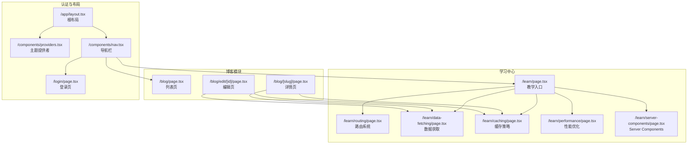
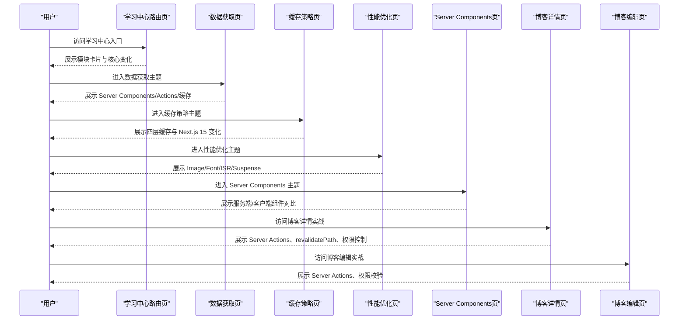
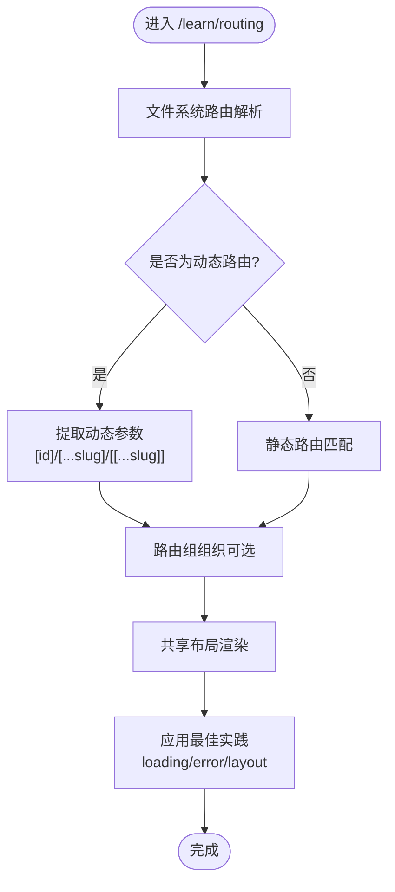
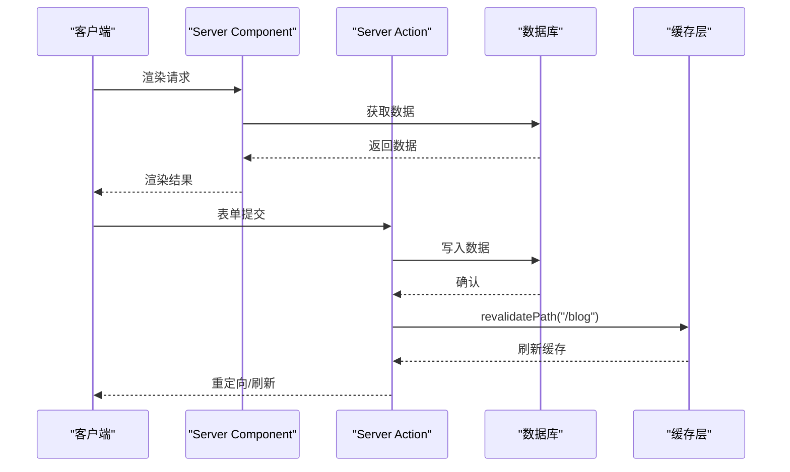
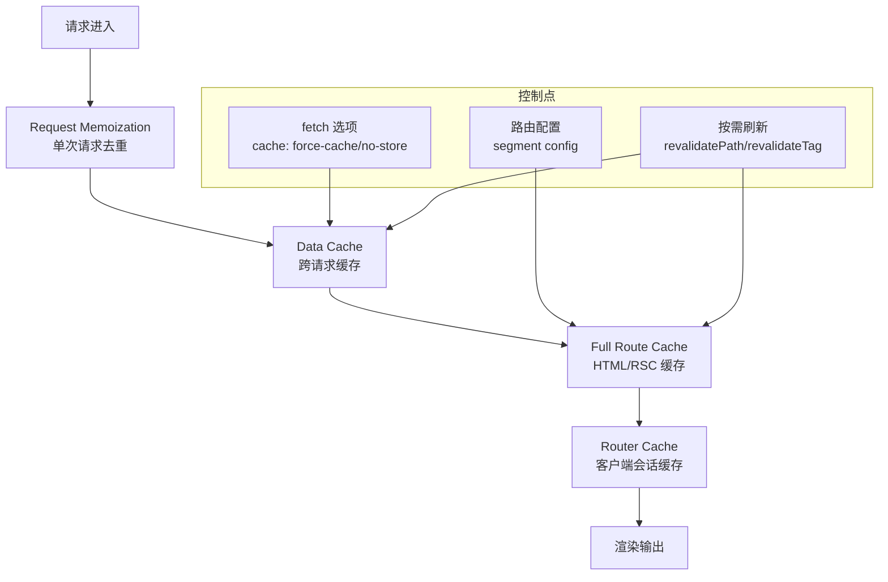
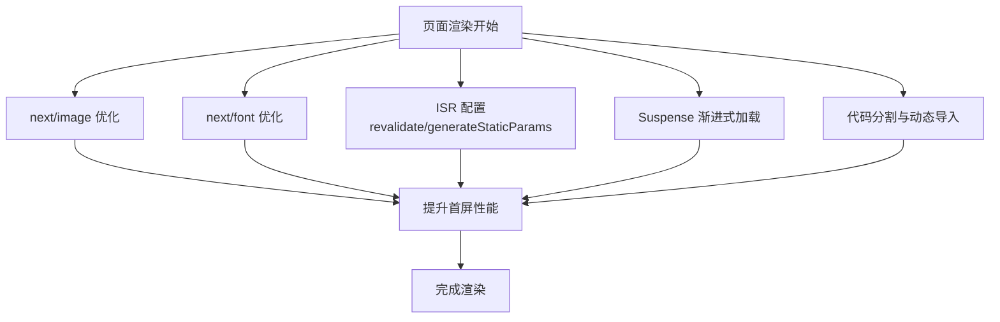
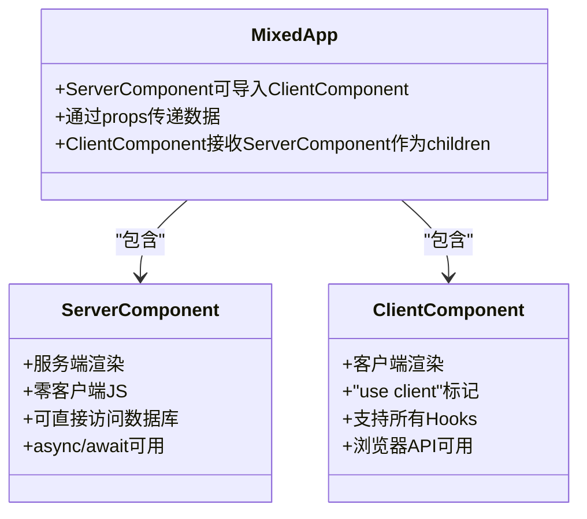
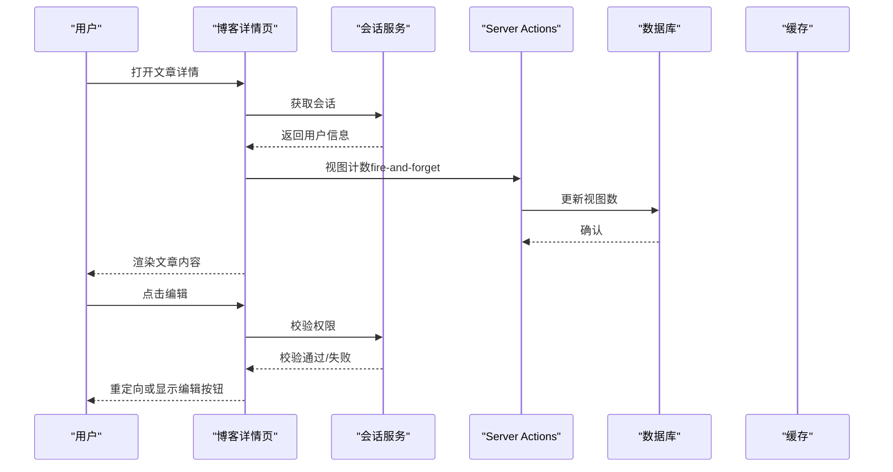
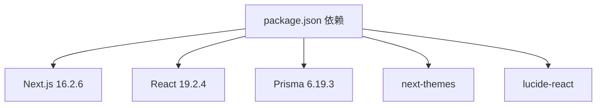

# 学习中心模块

<cite>
**本文档引用的文件**
- [src/app/learn/page.tsx](file://src/app/learn/page.tsx)
- [src/app/learn/routing/page.tsx](file://src/app/learn/routing/page.tsx)
- [src/app/learn/data-fetching/page.tsx](file://src/app/learn/data-fetching/page.tsx)
- [src/app/learn/caching/page.tsx](file://src/app/learn/caching/page.tsx)
- [src/app/learn/performance/page.tsx](file://src/app/learn/performance/page.tsx)
- [src/app/learn/server-components/page.tsx](file://src/app/learn/server-components/page.tsx)
- [src/lib/actions.ts](file://src/lib/actions.ts)
- [src/lib/prisma.ts](file://src/lib/prisma.ts)
- [src/app/layout.tsx](file://src/app/layout.tsx)
- [src/app/blog/[slug]/page.tsx](file://src/app/blog/[slug]/page.tsx)
- [src/app/blog/edit/[id]/page.tsx](file://src/app/blog/edit/[id]/page.tsx)
- [package.json](file://package.json)
- [next.config.ts](file://next.config.ts)
- [src/components/providers.tsx](file://src/components/providers.tsx)
- [src/components/nav.tsx](file://src/components/nav.tsx)
</cite>

## 目录
1. [简介](#简介)
2. [项目结构](#项目结构)
3. [核心组件](#核心组件)
4. [架构总览](#架构总览)
5. [详细组件分析](#详细组件分析)
6. [依赖分析](#依赖分析)
7. [性能考虑](#性能考虑)
8. [故障排除指南](#故障排除指南)
9. [结论](#结论)
10. [附录](#附录)

## 简介
本文件为“学习中心模块”的全面技术文档，围绕 Next.js 15+ App Router 的教学内容进行系统化梳理。重点涵盖：
- 路由系统：文件系统路由、动态路由、路由组与最佳实践
- 数据获取：Server Components、Server Actions、缓存控制与按需重新验证
- 性能优化：图片优化、字体优化、增量静态再生、流式渲染与代码分割
- 学习模块关系：从教学入口到具体示例页面的依赖与调用链
- 常见问题与调试技巧：缓存行为、权限控制、SEO 元数据与开发体验

## 项目结构
学习中心模块位于应用的 `/learn` 路由下，采用文件系统路由组织教学内容。每个主题对应一个独立页面，形成清晰的知识体系；同时，与博客模块、认证模块、全局布局等存在紧密耦合。

**图表来源**
- [src/app/learn/page.tsx:1-93](file://src/app/learn/page.tsx#L1-L93)
- [src/app/learn/routing/page.tsx:1-68](file://src/app/learn/routing/page.tsx#L1-L68)
- [src/app/learn/data-fetching/page.tsx:1-74](file://src/app/learn/data-fetching/page.tsx#L1-L74)
- [src/app/learn/caching/page.tsx:1-76](file://src/app/learn/caching/page.tsx#L1-L76)
- [src/app/learn/performance/page.tsx:1-91](file://src/app/learn/performance/page.tsx#L1-L91)
- [src/app/learn/server-components/page.tsx:1-65](file://src/app/learn/server-components/page.tsx#L1-L65)
- [src/app/blog/[slug]/page.tsx](file://src/app/blog/[slug]/page.tsx#L1-L107)
- [src/app/blog/edit/[id]/page.tsx](file://src/app/blog/edit/[id]/page.tsx#L1-L99)
- [src/app/layout.tsx:1-44](file://src/app/layout.tsx#L1-L44)
- [src/components/providers.tsx:1-13](file://src/components/providers.tsx#L1-L13)
- [src/components/nav.tsx:1-82](file://src/components/nav.tsx#L1-L82)

**章节来源**
- [src/app/learn/page.tsx:1-93](file://src/app/learn/page.tsx#L1-L93)
- [src/app/layout.tsx:1-44](file://src/app/layout.tsx#L1-L44)

## 核心组件
- 教学入口页：提供模块导航与 Next.js 15 核心变化概览，作为学习中心的总览页面。
- 主题教学页：分别讲解路由、数据获取、缓存、性能与 Server Components 的概念与最佳实践。
- 博客详情页与编辑页：演示 Server Actions、revalidatePath、权限控制与 SEO 元数据生成的实际应用。
- 全局布局与导航：统一字体加载、主题切换与导航链接，承载学习中心与其他模块的连接。

**章节来源**
- [src/app/learn/page.tsx:1-93](file://src/app/learn/page.tsx#L1-L93)
- [src/app/learn/routing/page.tsx:1-68](file://src/app/learn/routing/page.tsx#L1-L68)
- [src/app/learn/data-fetching/page.tsx:1-74](file://src/app/learn/data-fetching/page.tsx#L1-L74)
- [src/app/learn/caching/page.tsx:1-76](file://src/app/learn/caching/page.tsx#L1-L76)
- [src/app/learn/performance/page.tsx:1-91](file://src/app/learn/performance/page.tsx#L1-L91)
- [src/app/learn/server-components/page.tsx:1-65](file://src/app/learn/server-components/page.tsx#L1-L65)
- [src/app/blog/[slug]/page.tsx](file://src/app/blog/[slug]/page.tsx#L1-L107)
- [src/app/blog/edit/[id]/page.tsx](file://src/app/blog/edit/[id]/page.tsx#L1-L99)
- [src/app/layout.tsx:1-44](file://src/app/layout.tsx#L1-L44)

## 架构总览
学习中心模块采用“概念讲解 + 实战示例”的双轨设计：
- 概念讲解：通过 `/learn/*` 页面系统化介绍 Next.js 15 的核心特性。
- 实战示例：在博客模块中落地 Server Actions、缓存与权限控制，形成闭环学习。

**图表来源**
- [src/app/learn/page.tsx:1-93](file://src/app/learn/page.tsx#L1-L93)
- [src/app/learn/data-fetching/page.tsx:1-74](file://src/app/learn/data-fetching/page.tsx#L1-L74)
- [src/app/learn/caching/page.tsx:1-76](file://src/app/learn/caching/page.tsx#L1-L76)
- [src/app/learn/performance/page.tsx:1-91](file://src/app/learn/performance/page.tsx#L1-L91)
- [src/app/learn/server-components/page.tsx:1-65](file://src/app/learn/server-components/page.tsx#L1-L65)
- [src/app/blog/[slug]/page.tsx](file://src/app/blog/[slug]/page.tsx#L1-L107)
- [src/app/blog/edit/[id]/page.tsx](file://src/app/blog/edit/[id]/page.tsx#L1-L99)

## 详细组件分析

### 路由系统（文件系统路由、动态路由、路由组）
- 文件系统路由：通过目录结构映射 URL，如 `/learn/routing` 映射到 `src/app/learn/routing/page.tsx`。
- 动态路由：支持 `[id]`、`[...slug]`、`[[...slug]]` 等形式，用于处理可变参数与捕获路径。
- 路由组：使用括号分组，不影响最终 URL，便于组织与复用布局。
- 最佳实践：使用 `loading.tsx` 提供即时反馈，使用 `error.tsx` 处理错误，布局靠近叶子节点减少渲染范围。

**图表来源**
- [src/app/learn/routing/page.tsx:1-68](file://src/app/learn/routing/page.tsx#L1-L68)

**章节来源**
- [src/app/learn/routing/page.tsx:1-68](file://src/app/learn/routing/page.tsx#L1-L68)

### 数据获取（Server Components、Server Actions、缓存控制）
- Server Components：在服务端直接获取数据，减少客户端 JavaScript。
- Server Actions：在服务端执行异步操作（如数据库写入），返回后通过 `revalidatePath` 或 `revalidateTag` 刷新缓存。
- 缓存控制：通过 fetch 选项与路由配置控制缓存策略，Next.js 15 默认不缓存，需显式声明。

**图表来源**
- [src/app/learn/data-fetching/page.tsx:1-74](file://src/app/learn/data-fetching/page.tsx#L1-L74)
- [src/lib/actions.ts:1-200](file://src/lib/actions.ts#L1-L200)
- [src/app/blog/[slug]/page.tsx](file://src/app/blog/[slug]/page.tsx#L1-L107)

**章节来源**
- [src/app/learn/data-fetching/page.tsx:1-74](file://src/app/learn/data-fetching/page.tsx#L1-L74)
- [src/lib/actions.ts:1-200](file://src/lib/actions.ts#L1-L200)

### 缓存策略（四层缓存与 Next.js 15 变化）
- 四层缓存：Request Memoization、Data Cache、Full Route Cache、Router Cache。
- Next.js 15 变化：fetch 默认不缓存，路由处理器默认动态渲染，需显式声明缓存策略并使用按需刷新。

**图表来源**
- [src/app/learn/caching/page.tsx:1-76](file://src/app/learn/caching/page.tsx#L1-L76)

**章节来源**
- [src/app/learn/caching/page.tsx:1-76](file://src/app/learn/caching/page.tsx#L1-L76)

### 性能优化（Image/Font/ISR/Streaming/代码分割）
- 图片优化：使用 next/image 自动 WebP/AVIF 转换、响应式尺寸与懒加载。
- 字体优化：使用 next/font 预加载与消除布局偏移。
- ISR 增量静态再生：通过 revalidate 控制更新频率，结合 generateStaticParams 生成静态路径。
- Streaming & Suspense：使用 React Suspense 实现渐进式加载。
- 代码分割：按需动态导入与组件拆分，减少首屏体积。

**图表来源**
- [src/app/learn/performance/page.tsx:1-91](file://src/app/learn/performance/page.tsx#L1-L91)
- [src/app/blog/[slug]/page.tsx](file://src/app/blog/[slug]/page.tsx#L1-L107)
- [src/app/layout.tsx:1-44](file://src/app/layout.tsx#L1-L44)

**章节来源**
- [src/app/learn/performance/page.tsx:1-91](file://src/app/learn/performance/page.tsx#L1-L91)
- [src/app/layout.tsx:1-44](file://src/app/layout.tsx#L1-L44)

### Server Components（RSC 架构与混合模式）
- Server Components：服务端渲染、零客户端 JS、可直接访问数据库与文件系统。
- Client Components：客户端渲染、支持所有 Hooks、被打包到 bundle。
- 组合规则：Server Components 可导入 Client Components，并通过 props 传递数据；Client Components 可接收 Server Components 作为 children。

**图表来源**
- [src/app/learn/server-components/page.tsx:1-65](file://src/app/learn/server-components/page.tsx#L1-L65)

**章节来源**
- [src/app/learn/server-components/page.tsx:1-65](file://src/app/learn/server-components/page.tsx#L1-L65)

### 博客模块实战（Server Actions、权限控制、SEO 元数据）
- 权限控制：在 Server Components 中获取会话，校验作者身份或管理员角色，拒绝则重定向。
- Server Actions：封装数据库写入、删除与视图计数，完成后使用 revalidatePath 刷新缓存。
- SEO 元数据：在 Server Components 中动态生成 title 与 description，提升搜索可见性。

**图表来源**
- [src/app/blog/[slug]/page.tsx](file://src/app/blog/[slug]/page.tsx#L1-L107)
- [src/app/blog/edit/[id]/page.tsx](file://src/app/blog/edit/[id]/page.tsx#L1-L99)
- [src/lib/actions.ts:1-200](file://src/lib/actions.ts#L1-L200)

**章节来源**
- [src/app/blog/[slug]/page.tsx](file://src/app/blog/[slug]/page.tsx#L1-L107)
- [src/app/blog/edit/[id]/page.tsx](file://src/app/blog/edit/[id]/page.tsx#L1-L99)
- [src/lib/actions.ts:1-200](file://src/lib/actions.ts#L1-L200)

## 依赖分析
- 技术栈：Next.js 16.2.6、React 19.2.4、Prisma 6.19.3、next-themes、lucide-react 等。
- 配置：next.config.ts 支持远程图片与实验性功能预留；package.json 定义了开发与生产依赖。
- 组件依赖：学习中心模块依赖全局布局与导航；博客模块依赖认证与 Server Actions；Prisma 提供数据库访问。

**图表来源**
- [package.json:1-49](file://package.json#L1-L49)

**章节来源**
- [package.json:1-49](file://package.json#L1-L49)
- [next.config.ts:1-18](file://next.config.ts#L1-L18)

## 性能考虑
- 图片优化：使用 next/image 并设置 priority、sizes，避免阻塞首屏。
- 字体优化：使用 next/font，设置 display: swap，减少 FOIT/OFT。
- ISR：对静态内容启用 revalidate，结合 generateStaticParams 生成静态路径，降低服务端压力。
- Streaming：对耗时数据使用 Suspense，提升感知性能。
- 代码分割：将重型组件按需加载，减少首屏 JS 体积。
- 开发体验：启用 Turbopack（在 Next.js 15+ 中稳定），显著提升开发构建速度。

[本节为通用指导，无需特定文件引用]

## 故障排除指南
- 缓存不生效：确认 fetch 选项与路由配置，Next.js 15 默认不缓存，需显式声明。
- 权限错误：检查会话获取与权限校验逻辑，确保仅授权用户可编辑或删除。
- SEO 元数据缺失：在 Server Components 中使用 generateMetadata 动态生成 title/description。
- 图片加载异常：检查 next.config.ts 中的 remotePatterns 与图片尺寸设置。
- 导航闪烁：使用 Suspense 包裹耗时组件，避免阻塞主渲染。

**章节来源**
- [src/app/learn/caching/page.tsx:1-76](file://src/app/learn/caching/page.tsx#L1-L76)
- [src/app/blog/[slug]/page.tsx](file://src/app/blog/[slug]/page.tsx#L1-L107)
- [next.config.ts:1-18](file://next.config.ts#L1-L18)

## 结论
学习中心模块以“理论 + 实战”相结合的方式，系统呈现 Next.js 15+ 的核心能力。通过路由、数据获取、缓存、性能与 Server Components 的讲解，并结合博客模块的真实案例，能够帮助开发者快速掌握现代 Next.js 开发范式。建议在实际项目中优先采用 Server Components 获取数据、使用 Server Actions 处理表单、合理配置缓存与 ISR，并结合 Suspense 与图片/字体优化提升用户体验。

[本节为总结性内容，无需特定文件引用]

## 附录
- Next.js 15 核心变化要点：默认不缓存、Turbopack 稳定、React 19 支持、partialPrerender 实验性功能。
- 最佳实践清单：优先在 Server Component 中获取数据、使用 Server Actions 处理表单、按需刷新缓存、为动态导入使用 Suspense、使用 ISR/SSG 减少服务端压力。

**章节来源**
- [src/app/learn/page.tsx:69-89](file://src/app/learn/page.tsx#L69-L89)