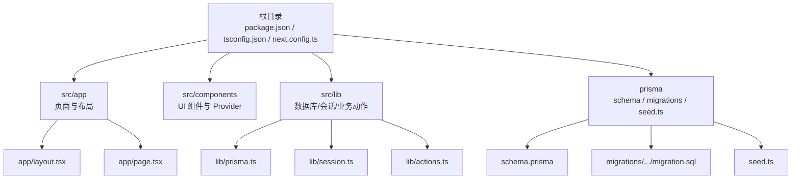
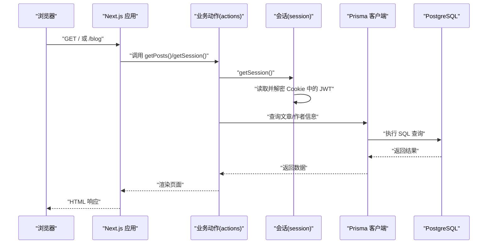
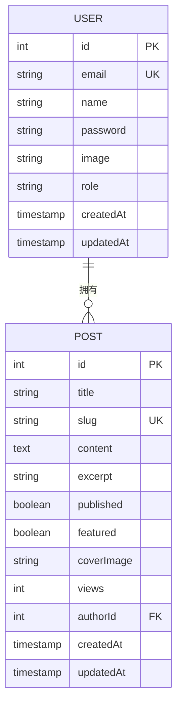
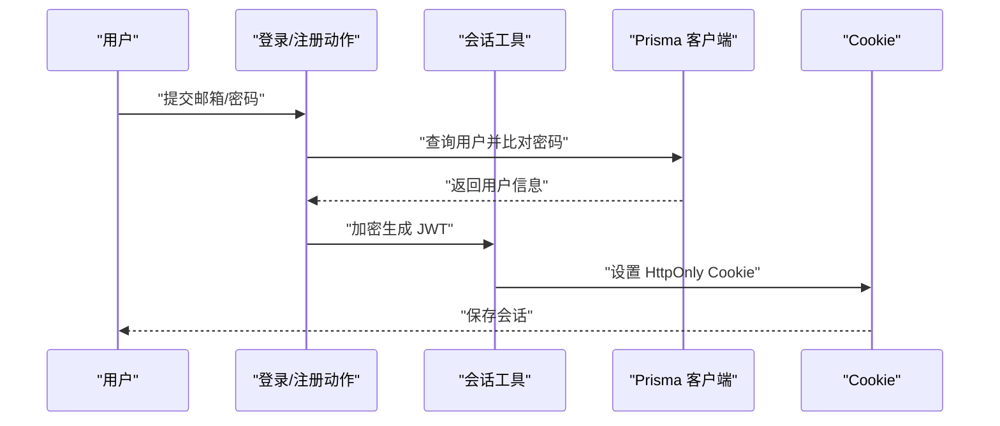
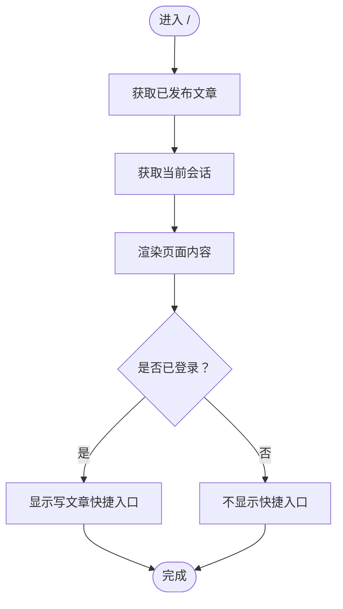
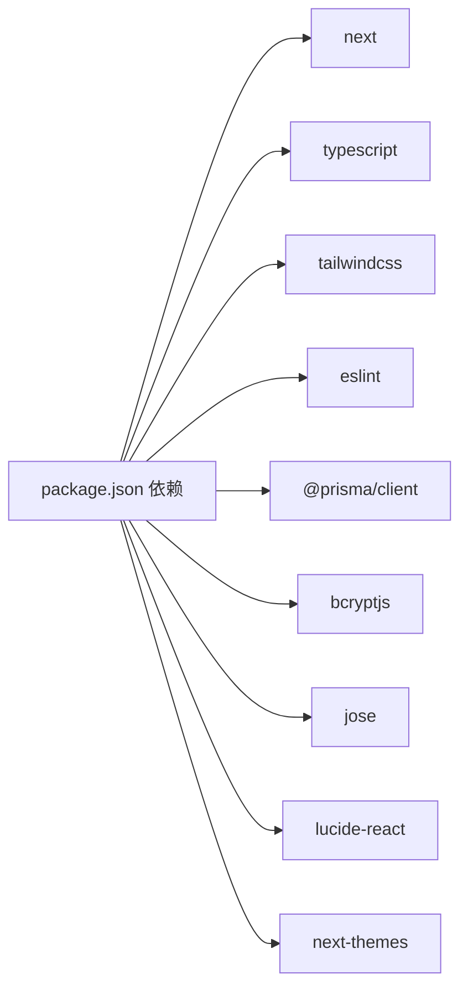

# 快速开始

<cite>
**本文引用的文件**
- [README.md](file://README.md)
- [package.json](file://package.json)
- [prisma/schema.prisma](file://prisma/schema.prisma)
- [prisma/migrations/20260527095355_init/migration.sql](file://prisma/migrations/20260527095355_init/migration.sql)
- [prisma/seed.ts](file://prisma/seed.ts)
- [prisma.config.ts](file://prisma.config.ts)
- [next.config.ts](file://next.config.ts)
- [tsconfig.json](file://tsconfig.json)
- [src/lib/prisma.ts](file://src/lib/prisma.ts)
- [src/lib/actions.ts](file://src/lib/actions.ts)
- [src/lib/session.ts](file://src/lib/session.ts)
- [src/app/layout.tsx](file://src/app/layout.tsx)
- [src/app/page.tsx](file://src/app/page.tsx)
- [src/components/providers.tsx](file://src/components/providers.tsx)
</cite>

## 目录
1. [简介](#简介)
2. [项目结构](#项目结构)
3. [核心组件](#核心组件)
4. [架构总览](#架构总览)
5. [详细组件分析](#详细组件分析)
6. [依赖关系分析](#依赖关系分析)
7. [性能注意事项](#性能注意事项)
8. [故障排除指南](#故障排除指南)
9. [结论](#结论)
10. [附录](#附录)

## 简介
本指南面向首次接触 Next.js 博客系统的开发者，帮助你在最短时间内完成环境准备、项目克隆与安装、数据库初始化（Prisma 迁移与种子数据）、开发服务器启动与基础配置，并提供常见问题的排查方法与验证步骤。你将能够在本地看到博客首页、登录认证、文章列表与详情等基本功能。

## 项目结构
该仓库采用 Next.js App Router 结构，核心目录与职责如下：
- 根目录：项目元信息与构建脚本（package.json、tsconfig.json、next.config.ts）
- prisma：数据库模式与迁移、种子数据
- src：应用源码
  - app：页面与路由（page.tsx、layout.tsx、各子路由页面）
  - components：UI 组件与全局 Provider
  - lib：数据库客户端、会话与业务动作（actions、session、prisma）

图表来源
- [next.config.ts:1-18](file://next.config.ts#L1-L18)
- [tsconfig.json:1-35](file://tsconfig.json#L1-L35)
- [src/app/layout.tsx:1-42](file://src/app/layout.tsx#L1-L42)
- [src/app/page.tsx:1-146](file://src/app/page.tsx#L1-L146)
- [src/lib/prisma.ts:1-16](file://src/lib/prisma.ts#L1-L16)
- [src/lib/session.ts:1-79](file://src/lib/session.ts#L1-L79)
- [src/lib/actions.ts:1-151](file://src/lib/actions.ts#L1-L151)
- [prisma/schema.prisma:1-40](file://prisma/schema.prisma#L1-L40)
- [prisma/migrations/20260527095355_init/migration.sql:1-47](file://prisma/migrations/20260527095355_init/migration.sql#L1-L47)
- [prisma/seed.ts:1-108](file://prisma/seed.ts#L1-L108)

章节来源
- [README.md:1-37](file://README.md#L1-L37)
- [package.json:1-42](file://package.json#L1-L42)
- [next.config.ts:1-18](file://next.config.ts#L1-L18)
- [tsconfig.json:1-35](file://tsconfig.json#L1-L35)

## 核心组件
- 数据库与 ORM：通过 Prisma 客户端连接 PostgreSQL，模型包含用户与文章，带索引与外键约束。
- 会话与认证：基于 JWT 的 Cookie 会话，支持登录、注册、登出与权限校验。
- 页面与路由：首页展示最新文章、学习模块入口与管理员快捷入口；博客路由支持按 slug 查看文章。
- 全局样式与主题：通过 next-themes 提供深浅主题切换，字体与全局样式在根布局中注入。

章节来源
- [prisma/schema.prisma:10-40](file://prisma/schema.prisma#L10-L40)
- [src/lib/prisma.ts:1-16](file://src/lib/prisma.ts#L1-L16)
- [src/lib/session.ts:1-79](file://src/lib/session.ts#L1-L79)
- [src/lib/actions.ts:13-54](file://src/lib/actions.ts#L13-L54)
- [src/app/layout.tsx:17-41](file://src/app/layout.tsx#L17-L41)
- [src/components/providers.tsx:1-13](file://src/components/providers.tsx#L1-L13)

## 架构总览
下图展示了从浏览器到数据库的关键调用链路：页面请求进入 Next.js，通过业务动作访问 Prisma，读取/写入数据库；会话通过 Cookie 传递并在服务端解密验证。

图表来源
- [src/app/page.tsx:7-22](file://src/app/page.tsx#L7-L22)
- [src/lib/actions.ts:60-74](file://src/lib/actions.ts#L60-L74)
- [src/lib/session.ts:54-65](file://src/lib/session.ts#L54-L65)
- [src/lib/prisma.ts:1-16](file://src/lib/prisma.ts#L1-L16)
- [prisma/schema.prisma:10-40](file://prisma/schema.prisma#L10-L40)

## 详细组件分析

### 数据库与迁移（Prisma）
- 模式定义：包含用户与文章两个模型，字段覆盖邮箱唯一性、文章 slug 唯一性、索引与外键。
- 迁移：初始迁移创建表、索引与外键约束，确保数据一致性。
- 种子数据：提供演示用户与若干示例文章，便于快速体验。

图表来源
- [prisma/schema.prisma:10-40](file://prisma/schema.prisma#L10-L40)
- [prisma/migrations/20260527095355_init/migration.sql:1-47](file://prisma/migrations/20260527095355_init/migration.sql#L1-L47)

章节来源
- [prisma/schema.prisma:1-40](file://prisma/schema.prisma#L1-L40)
- [prisma/migrations/20260527095355_init/migration.sql:1-47](file://prisma/migrations/20260527095355_init/migration.sql#L1-L47)
- [prisma/seed.ts:6-107](file://prisma/seed.ts#L6-L107)

### 会话与认证流程
- 登录/注册：前端提交表单，服务端通过 bcrypt 验证密码，成功后生成 JWT 并写入 Cookie。
- 权限控制：编辑/删除文章需验证当前用户是否为作者或管理员。
- 会话解密：每次请求读取 Cookie 并解密，返回用户信息用于页面渲染与权限判断。

图表来源
- [src/lib/actions.ts:13-49](file://src/lib/actions.ts#L13-L49)
- [src/lib/session.ts:36-65](file://src/lib/session.ts#L36-L65)
- [src/lib/prisma.ts:1-16](file://src/lib/prisma.ts#L1-L16)

章节来源
- [src/lib/actions.ts:13-151](file://src/lib/actions.ts#L13-L151)
- [src/lib/session.ts:1-79](file://src/lib/session.ts#L1-L79)

### 页面与路由
- 根布局：注入字体、主题 Provider 与导航栏，统一页面骨架。
- 首页：展示功能特性卡片、最新文章列表与管理员快捷入口；异步获取文章与会话信息。
- 子路由：博客列表、文章详情、新建/编辑文章、学习模块等。

图表来源
- [src/app/page.tsx:7-22](file://src/app/page.tsx#L7-L22)
- [src/app/layout.tsx:17-41](file://src/app/layout.tsx#L17-L41)
- [src/components/providers.tsx:6-12](file://src/components/providers.tsx#L6-L12)

章节来源
- [src/app/page.tsx:1-146](file://src/app/page.tsx#L1-L146)
- [src/app/layout.tsx:1-42](file://src/app/layout.tsx#L1-L42)
- [src/components/providers.tsx:1-13](file://src/components/providers.tsx#L1-L13)

## 依赖关系分析
- 构建与运行：Next.js 16、TypeScript、Tailwind CSS v4、ESLint。
- 数据层：@prisma/client、Prisma CLI、PostgreSQL。
- 认证与 UI：bcryptjs、jose（JWT）、lucide-react、next-themes。
- 开发工具：tsx、prisma、eslint-config-next。

图表来源
- [package.json:13-40](file://package.json#L13-L40)

章节来源
- [package.json:1-42](file://package.json#L1-42)

## 性能注意事项
- 图片优化：next.config.ts 已配置远程图片域名白名单，确保封面图加载正常。
- 类型严格：tsconfig.json 启用严格模式与增量编译，提升开发体验与类型安全。
- 缓存策略：Next.js 15 默认不再缓存 fetch 与路由处理器，如需缓存请显式配置。

章节来源
- [next.config.ts:4-11](file://next.config.ts#L4-L11)
- [tsconfig.json:7-15](file://tsconfig.json#L7-L15)

## 故障排除指南
- 环境变量缺失
  - DATABASE_URL 未设置：Prisma 将回退到 SQLite 文件（dev.db）。若需使用 PostgreSQL，请在运行环境中设置 DATABASE_URL。
  - SESSION_SECRET 未设置：会话加密密钥将使用默认值，建议在生产环境设置强密钥。
  - 参考路径：[prisma.config.ts:6-14](file://prisma.config.ts#L6-L14)，[src/lib/session.ts:6](file://src/lib/session.ts#L6)
- 数据库连接失败
  - 确认 PostgreSQL 服务可用且可从本机访问。
  - 若使用 Docker Compose，请检查容器网络与端口映射。
- 迁移未执行
  - 执行迁移命令后，确认迁移文件已生成且数据库中存在对应表与索引。
  - 参考路径：[prisma/migrations/20260527095355_init/migration.sql:1-47](file://prisma/migrations/20260527095355_init/migration.sql#L1-L47)
- 种子数据未生效
  - 使用种子脚本生成演示用户与文章，确保数据库已连接且迁移完成。
  - 参考路径：[prisma/seed.ts:6-107](file://prisma/seed.ts#L6-L107)
- 开发服务器无法启动
  - 确认 Node.js 版本满足 Next.js 16 要求（建议使用 LTS 版本）。
  - 参考路径：[README.md:5-15](file://README.md#L5-L15)
- 路由或样式异常
  - 检查 App Router 路由约定与页面导出是否正确。
  - 确认 Tailwind CSS 配置与全局样式加载顺序。

章节来源
- [prisma.config.ts:6-14](file://prisma.config.ts#L6-L14)
- [src/lib/session.ts:6](file://src/lib/session.ts#L6)
- [prisma/migrations/20260527095355_init/migration.sql:1-47](file://prisma/migrations/20260527095355_init/migration.sql#L1-L47)
- [prisma/seed.ts:6-107](file://prisma/seed.ts#L6-L107)
- [README.md:5-15](file://README.md#L5-L15)

## 结论
按照本指南完成环境准备、安装依赖、数据库初始化与开发服务器启动后，你将能在本地看到博客首页、登录认证、文章列表与详情等核心功能。遇到问题时，优先检查环境变量、数据库连接与迁移状态，并参考“故障排除指南”逐项排查。

## 附录

### 快速开始步骤清单
- 环境准备
  - 安装 Node.js（建议使用 LTS），确保版本满足 Next.js 16 要求。
  - 选择包管理器：npm、yarn、pnpm 或 bun。
  - 准备 PostgreSQL 数据库或使用 SQLite（默认回退）。
- 克隆与安装
  - 克隆仓库后，在项目根目录安装依赖。
  - 参考路径：[README.md:5-15](file://README.md#L5-L15)
- 数据库初始化
  - 设置 DATABASE_URL（推荐）或使用默认 SQLite。
  - 执行 Prisma 迁移，生成客户端并生成类型。
  - 可选：执行种子脚本生成演示数据。
  - 参考路径：[prisma.config.ts:6-14](file://prisma.config.ts#L6-L14)，[package.json:5-11](file://package.json#L5-L11)，[prisma/seed.ts:6-107](file://prisma/seed.ts#L6-L107)
- 启动开发服务器
  - 运行开发命令，打开浏览器访问本地地址。
  - 参考路径：[README.md:5-15](file://README.md#L5-L15)
- 验证步骤
  - 访问首页，确认功能卡片与最新文章列表显示正常。
  - 登录演示账户（来自种子数据），进入写文章快捷入口。
  - 参考路径：[src/app/page.tsx:24-145](file://src/app/page.tsx#L24-L145)，[prisma/seed.ts:9-18](file://prisma/seed.ts#L9-L18)