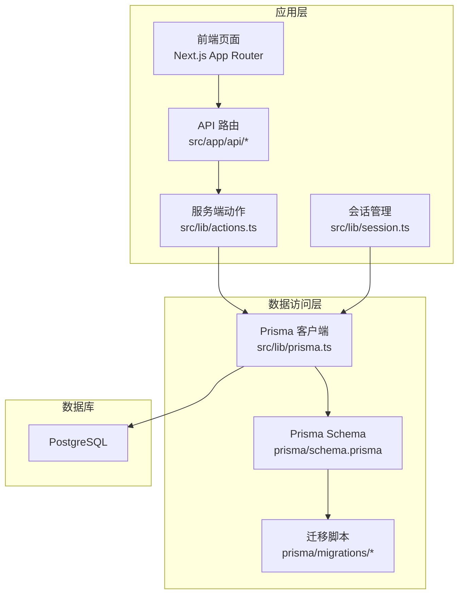
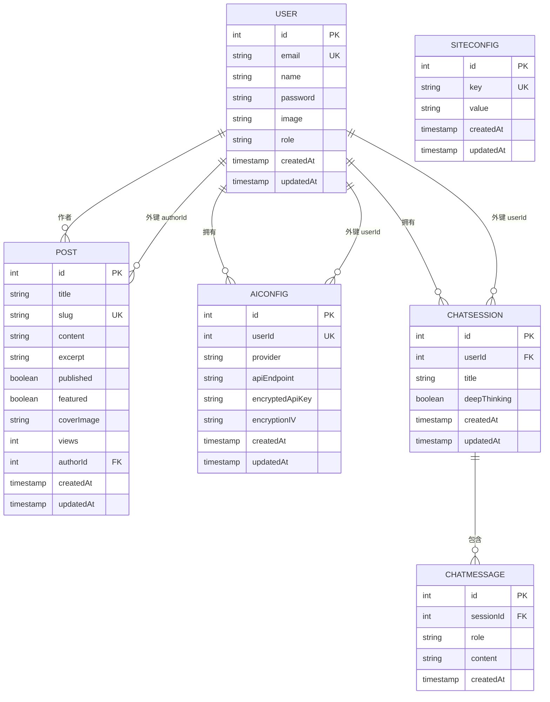
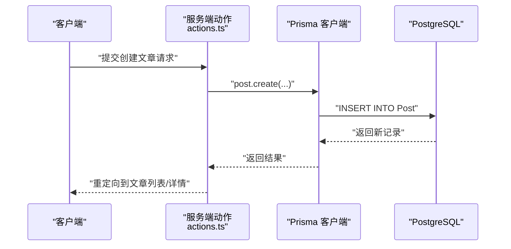
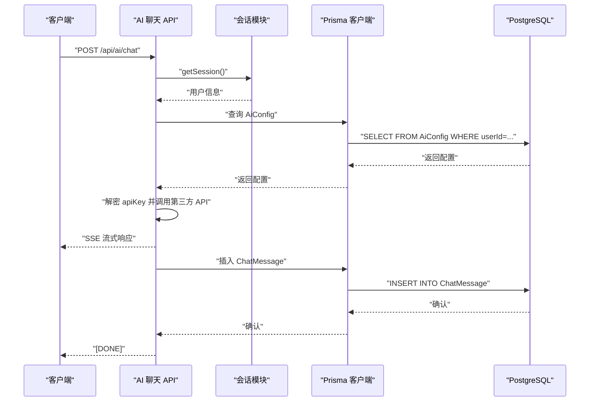
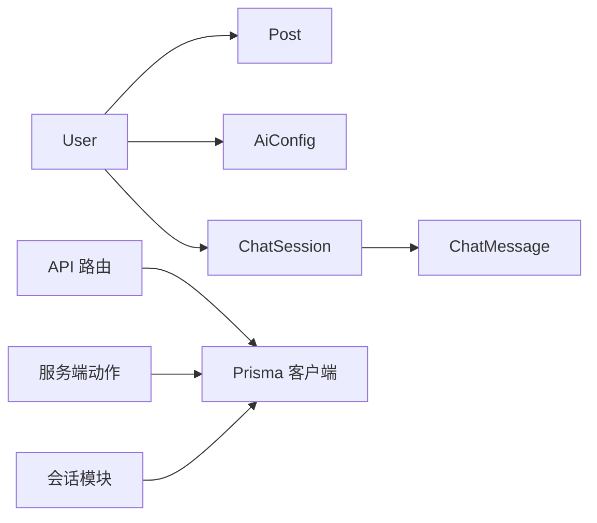

# 数据库设计

<cite>
**本文引用的文件**
- [schema.prisma](file://prisma/schema.prisma)
- [migration.sql](file://prisma/migrations/20260527095355_init/migration.sql)
- [seed.ts](file://prisma/seed.ts)
- [prisma.ts](file://src/lib/prisma.ts)
- [actions.ts](file://src/lib/actions.ts)
- [session.ts](file://src/lib/session.ts)
- [route.ts（站点配置）](file://src/app/api/site-config/route.ts)
- [route.ts（统计）](file://src/app/api/stats/route.ts)
- [route.ts（AI聊天）](file://src/app/api/ai/chat/route.ts)
- [route.ts（AI配置）](file://src/app/api/ai/config/route.ts)
- [route.ts（AI消息）](file://src/app/api/ai/messages/route.ts)
- [route.ts（AI会话）](file://src/app/api/ai/sessions/route.ts)
</cite>

## 目录
1. [简介](#简介)
2. [项目结构](#项目结构)
3. [核心组件](#核心组件)
4. [架构总览](#架构总览)
5. [详细组件分析](#详细组件分析)
6. [依赖分析](#依赖分析)
7. [性能考虑](#性能考虑)
8. [故障排除指南](#故障排除指南)
9. [结论](#结论)
10. [附录](#附录)

## 简介
本文件为该 Next.js 博客系统的数据库设计综合文档，基于 Prisma 模型与迁移脚本，结合实际数据访问层与 API 路由，系统性梳理实体关系、字段定义、主键/外键、索引与约束、数据验证与业务规则，并提供模式图、示例数据、数据访问模式、缓存策略、性能考量、数据生命周期与归档、迁移路径与版本管理、以及数据安全与隐私要求。

## 项目结构
系统采用 Prisma 作为 ORM，PostgreSQL 作为数据库，通过迁移脚本初始化表结构；应用层通过 Prisma 客户端进行数据访问，Next.js API 路由提供对外接口；会话与认证逻辑通过 JWT 实现。

**图表来源**
- [prisma.ts:1-16](file://src/lib/prisma.ts#L1-L16)
- [schema.prisma:1-86](file://prisma/schema.prisma#L1-L86)
- [migration.sql:1-47](file://prisma/migrations/20260527095355_init/migration.sql#L1-L47)

**章节来源**
- [prisma.ts:1-16](file://src/lib/prisma.ts#L1-L16)
- [schema.prisma:1-86](file://prisma/schema.prisma#L1-L86)
- [migration.sql:1-47](file://prisma/migrations/20260527095355_init/migration.sql#L1-L47)

## 核心组件
- 用户（User）
  - 主键：id（自增整数）
  - 唯一约束：email
  - 字段：email、name、password、image、role（默认值）、createdAt、updatedAt
  - 关系：一对多到 Post、AiConfig、ChatSession
- 文章（Post）
  - 主键：id（自增整数）
  - 唯一约束：slug
  - 字段：title、slug、content、excerpt、published（默认 false）、featured（默认 false）、coverImage、views（默认 0）、authorId、createdAt、updatedAt
  - 外键：authorId → User.id（级联删除）
  - 索引：slug、(published, createdAt)
- AI 配置（AiConfig）
  - 主键：id（自增整数）
  - 唯一约束：userId（一对一关联用户）
  - 字段：userId、provider（默认 deepseek）、apiEndpoint（默认特定值）、encryptedApiKey、encryptionIV、createdAt、updatedAt
  - 外键：userId → User.id（级联删除）
- 聊天会话（ChatSession）
  - 主键：id（自增整数）
  - 字段：userId、title（默认“新对话”）、deepThinking（默认 false）、createdAt、updatedAt
  - 外键：userId → User.id（级联删除）
  - 索引：(userId, createdAt)
- 聊天消息（ChatMessage）
  - 主键：id（自增整数）
  - 字段：sessionId、role、content、createdAt
  - 外键：sessionId → ChatSession.id（级联删除）
  - 索引：(sessionId, createdAt)
- 站点配置（SiteConfig）
  - 主键：id（自增整数）
  - 唯一约束：key
  - 字段：key、value、createdAt、updatedAt

**章节来源**
- [schema.prisma:10-85](file://prisma/schema.prisma#L10-L85)
- [migration.sql:1-47](file://prisma/migrations/20260527095355_init/migration.sql#L1-L47)

## 架构总览
下图展示数据库实体之间的关系与关键约束，映射到实际的 Prisma 模型与迁移脚本。

**图表来源**
- [schema.prisma:10-85](file://prisma/schema.prisma#L10-L85)
- [migration.sql:1-47](file://prisma/migrations/20260527095355_init/migration.sql#L1-L47)

## 详细组件分析

### 用户（User）与文章（Post）
- 关系：一个用户可发布多篇文章，文章通过 authorId 关联到用户。
- 约束：用户邮箱唯一；文章 slug 唯一；Post.authorId 外键指向 User.id 并设置级联删除。
- 索引：Post.slug 上建立唯一索引与普通索引；复合索引 (published, createdAt) 用于高效查询已发布文章并按时间排序。
- 业务规则：
  - 创建文章时自动填充 views=0、published=false、featured=false。
  - 更新文章时需校验作者身份或管理员角色。
  - 查看文章时递增 views 字段。
- 数据访问模式：
  - 列表：按 published=true 且按 createdAt 降序分页取前 N 条。
  - 详情：按 slug 查询并包含作者信息。
  - 搜索：对 title 与 excerpt 进行不区分大小写的模糊匹配。

**图表来源**
- [actions.ts:76-100](file://src/lib/actions.ts#L76-L100)
- [schema.prisma:24-41](file://prisma/schema.prisma#L24-L41)

**章节来源**
- [schema.prisma:24-41](file://prisma/schema.prisma#L24-L41)
- [migration.sql:15-46](file://prisma/migrations/20260527095355_init/migration.sql#L15-L46)
- [actions.ts:60-150](file://src/lib/actions.ts#L60-L150)

### AI 配置（AiConfig）与聊天（ChatSession/ChatMessage）
- 关系：每个用户仅有一份 AI 配置；聊天会话属于用户；消息属于会话。
- 约束：AiConfig.userId 唯一；ChatSession.userId、ChatMessage.sessionId 外键分别指向 User.id 与 ChatSession.id，并设置级联删除。
- 索引：ChatSession(userId, createdAt)、ChatMessage(sessionId, createdAt)。
- 业务规则：
  - AI 聊天接口在发送消息前检查用户是否已配置密钥。
  - 流式响应中逐行解析 SSE 数据，拼接后写入 ChatMessage 表。
  - 若会话标题仍为默认值，则从第一条用户消息截断作为标题。
- 数据访问模式：
  - 获取配置：根据当前用户查询 AiConfig，返回脱敏后的 apiKey。
  - 保存配置：对 apiKey 进行加密存储，同时保存 IV。
  - 会话管理：列出、创建、删除用户自己的会话。
  - 消息管理：按会话 ID 查询消息列表并按时间排序。

**图表来源**
- [route.ts（AI聊天）:1-134](file://src/app/api/ai/chat/route.ts#L1-L134)
- [route.ts（AI配置）:1-66](file://src/app/api/ai/config/route.ts#L1-L66)
- [route.ts（AI消息）:1-33](file://src/app/api/ai/messages/route.ts#L1-L33)
- [route.ts（AI会话）:1-60](file://src/app/api/ai/sessions/route.ts#L1-L60)
- [session.ts:54-65](file://src/lib/session.ts#L54-L65)

**章节来源**
- [schema.prisma:43-77](file://prisma/schema.prisma#L43-L77)
- [migration.sql:1-47](file://prisma/migrations/20260527095355_init/migration.sql#L1-L47)
- [route.ts（AI聊天）:1-134](file://src/app/api/ai/chat/route.ts#L1-L134)
- [route.ts（AI配置）:1-66](file://src/app/api/ai/config/route.ts#L1-L66)
- [route.ts（AI消息）:1-33](file://src/app/api/ai/messages/route.ts#L1-L33)
- [route.ts（AI会话）:1-60](file://src/app/api/ai/sessions/route.ts#L1-L60)
- [session.ts:54-79](file://src/lib/session.ts#L54-L79)

### 站点配置（SiteConfig）
- 用途：以键值对形式存储运行时配置，便于动态调整。
- 索引：key 唯一。
- 数据访问模式：批量 upsert，GET 返回扁平对象。

**章节来源**
- [schema.prisma:79-85](file://prisma/schema.prisma#L79-L85)
- [route.ts（站点配置）:1-35](file://src/app/api/site-config/route.ts#L1-L35)

### 统计（Stats）
- 查询：并发统计已发布文章数量、总浏览量、用户总数。
- 数据访问模式：Promise.all 并行查询，聚合结果返回。

**章节来源**
- [route.ts（统计）:1-21](file://src/app/api/stats/route.ts#L1-L21)
- [actions.ts:156-167](file://src/lib/actions.ts#L156-L167)

## 依赖分析
- 模型依赖：Post.authorId → User.id；AiConfig.userId → User.id；ChatSession.userId → User.id；ChatMessage.sessionId → ChatSession.id。
- 应用依赖：API 路由依赖会话模块与 Prisma 客户端；服务端动作封装常用数据操作并集成缓存失效。
- 外部依赖：AI 聊天依赖第三方大模型 API，使用 SSE 流式传输。

**图表来源**
- [schema.prisma:10-85](file://prisma/schema.prisma#L10-L85)
- [route.ts（AI聊天）:1-134](file://src/app/api/ai/chat/route.ts#L1-L134)
- [actions.ts:1-200](file://src/lib/actions.ts#L1-L200)
- [session.ts:1-79](file://src/lib/session.ts#L1-L79)

**章节来源**
- [schema.prisma:10-85](file://prisma/schema.prisma#L10-L85)
- [route.ts（AI聊天）:1-134](file://src/app/api/ai/chat/route.ts#L1-L134)
- [actions.ts:1-200](file://src/lib/actions.ts#L1-L200)
- [session.ts:1-79](file://src/lib/session.ts#L1-L79)

## 性能考虑
- 索引策略
  - Post.slug：唯一索引 + 普通索引，满足按 slug 查询与排序需求。
  - Post.published + Post.createdAt：复合索引，优化“已发布文章按时间倒序”的查询。
  - ChatSession(userId, createdAt)、ChatMessage(sessionId, createdAt)：加速用户会话列表与消息列表查询。
- 查询优化
  - 使用 select/orderBy/take 控制返回字段与分页。
  - 并发查询：统计接口使用 Promise.all 并行执行多个聚合查询。
- 写入优化
  - 文章浏览量 views 使用原子自增，避免热点竞争。
- 缓存策略
  - 应用层通过 revalidatePath 触发 Next.js 缓存失效，确保数据变更后及时刷新。
  - 开发环境开启 Prisma 日志，生产环境关闭冗余日志，降低开销。
- I/O 优化
  - AI 聊天使用流式响应，边接收边输出，减少等待时间。

**章节来源**
- [migration.sql:33-46](file://prisma/migrations/20260527095355_init/migration.sql#L33-L46)
- [actions.ts:60-150](file://src/lib/actions.ts#L60-L150)
- [route.ts（统计）:6-10](file://src/app/api/stats/route.ts#L6-L10)
- [prisma.ts:8-11](file://src/lib/prisma.ts#L8-L11)

## 故障排除指南
- 登录/注册失败
  - 现象：邮箱或密码错误、邮箱已存在。
  - 排查：确认 credentials 校验流程与 bcrypt 密码比对逻辑。
- 权限不足
  - 现象：更新/删除文章时报无权限。
  - 排查：确认当前会话用户与文章作者一致或具备管理员角色。
- AI 配置缺失
  - 现象：调用 AI 聊天接口提示未配置 API Key。
  - 排查：确认 AiConfig 是否为当前用户创建，且加密存储正确。
- 会话/消息越权
  - 现象：获取消息或会话列表返回无权限。
  - 排查：确认 sessionId 或 userId 与当前会话用户一致。
- 统计异常
  - 现象：统计接口返回 0 或报错。
  - 排查：检查 Prisma 查询条件与并发聚合逻辑。

**章节来源**
- [actions.ts:102-143](file://src/lib/actions.ts#L102-L143)
- [route.ts（AI聊天）:18-20](file://src/app/api/ai/chat/route.ts#L18-L20)
- [route.ts（AI消息）:14-20](file://src/app/api/ai/messages/route.ts#L14-L20)
- [route.ts（统计）:4-19](file://src/app/api/stats/route.ts#L4-L19)

## 结论
该数据库设计围绕用户、文章、AI 配置与聊天会话构建，通过合理的主外键关系、索引与约束保障一致性与性能。配合 Prisma 的强类型模型与 Next.js 的 API 路由，实现了清晰的数据访问模式与良好的扩展性。建议后续在生产环境中进一步完善审计日志、备份策略与监控告警，以满足企业级数据治理要求。

## 附录

### 示例数据
- 用户（User）
  - email: demo@example.com
  - name: Demo User
  - role: admin
  - password: 已哈希
- 文章（Post）
  - title: Next.js 15 新特性详解
  - slug: nextjs-15-features
  - published: true
  - featured: true
  - excerpt: 摘要...
  - content: 正文...
  - authorId: 对应用户 id
- AI 配置（AiConfig）
  - userId: 对应用户 id
  - provider: deepseek
  - apiEndpoint: https://api.deepseek.com/v1
  - encryptedApiKey: 已加密
  - encryptionIV: 随机向量
- 聊天会话（ChatSession）
  - userId: 对应用户 id
  - title: 新对话
  - deepThinking: false
- 聊天消息（ChatMessage）
  - sessionId: 对应会话 id
  - role: user 或 assistant
  - content: 消息内容
- 站点配置（SiteConfig）
  - key: 示例键
  - value: 示例值

**章节来源**
- [seed.ts:6-99](file://prisma/seed.ts#L6-L99)
- [schema.prisma:10-85](file://prisma/schema.prisma#L10-L85)

### 数据访问模式清单
- 用户
  - 注册：邮箱唯一性检查 + 密码哈希 + 创建用户 + 自动登录
  - 登录：邮箱查找 + 密码比对 + 创建会话
  - 登出：删除会话 Cookie
- 文章
  - 列表：published=true + 分页 + 排序
  - 详情：按 slug 查询 + 包含作者信息
  - 创建/更新/删除：鉴权 + 业务校验 + 缓存失效
  - 浏览量：views 自增
- 统计
  - 并发 count/aggregate
- 站点配置
  - 批量 upsert
- AI
  - 配置：获取（脱敏）+ 保存（加密）
  - 会话：列表/创建/删除
  - 消息：按会话查询
  - 聊天：流式响应 + 写入消息 + 标题更新

**章节来源**
- [actions.ts:13-150](file://src/lib/actions.ts#L13-L150)
- [route.ts（站点配置）:4-34](file://src/app/api/site-config/route.ts#L4-L34)
- [route.ts（统计）:4-20](file://src/app/api/stats/route.ts#L4-L20)
- [route.ts（AI聊天）:6-133](file://src/app/api/ai/chat/route.ts#L6-L133)
- [route.ts（AI配置）:6-65](file://src/app/api/ai/config/route.ts#L6-L65)
- [route.ts（AI消息）:5-32](file://src/app/api/ai/messages/route.ts#L5-L32)
- [route.ts（AI会话）:5-59](file://src/app/api/ai/sessions/route.ts#L5-L59)

### 数据生命周期、保留策略与归档
- 生命周期
  - 用户：长期保留，支持注销清理会话。
  - 文章：草稿/已发布状态切换，删除后级联清理相关会话与消息。
  - AI 配置：随用户存在，删除用户时级联清理。
  - 聊天会话与消息：按用户维度管理，支持删除单个会话及其中所有消息。
- 保留策略
  - 建议对历史文章与聊天记录设定保留期限（如 1 年），到期后归档至冷存储。
- 归档规则
  - 定期导出统计与配置快照，保留审计证据。
  - 对敏感字段（如 API Key）仅保留加密副本，定期轮换 IV。

### 数据迁移路径与版本管理
- 迁移流程
  - 在 schema.prisma 中修改模型后生成新迁移文件，执行迁移脚本同步数据库。
  - 使用 seed.ts 初始化演示数据，便于本地开发与测试。
- 版本管理
  - 迁移文件名带时间戳，保证顺序与幂等。
  - 生产环境迁移前先在预生产验证，再灰度发布。

**章节来源**
- [schema.prisma:1-86](file://prisma/schema.prisma#L1-L86)
- [migration.sql:1-47](file://prisma/migrations/20260527095355_init/migration.sql#L1-L47)
- [seed.ts:1-108](file://prisma/seed.ts#L1-L108)

### 数据安全与隐私
- 传输安全
  - 生产环境启用 HTTPS，Cookie 设置 secure 属性。
- 存储安全
  - 密码使用 bcrypt 哈希存储；API Key 采用对称加密存储并分离 IV。
- 访问控制
  - 所有受保护接口均需有效会话；AI 消息与会话读取需校验归属。
- 隐私合规
  - 提供用户注销功能，删除会话与相关数据；支持导出/删除个人数据。

**章节来源**
- [session.ts:36-52](file://src/lib/session.ts#L36-L52)
- [route.ts（AI配置）:42-59](file://src/app/api/ai/config/route.ts#L42-L59)
- [route.ts（AI消息）:18-20](file://src/app/api/ai/messages/route.ts#L18-L20)
- [route.ts（AI会话）:51-53](file://src/app/api/ai/sessions/route.ts#L51-L53)