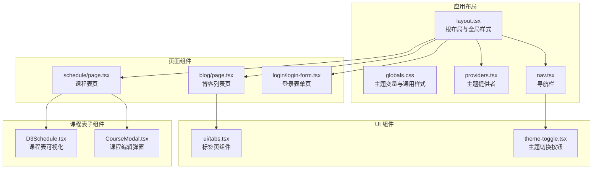
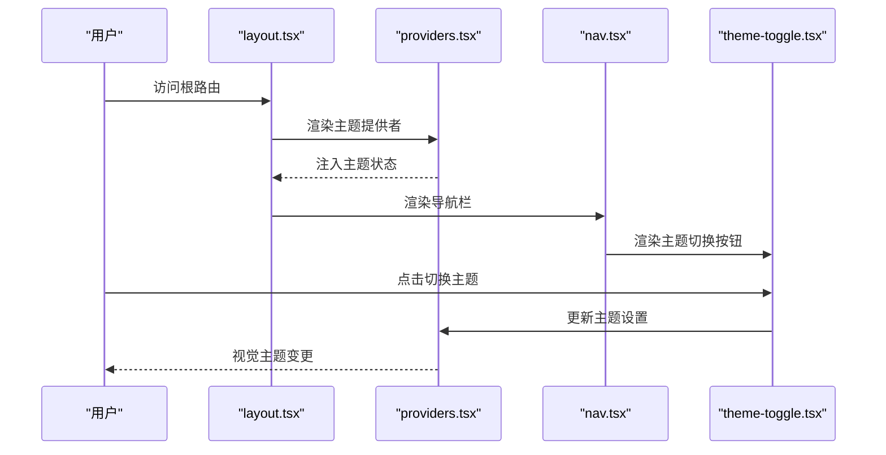
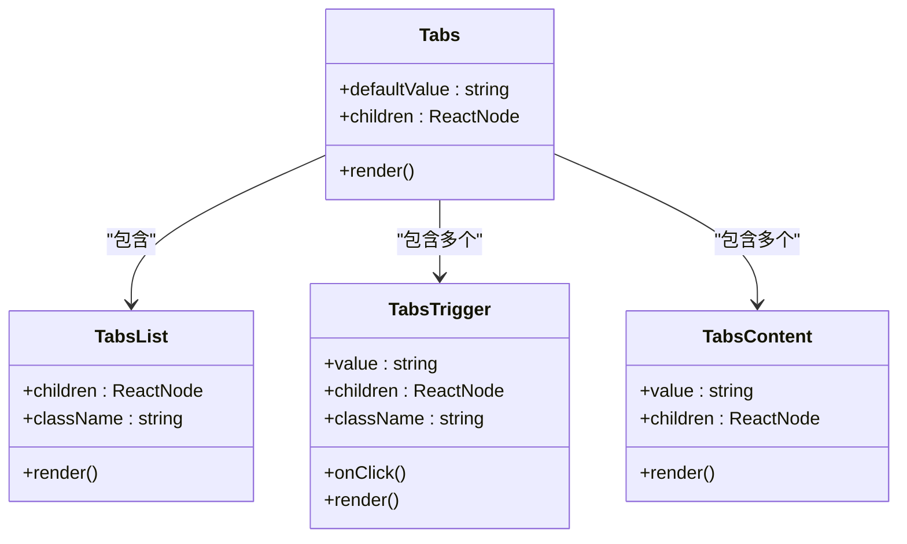
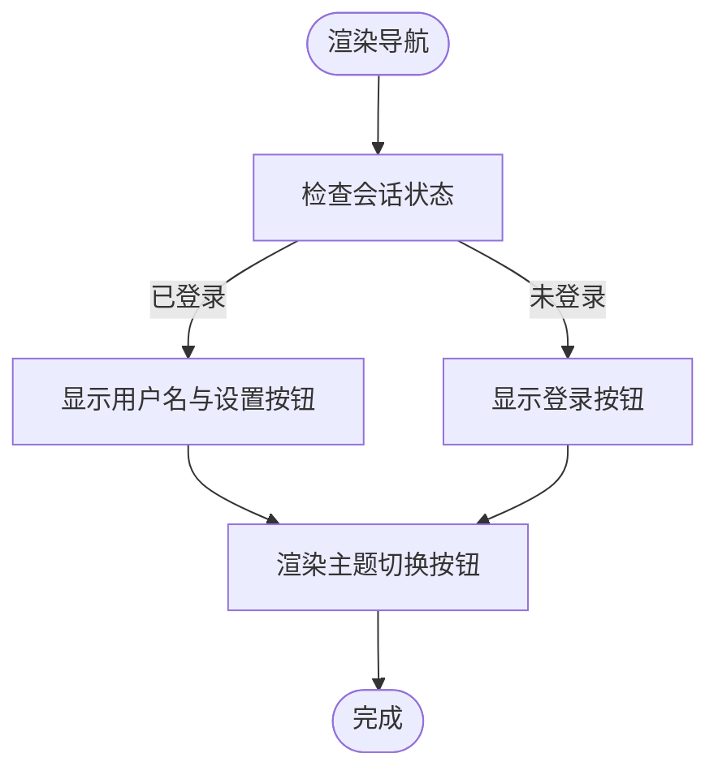
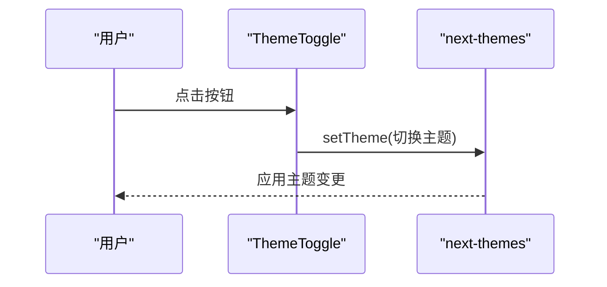
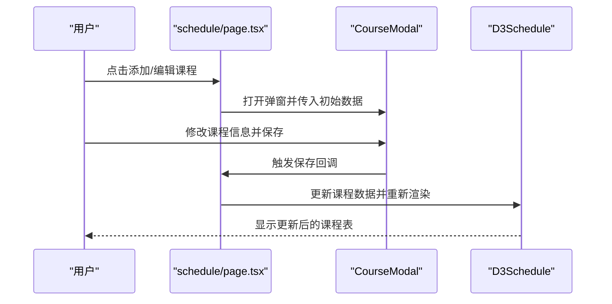
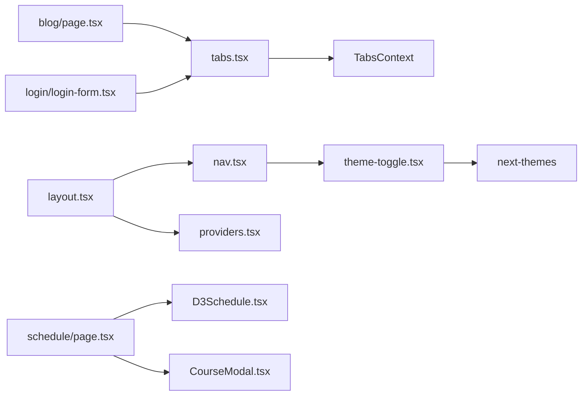

# 用户界面组件

<cite>
**本文引用的文件**
- [src/components/ui/tabs.tsx](file://src/components/ui/tabs.tsx)
- [src/components/nav.tsx](file://src/components/nav.tsx)
- [src/components/theme-toggle.tsx](file://src/components/theme-toggle.tsx)
- [src/components/providers.tsx](file://src/components/providers.tsx)
- [src/app/layout.tsx](file://src/app/layout.tsx)
- [src/app/globals.css](file://src/app/globals.css)
- [src/app/blog/page.tsx](file://src/app/blog/page.tsx)
- [src/app/schedule/page.tsx](file://src/app/schedule/page.tsx)
- [src/components/schedule/CourseModal.tsx](file://src/components/schedule/CourseModal.tsx)
- [src/components/schedule/D3Schedule.tsx](file://src/components/schedule/D3Schedule.tsx)
- [src/app/login/login-form.tsx](file://src/app/login/login-form.tsx)
</cite>

## 目录
1. [简介](#简介)
2. [项目结构](#项目结构)
3. [核心组件](#核心组件)
4. [架构概览](#架构概览)
5. [详细组件分析](#详细组件分析)
6. [依赖关系分析](#依赖关系分析)
7. [性能考虑](#性能考虑)
8. [故障排除指南](#故障排除指南)
9. [结论](#结论)
10. [附录](#附录)

## 简介
本文件为该 Next.js 博客系统的用户界面组件提供全面的技术文档。重点覆盖以下方面：
- 组件的视觉外观、行为与用户交互模式
- Props/属性、事件、插槽与自定义选项
- 带有代码片段路径的使用示例
- 响应式设计与无障碍访问合规性指南
- 组件状态、动画与过渡效果
- 样式自定义与主题支持
- 跨浏览器兼容性与性能优化
- 组件组合模式与与其他 UI 元素的集成

## 项目结构
该项目采用按功能分层的组织方式，UI 组件主要位于 `src/components` 目录下，并通过应用布局在页面中统一渲染。

**图表来源**
- [src/app/layout.tsx:24-43](file://src/app/layout.tsx#L24-L43)
- [src/app/globals.css:1-628](file://src/app/globals.css#L1-L628)
- [src/components/providers.tsx:6-12](file://src/components/providers.tsx#L6-L12)
- [src/components/nav.tsx:26-81](file://src/components/nav.tsx#L26-L81)
- [src/components/theme-toggle.tsx:7-26](file://src/components/theme-toggle.tsx#L7-L26)
- [src/components/ui/tabs.tsx:7-41](file://src/components/ui/tabs.tsx#L7-L41)
- [src/app/blog/page.tsx:1-89](file://src/app/blog/page.tsx#L1-L89)
- [src/app/schedule/page.tsx:1-324](file://src/app/schedule/page.tsx#L1-L324)
- [src/components/schedule/D3Schedule.tsx:124-203](file://src/components/schedule/D3Schedule.tsx#L124-L203)
- [src/components/schedule/CourseModal.tsx:17-356](file://src/components/schedule/CourseModal.tsx#L17-L356)
- [src/app/login/login-form.tsx:41-73](file://src/app/login/login-form.tsx#L41-L73)

**章节来源**
- [src/app/layout.tsx:24-43](file://src/app/layout.tsx#L24-L43)
- [src/app/globals.css:1-628](file://src/app/globals.css#L1-L628)

## 核心组件
本节概述项目中的关键 UI 组件及其职责：
- 标签页组件（Tabs）：提供可组合的标签页容器、触发器与内容区域，支持受控/非受控状态切换。
- 导航栏（Nav）：包含品牌标识、主导航链接、主题切换、用户登录/登出入口等。
- 主题切换按钮（ThemeToggle）：基于 next-themes 实现明暗主题切换，带无障碍标签与过渡动效。
- 主题提供者（Providers）：配置 next-themes 的主题持久化与系统偏好检测。
- 博客卡片列表（Blog Page）：展示文章封面、标题、摘要、作者与浏览量等信息，使用 iOS 风格卡片与悬停/按压反馈。
- 课程表（Schedule Page）：包含统计卡片、冲突提示、D3 可视化课程表、动态图例与课程编辑弹窗。
- 登录表单（Login Form）：使用 Tabs 组合登录/注册内容区，输入框具备焦点态高亮与错误提示。

**章节来源**
- [src/components/ui/tabs.tsx:7-41](file://src/components/ui/tabs.tsx#L7-L41)
- [src/components/nav.tsx:26-81](file://src/components/nav.tsx#L26-L81)
- [src/components/theme-toggle.tsx:7-26](file://src/components/theme-toggle.tsx#L7-L26)
- [src/components/providers.tsx:6-12](file://src/components/providers.tsx#L6-L12)
- [src/app/blog/page.tsx:41-84](file://src/app/blog/page.tsx#L41-L84)
- [src/app/schedule/page.tsx:68-238](file://src/app/schedule/page.tsx#L68-L238)
- [src/app/login/login-form.tsx:41-73](file://src/app/login/login-form.tsx#L41-L73)

## 架构概览
整体架构围绕「布局 → 提供者 → 导航 → 页面」的层次展开，主题系统通过 next-themes 在客户端生效；UI 组件以函数式组件与上下文组合的方式实现复用与状态共享。

**图表来源**
- [src/app/layout.tsx:24-43](file://src/app/layout.tsx#L24-L43)
- [src/components/providers.tsx:6-12](file://src/components/providers.tsx#L6-L12)
- [src/components/nav.tsx:52-77](file://src/components/nav.tsx#L52-L77)
- [src/components/theme-toggle.tsx:18-24](file://src/components/theme-toggle.tsx#L18-L24)

## 详细组件分析

### 标签页组件（Tabs）
- 功能与行为
  - 提供 Tabs 容器、TabsList 列表、TabsTrigger 触发器、TabsContent 内容区。
  - 使用 Context 在子组件间共享当前激活值与更新函数，确保触发器与内容区联动。
  - 触发器在激活态与非激活态具有不同的样式类，支持通过 className 扩展。
- 属性与事件
  - Tabs: defaultValue(string), children(ReactNode)
  - TabsList: children(ReactNode), className(string, 可选)
  - TabsTrigger: value(string), children(ReactNode), className(string, 可选)
  - TabsContent: value(string), children(ReactNode)
- 插槽与自定义
  - 通过 className 扩展样式；TabsList 默认提供 iOS 风格的背景与圆角。
- 无障碍与交互
  - 触发器为 button，支持键盘操作；未正确嵌套会抛出错误，避免误用。
- 示例（代码片段路径）
  - [登录表单中使用 Tabs:41-73](file://src/app/login/login-form.tsx#L41-L73)

**图表来源**
- [src/components/ui/tabs.tsx:7-41](file://src/components/ui/tabs.tsx#L7-L41)

**章节来源**
- [src/components/ui/tabs.tsx:7-41](file://src/components/ui/tabs.tsx#L7-L41)
- [src/app/login/login-form.tsx:41-73](file://src/app/login/login-form.tsx#L41-L73)

### 导航栏（Nav）
- 视觉外观
  - 固定顶部，玻璃模糊背景，品牌图标采用渐变色与阴影。
  - 导航项通过 NavLinks 渲染，右侧包含主题切换、用户信息与登录/登出按钮。
- 行为与交互
  - 支持登录态显示用户名与设置入口；未登录显示登录按钮。
  - 使用 Next.js Link 进行路由跳转，保持 SPA 导航体验。
- 属性与事件
  - 无显式 props；通过 session 状态控制渲染分支。
- 无障碍与响应式
  - 使用语义化标签与合适的字体大小；在小屏设备上隐藏部分文本以保证可读性。
- 示例（代码片段路径）
  - [导航栏主实现:26-81](file://src/components/nav.tsx#L26-L81)

**图表来源**
- [src/components/nav.tsx:26-81](file://src/components/nav.tsx#L26-L81)

**章节来源**
- [src/components/nav.tsx:26-81](file://src/components/nav.tsx#L26-L81)

### 主题切换按钮（ThemeToggle）
- 视觉外观
  - 圆形按钮，根据当前主题显示太阳/月亮图标，悬停与按压有缩放与透明度变化。
- 行为与交互
  - 点击切换明/暗主题；首次渲染使用 useSyncExternalStore 避免水合不一致。
  - 无障碍：提供 aria-label。
- 属性与事件
  - 无 props；内部通过 useTheme 获取/设置主题。
- 示例（代码片段路径）
  - [主题切换按钮实现:7-26](file://src/components/theme-toggle.tsx#L7-L26)

**图表来源**
- [src/components/theme-toggle.tsx:18-24](file://src/components/theme-toggle.tsx#L18-L24)

**章节来源**
- [src/components/theme-toggle.tsx:7-26](file://src/components/theme-toggle.tsx#L7-L26)

### 主题提供者（Providers）
- 功能与行为
  - 包装应用树，启用基于 class 的主题切换、系统主题检测与禁用过渡闪烁。
- 属性与事件
  - children: ReactNode
- 示例（代码片段路径）
  - [主题提供者配置:6-12](file://src/components/providers.tsx#L6-L12)

**章节来源**
- [src/components/providers.tsx:6-12](file://src/components/providers.tsx#L6-L12)

### 博客卡片列表（Blog Page）
- 视觉外观
  - iOS 风格卡片，悬停提升与阴影变化，按压缩放反馈；图片懒加载与尺寸适配。
- 行为与交互
  - 卡片容器支持分组悬停高亮；封面图在悬停时放大增强动感。
- 属性与事件
  - 无 props；通过服务端数据渲染。
- 示例（代码片段路径）
  - [博客卡片渲染:41-84](file://src/app/blog/page.tsx#L41-L84)

**章节来源**
- [src/app/blog/page.tsx:41-84](file://src/app/blog/page.tsx#L41-L84)

### 课程表（Schedule Page）
- 视觉外观
  - 统计卡片采用渐变背景与图标装饰；冲突提示条支持展开/收起；D3 课程表可视化。
- 行为与交互
  - 冲突检测与高亮；动态图例展示课程颜色；支持重置、添加、编辑、删除课程。
- 属性与事件
  - D3Schedule: courses, conflictIds, onEditCourse, onAddCourse
  - CourseModal: isOpen, onClose, onSave, onDelete, initialCourse, defaultDay, defaultHour, allCourses
- 示例（代码片段路径）
  - [课程表页面主逻辑:68-238](file://src/app/schedule/page.tsx#L68-L238)
  - [课程表可视化组件:124-203](file://src/components/schedule/D3Schedule.tsx#L124-L203)
  - [课程编辑弹窗:17-356](file://src/components/schedule/CourseModal.tsx#L17-L356)

**图表来源**
- [src/app/schedule/page.tsx:21-38](file://src/app/schedule/page.tsx#L21-L38)
- [src/components/schedule/CourseModal.tsx:17-356](file://src/components/schedule/CourseModal.tsx#L17-L356)
- [src/components/schedule/D3Schedule.tsx:124-203](file://src/components/schedule/D3Schedule.tsx#L124-L203)

**章节来源**
- [src/app/schedule/page.tsx:68-238](file://src/app/schedule/page.tsx#L68-L238)
- [src/components/schedule/D3Schedule.tsx:124-203](file://src/components/schedule/D3Schedule.tsx#L124-L203)
- [src/components/schedule/CourseModal.tsx:17-356](file://src/components/schedule/CourseModal.tsx#L17-L356)

### 登录表单（Login Form）
- 视觉外观
  - 输入框聚焦时出现高亮边框与阴影；错误信息以柔和背景提示。
- 行为与交互
  - 使用 Tabs 组织登录/注册内容区；提交后触发服务端动作。
- 属性与事件
  - 无 props；通过表单 action 与状态管理处理提交。
- 示例（代码片段路径）
  - [登录表单内容区:41-73](file://src/app/login/login-form.tsx#L41-L73)

**章节来源**
- [src/app/login/login-form.tsx:41-73](file://src/app/login/login-form.tsx#L41-L73)

## 依赖关系分析
- 组件耦合
  - Tabs 通过 Context 与 Trigger/Content 解耦，提高复用性。
  - Nav 依赖 ThemeToggle 与 Session 状态，形成导航层的组合。
  - Schedule 页面聚合 CourseModal 与 D3Schedule，形成复杂交互闭环。
- 外部依赖
  - next-themes：主题状态管理与持久化。
  - lucide-react：图标库。
  - TailwindCSS/自定义 CSS 变量：主题与动效实现。
- 潜在循环依赖
  - 当前文件间无直接循环导入。

**图表来源**
- [src/components/ui/tabs.tsx:3-5](file://src/components/ui/tabs.tsx#L3-L5)
- [src/components/nav.tsx:4-5](file://src/components/nav.tsx#L4-L5)
- [src/components/theme-toggle.tsx:3-3](file://src/components/theme-toggle.tsx#L3-L3)
- [src/app/layout.tsx:4-5](file://src/app/layout.tsx#L4-L5)
- [src/components/providers.tsx:3-3](file://src/components/providers.tsx#L3-L3)
- [src/app/blog/page.tsx:1-1](file://src/app/blog/page.tsx#L1-L1)
- [src/app/schedule/page.tsx:5-6](file://src/app/schedule/page.tsx#L5-L6)
- [src/components/schedule/D3Schedule.tsx:124-124](file://src/components/schedule/D3Schedule.tsx#L124-L124)
- [src/components/schedule/CourseModal.tsx:17-17](file://src/components/schedule/CourseModal.tsx#L17-L17)
- [src/app/login/login-form.tsx:41-41](file://src/app/login/login-form.tsx#L41-L41)

**章节来源**
- [src/components/ui/tabs.tsx:3-5](file://src/components/ui/tabs.tsx#L3-L5)
- [src/components/nav.tsx:4-5](file://src/components/nav.tsx#L4-L5)
- [src/components/theme-toggle.tsx:3-3](file://src/components/theme-toggle.tsx#L3-L3)
- [src/app/layout.tsx:4-5](file://src/app/layout.tsx#L4-L5)
- [src/components/providers.tsx:3-3](file://src/components/providers.tsx#L3-L3)
- [src/app/blog/page.tsx:1-1](file://src/app/blog/page.tsx#L1-L1)
- [src/app/schedule/page.tsx:5-6](file://src/app/schedule/page.tsx#L5-L6)
- [src/components/schedule/D3Schedule.tsx:124-124](file://src/components/schedule/D3Schedule.tsx#L124-L124)
- [src/components/schedule/CourseModal.tsx:17-17](file://src/components/schedule/CourseModal.tsx#L17-L17)
- [src/app/login/login-form.tsx:41-41](file://src/app/login/login-form.tsx#L41-L41)

## 性能考虑
- 图片懒加载与尺寸适配
  - 博客卡片中的封面图使用懒加载与多尺寸 sizes，减少首屏压力。
- 动画与过渡
  - 使用 CSS 动画与过渡（如卡片悬停、输入框聚焦、气泡出现），建议在低端设备上适度降低动画强度。
- 主题切换
  - 通过 useSyncExternalStore 避免水合不一致导致的闪烁。
- 交互反馈
  - 按钮与卡片的按压/悬停反馈使用 transform 与 box-shadow，注意 GPU 加速与层级管理。

**章节来源**
- [src/app/blog/page.tsx:48-56](file://src/app/blog/page.tsx#L48-L56)
- [src/components/theme-toggle.tsx:9-13](file://src/components/theme-toggle.tsx#L9-L13)
- [src/app/globals.css:133-149](file://src/app/globals.css#L133-L149)
- [src/app/globals.css:280-335](file://src/app/globals.css#L280-L335)
- [src/app/globals.css:424-443](file://src/app/globals.css#L424-L443)

## 故障排除指南
- TabsTrigger 必须在 Tabs 内部使用
  - 若未正确嵌套，会抛出错误，需确保 Trigger 在 TabsList/TabsContent 内部。
- 主题切换无效或闪烁
  - 确认 Providers 已包裹应用树；检查 useSyncExternalStore 的挂载时机。
- 导航按钮不可点击
  - 检查 Link 组件的 href 与权限状态；确认按钮样式未被覆盖。
- 课程表冲突提示不显示
  - 确认 detectConflicts 返回结果与冲突 ID 集合正确传递给 D3Schedule。
- 登录表单提交失败
  - 检查表单 action 是否正确绑定；查看错误信息提示样式是否生效。

**章节来源**
- [src/components/ui/tabs.tsx:21-23](file://src/components/ui/tabs.tsx#L21-L23)
- [src/components/theme-toggle.tsx:9-13](file://src/components/theme-toggle.tsx#L9-L13)
- [src/app/schedule/page.tsx:46-48](file://src/app/schedule/page.tsx#L46-L48)

## 结论
本项目的 UI 组件体系以简洁、可组合为核心设计原则：通过 Tabs 提供标签页能力，通过 Nav/ThemeToggle 构建导航与主题系统，通过页面组件承载业务场景（博客、课程表、登录）。配合 TailwindCSS 与 CSS 变量，实现了主题一致、动效自然、响应式友好的用户体验。建议在复杂交互场景中进一步抽象状态管理与事件流，以提升可维护性与可测试性。

## 附录

### 响应式设计与无障碍访问合规性
- 响应式设计
  - 使用 Tailwind 断点与相对单位，确保在移动端与桌面端均有良好表现。
  - 导航栏在小屏设备上隐藏部分文本，避免拥挤。
- 无障碍访问
  - 按钮与交互元素具备明确的 aria-label 或文本标签。
  - 表单输入具备聚焦态高亮与错误提示，便于键盘与屏幕阅读器使用。

**章节来源**
- [src/app/globals.css:621-627](file://src/app/globals.css#L621-L627)
- [src/components/nav.tsx:37-49](file://src/components/nav.tsx#L37-L49)
- [src/components/theme-toggle.tsx:21-21](file://src/components/theme-toggle.tsx#L21-L21)
- [src/app/login/login-form.tsx:44-61](file://src/app/login/login-form.tsx#L44-L61)

### 样式自定义与主题支持
- 主题变量
  - 通过 CSS 变量与 @theme inline 定义主题色彩与半径，支持明/暗两套配色。
- 组件样式扩展
  - 大多数组件支持 className 扩展，便于局部定制。
- 动画与过渡
  - 卡片、输入框、气泡等元素使用 CSS 动画与过渡，提升交互质感。

**章节来源**
- [src/app/globals.css:15-39](file://src/app/globals.css#L15-L39)
- [src/app/globals.css:41-81](file://src/app/globals.css#L41-L81)
- [src/components/ui/tabs.tsx:16-33](file://src/components/ui/tabs.tsx#L16-L33)
- [src/app/globals.css:133-149](file://src/app/globals.css#L133-L149)
- [src/app/globals.css:280-335](file://src/app/globals.css#L280-L335)
- [src/app/globals.css:424-443](file://src/app/globals.css#L424-L443)

### 跨浏览器兼容性
- 字体与滚动条
  - 使用现代字体加载策略与自定义滚动条样式，注意在旧版浏览器上的降级处理。
- 动画与过渡
  - 使用标准 CSS 动画与过渡，确保在主流浏览器中平滑运行。
- 无障碍与键盘导航
  - 确保按钮与表单元素可通过键盘访问，提供可见的焦点指示。

**章节来源**
- [src/app/globals.css:83-87](file://src/app/globals.css#L83-L87)
- [src/app/globals.css:106-130](file://src/app/globals.css#L106-L130)
- [src/components/theme-toggle.tsx:21-21](file://src/components/theme-toggle.tsx#L21-L21)