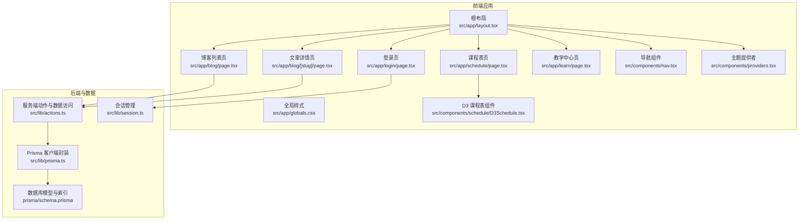
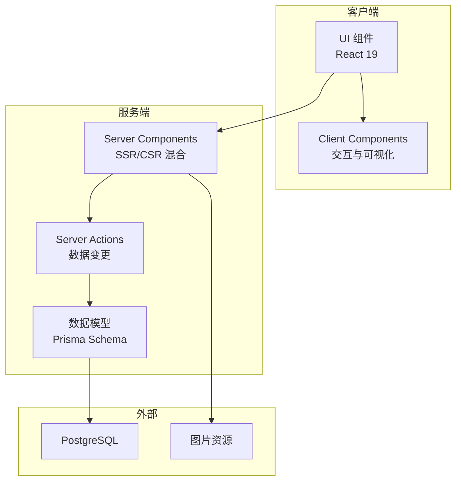
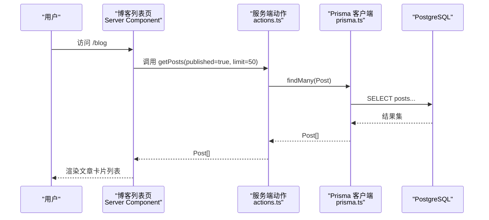
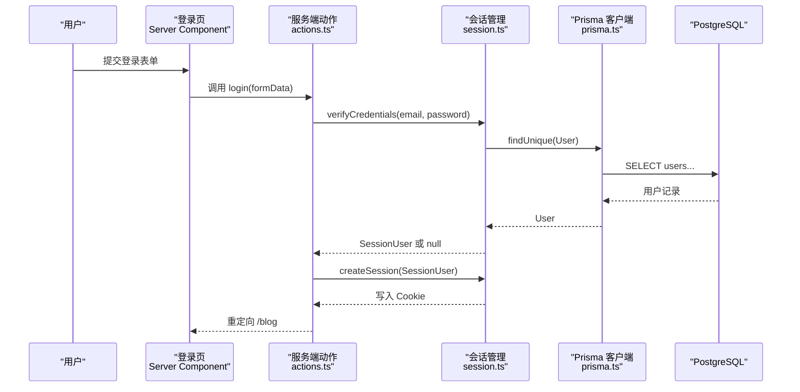
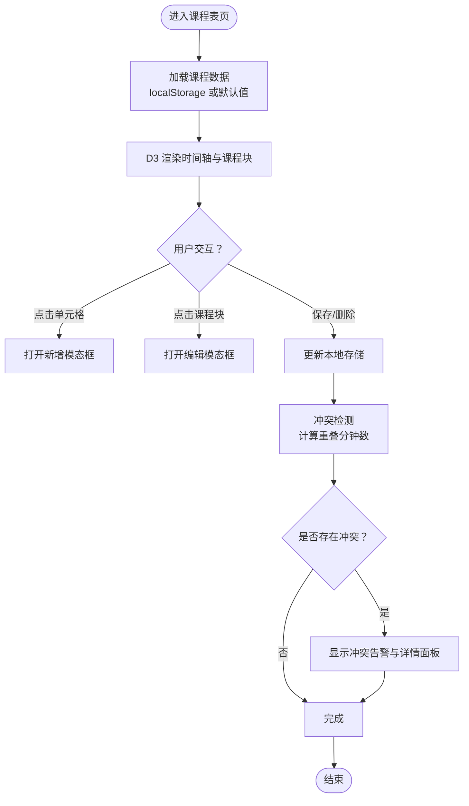
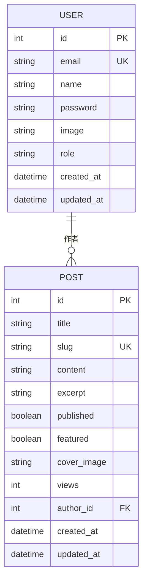
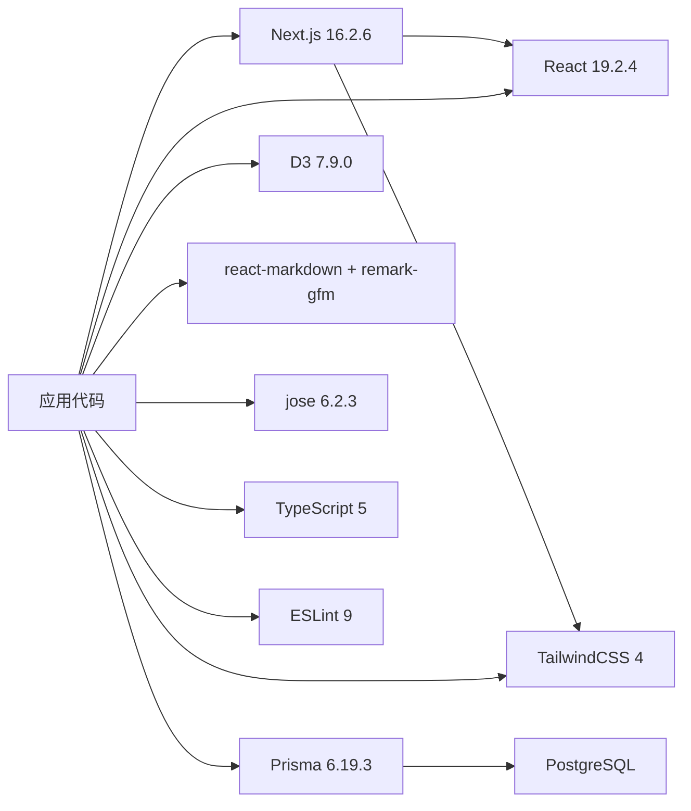
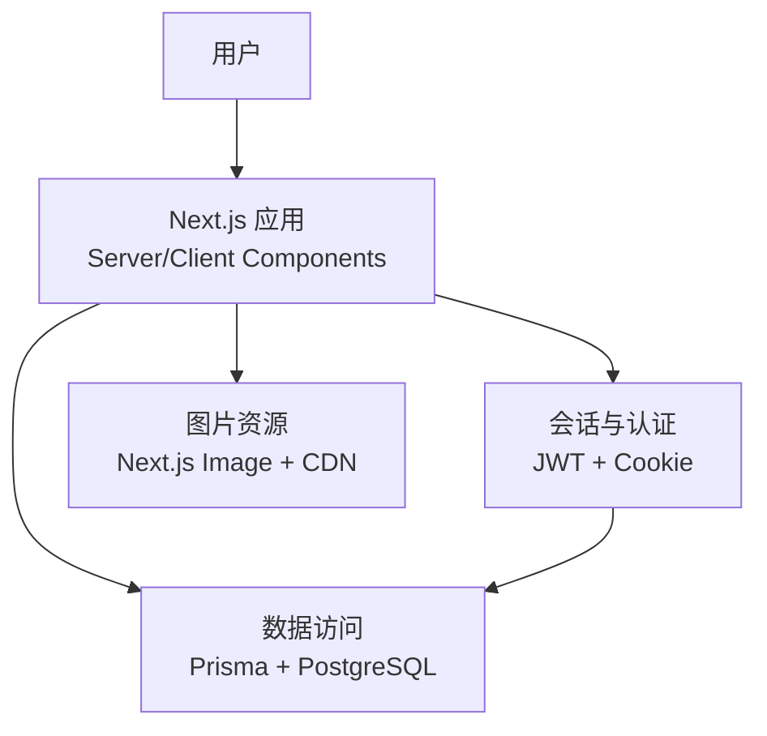

# 系统架构

<cite>
**本文引用的文件**
- [README.md](file://README.md)
- [package.json](file://package.json)
- [next.config.ts](file://next.config.ts)
- [tsconfig.json](file://tsconfig.json)
- [src/app/layout.tsx](file://src/app/layout.tsx)
- [src/app/blog/page.tsx](file://src/app/blog/page.tsx)
- [src/app/blog/[slug]/page.tsx](file://src/app/blog/[slug]/page.tsx)
- [src/app/login/page.tsx](file://src/app/login/page.tsx)
- [src/app/schedule/page.tsx](file://src/app/schedule/page.tsx)
- [src/app/learn/page.tsx](file://src/app/learn/page.tsx)
- [src/app/globals.css](file://src/app/globals.css)
- [src/components/providers.tsx](file://src/components/providers.tsx)
- [src/components/nav.tsx](file://src/components/nav.tsx)
- [src/components/schedule/D3Schedule.tsx](file://src/components/schedule/D3Schedule.tsx)
- [src/lib/actions.ts](file://src/lib/actions.ts)
- [src/lib/session.ts](file://src/lib/session.ts)
- [src/lib/prisma.ts](file://src/lib/prisma.ts)
- [prisma/schema.prisma](file://prisma/schema.prisma)
</cite>

## 目录
1. [引言](#引言)
2. [项目结构](#项目结构)
3. [核心组件](#核心组件)
4. [架构总览](#架构总览)
5. [详细组件分析](#详细组件分析)
6. [依赖关系分析](#依赖关系分析)
7. [性能考量](#性能考量)
8. [故障排查指南](#故障排查指南)
9. [结论](#结论)
10. [附录](#附录)

## 引言
本文件为 Next.js 博客系统的技术架构文档，面向技术与非技术读者，系统化阐述系统的高层设计、架构模式、系统边界、App Router 架构、Server Components 与 Client Components 的交互、数据流向与集成模式，并对技术决策、权衡与约束条件进行说明。同时涵盖基础设施要求、可扩展性考虑、部署拓扑、安全、监控与灾难恢复等横切关注点，以及技术栈、第三方依赖与版本兼容性。

## 项目结构
该仓库采用 Next.js App Router 文件系统路由组织方式，页面与布局位于 src/app 下，通用组件位于 src/components，业务逻辑与数据访问位于 src/lib，数据库模型与迁移位于 prisma。整体采用分层与按功能域划分相结合的组织方式，便于维护与扩展。

**图表来源**
- [src/app/layout.tsx:1-42](file://src/app/layout.tsx#L1-L42)
- [src/app/blog/page.tsx:1-89](file://src/app/blog/page.tsx#L1-L89)
- [src/app/blog/[slug]/page.tsx](file://src/app/blog/[slug]/page.tsx#L1-L107)
- [src/app/login/page.tsx:1-19](file://src/app/login/page.tsx#L1-L19)
- [src/app/schedule/page.tsx:1-324](file://src/app/schedule/page.tsx#L1-L324)
- [src/app/learn/page.tsx:1-93](file://src/app/learn/page.tsx#L1-L93)
- [src/components/nav.tsx:1-79](file://src/components/nav.tsx#L1-L79)
- [src/components/providers.tsx:1-13](file://src/components/providers.tsx#L1-L13)
- [src/components/schedule/D3Schedule.tsx:1-545](file://src/components/schedule/D3Schedule.tsx#L1-L545)
- [src/lib/actions.ts:1-151](file://src/lib/actions.ts#L1-L151)
- [src/lib/session.ts:1-79](file://src/lib/session.ts#L1-L79)
- [src/lib/prisma.ts:1-16](file://src/lib/prisma.ts#L1-L16)
- [prisma/schema.prisma:1-40](file://prisma/schema.prisma#L1-L40)

**章节来源**
- [README.md:1-37](file://README.md#L1-L37)
- [package.json:1-42](file://package.json#L1-L42)
- [next.config.ts:1-18](file://next.config.ts#L1-L18)
- [tsconfig.json:1-35](file://tsconfig.json#L1-L35)

## 核心组件
- 根布局与主题系统
  - 根布局负责注入全局样式、主题提供者与导航，统一页面骨架与外观。
  - 主题提供者通过 next-themes 实现明暗主题切换与系统偏好同步。
- 导航与认证
  - 导航组件在服务端获取会话状态，根据登录态显示菜单与用户操作。
  - 会话管理基于 jose/JWT 存储在 HttpOnly Cookie 中，支持加密与校验。
- 博客功能
  - 列表页与详情页均为服务端渲染页面，使用 Prisma 查询数据；详情页异步增量增加阅读量。
  - 文章内容通过 react-markdown + remark-gfm 渲染，支持 GFM 表格等扩展。
- 课程表功能
  - 使用 D3 进行可视化排课，支持冲突检测、实时时间线、本地持久化与交互编辑。
- 数据访问与缓存
  - Prisma 客户端封装避免重复实例化，开发环境开启查询日志以便调试。
  - 服务端动作中使用 revalidatePath 触发增量缓存失效，保障数据一致性。

**章节来源**
- [src/app/layout.tsx:1-42](file://src/app/layout.tsx#L1-L42)
- [src/components/providers.tsx:1-13](file://src/components/providers.tsx#L1-L13)
- [src/components/nav.tsx:1-79](file://src/components/nav.tsx#L1-L79)
- [src/lib/session.ts:1-79](file://src/lib/session.ts#L1-L79)
- [src/app/blog/page.tsx:1-89](file://src/app/blog/page.tsx#L1-L89)
- [src/app/blog/[slug]/page.tsx](file://src/app/blog/[slug]/page.tsx#L1-L107)
- [src/lib/actions.ts:1-151](file://src/lib/actions.ts#L1-L151)
- [src/lib/prisma.ts:1-16](file://src/lib/prisma.ts#L1-L16)
- [src/app/schedule/page.tsx:1-324](file://src/app/schedule/page.tsx#L1-L324)
- [src/components/schedule/D3Schedule.tsx:1-545](file://src/components/schedule/D3Schedule.tsx#L1-L545)

## 架构总览
系统采用 Next.js App Router 的混合渲染架构：页面以 Server Components 为主，配合 Client Components 实现交互与可视化；数据访问通过 Prisma 与数据库交互；会话状态通过 JWT Cookie 管理；样式与主题通过 TailwindCSS 与 CSS 变量实现。

**图表来源**
- [src/app/blog/page.tsx:1-89](file://src/app/blog/page.tsx#L1-L89)
- [src/app/blog/[slug]/page.tsx](file://src/app/blog/[slug]/page.tsx#L1-L107)
- [src/app/schedule/page.tsx:1-324](file://src/app/schedule/page.tsx#L1-L324)
- [src/lib/actions.ts:1-151](file://src/lib/actions.ts#L1-L151)
- [prisma/schema.prisma:1-40](file://prisma/schema.prisma#L1-L40)

## 详细组件分析

### 博客列表与详情流程
- 列表页：服务端渲染，调用服务端动作获取已发布文章列表，渲染卡片列表。
- 详情页：服务端渲染，生成页面元信息，查询文章详情，触发阅读量增量更新（fire-and-forget），根据会话判断编辑/删除权限。

**图表来源**
- [src/app/blog/page.tsx:1-89](file://src/app/blog/page.tsx#L1-L89)
- [src/lib/actions.ts:60-74](file://src/lib/actions.ts#L60-L74)
- [src/lib/prisma.ts:1-16](file://src/lib/prisma.ts#L1-L16)
- [prisma/schema.prisma:22-39](file://prisma/schema.prisma#L22-L39)

**章节来源**
- [src/app/blog/page.tsx:1-89](file://src/app/blog/page.tsx#L1-L89)
- [src/app/blog/[slug]/page.tsx](file://src/app/blog/[slug]/page.tsx#L1-L107)
- [src/lib/actions.ts:60-151](file://src/lib/actions.ts#L60-L151)

### 会话与认证流程
- 登录：服务端动作验证凭据，成功后创建 JWT 并写入 HttpOnly Cookie，重定向至博客列表。
- 导航：服务端组件获取会话，显示用户信息与登出按钮。

**图表来源**
- [src/app/login/page.tsx:1-19](file://src/app/login/page.tsx#L1-L19)
- [src/lib/actions.ts:13-24](file://src/lib/actions.ts#L13-L24)
- [src/lib/session.ts:67-79](file://src/lib/session.ts#L67-L79)
- [src/lib/prisma.ts:1-16](file://src/lib/prisma.ts#L1-L16)
- [prisma/schema.prisma:10-20](file://prisma/schema.prisma#L10-L20)

**章节来源**
- [src/app/login/page.tsx:1-19](file://src/app/login/page.tsx#L1-L19)
- [src/lib/session.ts:1-79](file://src/lib/session.ts#L1-L79)
- [src/lib/actions.ts:13-54](file://src/lib/actions.ts#L13-L54)

### 课程表可视化与冲突检测
- 课程表页为 Client Component，使用 D3 在浏览器中绘制时间轴与课程块，支持点击添加/编辑课程、冲突检测与本地持久化。
- 冲突检测算法基于时间区间重叠计算，返回冲突集合与涉及课程 ID 集合。

**图表来源**
- [src/app/schedule/page.tsx:1-324](file://src/app/schedule/page.tsx#L1-L324)
- [src/components/schedule/D3Schedule.tsx:1-545](file://src/components/schedule/D3Schedule.tsx#L1-L545)

**章节来源**
- [src/app/schedule/page.tsx:1-324](file://src/app/schedule/page.tsx#L1-L324)
- [src/components/schedule/D3Schedule.tsx:1-545](file://src/components/schedule/D3Schedule.tsx#L1-L545)

### 数据模型与索引

**图表来源**
- [prisma/schema.prisma:10-39](file://prisma/schema.prisma#L10-L39)

**章节来源**
- [prisma/schema.prisma:1-40](file://prisma/schema.prisma#L1-L40)

## 依赖关系分析
- 技术栈与版本
  - 前端框架：Next.js 16.2.6、React 19.2.4、React DOM 19.2.4
  - 样式：TailwindCSS 4、CSS 变量与暗色主题
  - 数据库：Prisma 6.19.3 + PostgreSQL
  - 图表：D3 7.9.0
  - Markdown：react-markdown 10.1.0 + remark-gfm 4.0.1
  - 安全：jose 6.2.3（JWT）
  - 工具：TypeScript 5、ESLint 9、bcryptjs 3.x
- 关键依赖耦合
  - 页面与服务端动作：通过 actions.ts 聚合数据访问与业务逻辑。
  - 会话与认证：session.ts 依赖 jose 与 Prisma。
  - 可视化：D3Schedule.tsx 依赖 d3 与本地存储。
  - 样式：globals.css 与 TailwindCSS 提供主题变量与组件样式。

**图表来源**
- [package.json:13-26](file://package.json#L13-L26)
- [src/app/globals.css:1-270](file://src/app/globals.css#L1-L270)

**章节来源**
- [package.json:1-42](file://package.json#L1-L42)
- [tsconfig.json:1-35](file://tsconfig.json#L1-L35)

## 性能考量
- 渲染与缓存
  - 列表页与详情页采用服务端渲染，减少首屏 JavaScript 体积；详情页阅读量增量更新采用 fire-and-forget，避免阻塞主渲染。
  - 服务端动作中使用 revalidatePath 对相关路径进行增量缓存失效，确保数据新鲜度。
- 图片与字体
  - 使用 Next.js Image 与自动字体优化，提升加载性能与可访问性。
- 可视化性能
  - 课程表使用 D3 在浏览器端渲染，合理控制重绘范围与事件绑定，避免频繁大范围重排。
- 开发体验
  - TypeScript 严格模式与 ESLint 规则提升代码质量与一致性。

[本节为通用指导，无需具体文件来源]

## 故障排查指南
- 会话问题
  - 检查 Cookie 是否正确设置为 HttpOnly、Secure（生产环境）、SameSite/Lax，以及签名密钥是否配置。
  - 若登录后仍提示未登录，确认 getSession 解析流程与 JWT 校验是否抛错。
- 数据访问异常
  - 开发环境下查看 Prisma 日志输出，定位 SQL 错误；检查数据库连接字符串与索引是否生效。
- 路由与缓存
  - 若页面未更新，确认 revalidatePath 是否在相应服务端动作中调用；检查 Next.js 缓存策略与 ISR 配置。
- 可视化异常
  - D3 渲染失败时检查容器尺寸与 SVG 尺寸计算逻辑，确认事件绑定与状态更新时机。

**章节来源**
- [src/lib/session.ts:36-65](file://src/lib/session.ts#L36-L65)
- [src/lib/prisma.ts:7-11](file://src/lib/prisma.ts#L7-L11)
- [src/lib/actions.ts:97-98](file://src/lib/actions.ts#L97-L98)

## 结论
该博客系统以 Next.js App Router 为核心，结合 Server Components 与 Client Components 的混合架构，实现了清晰的数据流与良好的用户体验。通过 Prisma 管理数据模型与索引，使用 JWT 管理会话状态，配合 TailwindCSS 与 D3 实现主题与可视化增强。整体架构具备良好的可扩展性与可维护性，适合在生产环境中持续演进。

[本节为总结，无需具体文件来源]

## 附录

### 系统上下文图

**图表来源**
- [src/app/layout.tsx:1-42](file://src/app/layout.tsx#L1-L42)
- [src/lib/session.ts:1-79](file://src/lib/session.ts#L1-L79)
- [src/lib/actions.ts:1-151](file://src/lib/actions.ts#L1-L151)
- [prisma/schema.prisma:1-40](file://prisma/schema.prisma#L1-L40)
- [next.config.ts:4-11](file://next.config.ts#L4-L11)

### 部署拓扑与基础设施要求
- 运行时
  - Node.js 版本与包管理器：根据 package.json 中脚本与依赖选择稳定 LTS 版本。
  - Next.js 构建与启动：使用 next build 与 next start。
- 数据库
  - PostgreSQL：使用 Prisma 管理迁移与连接，建议在生产环境配置只读副本与备份策略。
- 静态资源
  - 图片资源通过 Next.js Image 与 remotePatterns 放行，建议结合 CDN 加速。
- 安全
  - 启用 HttpOnly、Secure、SameSite Cookie；生产环境强制 HTTPS；定期轮换 SESSION_SECRET。
- 可观测性
  - 建议接入日志聚合与指标监控，对关键服务端动作与数据库查询进行采样追踪。
- 灾难恢复
  - 数据库备份与快照策略；会话状态无状态化（Cookie 中仅含签名令牌），降低会话丢失风险。

**章节来源**
- [package.json:5-11](file://package.json#L5-L11)
- [next.config.ts:4-11](file://next.config.ts#L4-L11)
- [src/lib/session.ts:36-46](file://src/lib/session.ts#L36-L46)
- [prisma/schema.prisma:5-8](file://prisma/schema.prisma#L5-L8)