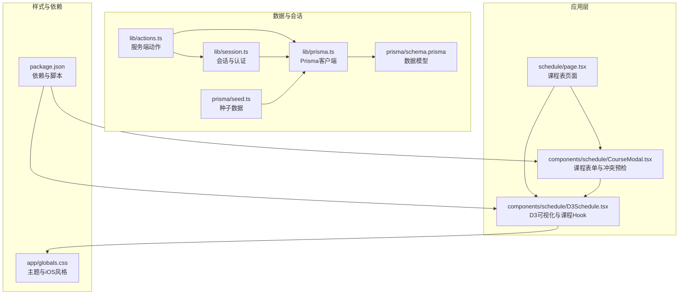
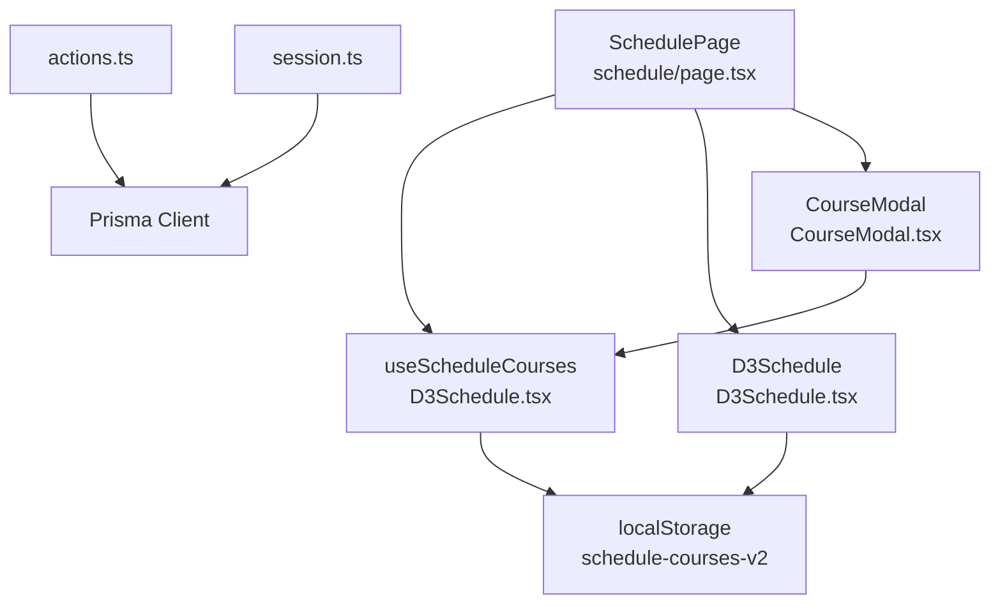
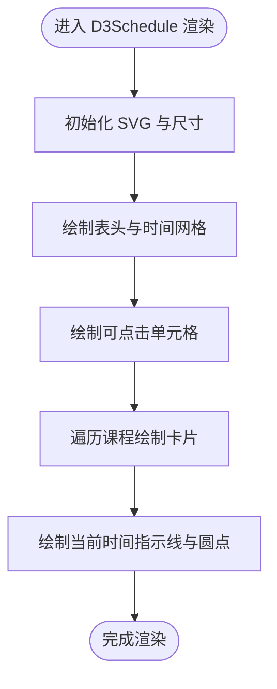
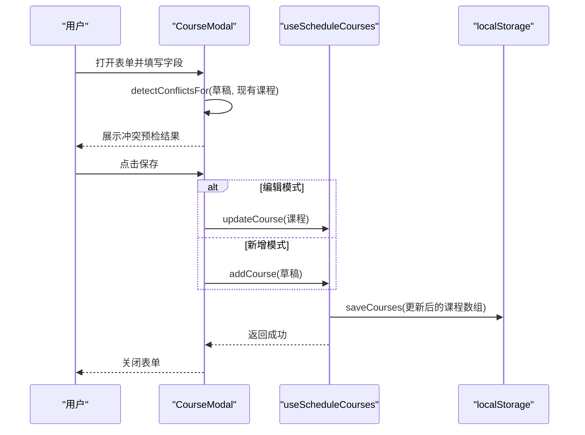
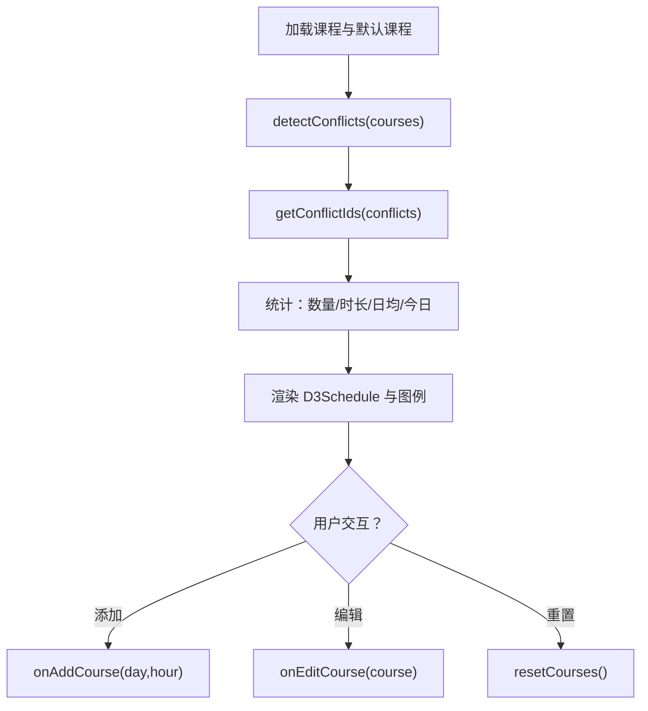
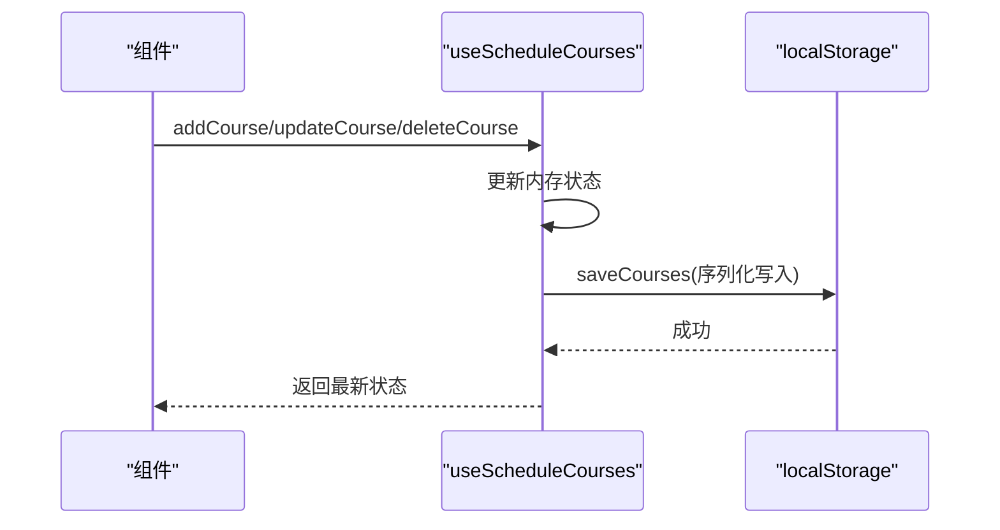
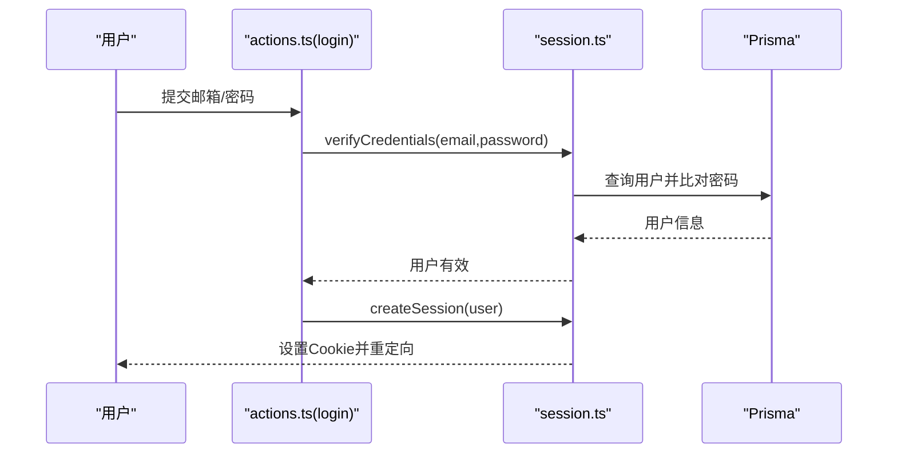
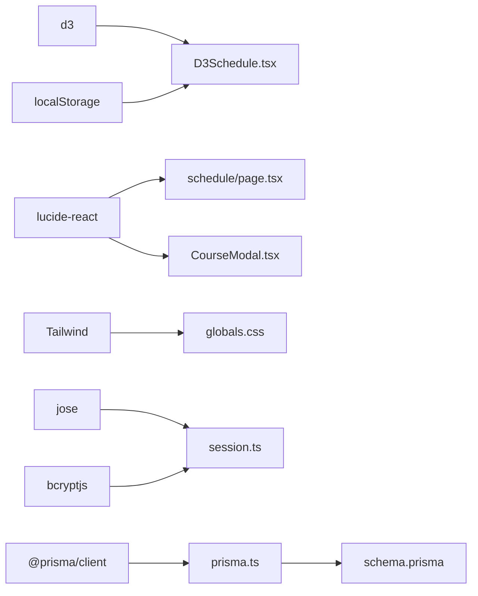

# 课程表管理系统

<cite>
**本文引用的文件**
- [src/app/schedule/page.tsx](file://src/app/schedule/page.tsx)
- [src/components/schedule/D3Schedule.tsx](file://src/components/schedule/D3Schedule.tsx)
- [src/components/schedule/CourseModal.tsx](file://src/components/schedule/CourseModal.tsx)
- [src/lib/actions.ts](file://src/lib/actions.ts)
- [src/lib/prisma.ts](file://src/lib/prisma.ts)
- [src/lib/session.ts](file://src/lib/session.ts)
- [prisma/schema.prisma](file://prisma/schema.prisma)
- [package.json](file://package.json)
- [src/app/globals.css](file://src/app/globals.css)
- [prisma/seed.ts](file://prisma/seed.ts)
</cite>

## 目录
1. [简介](#简介)
2. [项目结构](#项目结构)
3. [核心组件](#核心组件)
4. [架构总览](#架构总览)
5. [详细组件分析](#详细组件分析)
6. [依赖分析](#依赖分析)
7. [性能考虑](#性能考虑)
8. [故障排查指南](#故障排查指南)
9. [结论](#结论)
10. [附录](#附录)

## 简介
本项目是一个基于 Next.js 的课程表管理系统，采用 D3.js 实现交互式课程表可视化，提供课程增删改查、冲突检测、本地持久化与实时更新能力。系统通过 React 自定义 Hook 管理课程状态，使用 D3 动态绘制时间轴与课程卡片；同时提供模态表单进行课程编辑与新增，并在表单中进行实时冲突预检。

## 项目结构
- 应用入口与页面组织位于 src/app 下，课程表页面位于 schedule/page.tsx
- 可视化与课程逻辑集中在 src/components/schedule 下的 D3Schedule.tsx 与 CourseModal.tsx
- 数据持久化与会话管理位于 src/lib 下的 prisma.ts、session.ts、actions.ts
- 数据模型定义于 prisma/schema.prisma，种子数据位于 prisma/seed.ts
- 样式与主题变量位于 src/app/globals.css

**图表来源**
- [src/app/schedule/page.tsx:1-324](file://src/app/schedule/page.tsx#L1-L324)
- [src/components/schedule/D3Schedule.tsx:1-545](file://src/components/schedule/D3Schedule.tsx#L1-L545)
- [src/components/schedule/CourseModal.tsx:1-357](file://src/components/schedule/CourseModal.tsx#L1-L357)
- [src/lib/actions.ts:1-200](file://src/lib/actions.ts#L1-L200)
- [src/lib/prisma.ts:1-16](file://src/lib/prisma.ts#L1-L16)
- [src/lib/session.ts:1-79](file://src/lib/session.ts#L1-L79)
- [prisma/schema.prisma:1-86](file://prisma/schema.prisma#L1-L86)
- [prisma/seed.ts:1-108](file://prisma/seed.ts#L1-L108)
- [package.json:1-49](file://package.json#L1-L49)
- [src/app/globals.css:1-628](file://src/app/globals.css#L1-L628)

**章节来源**
- [src/app/schedule/page.tsx:1-324](file://src/app/schedule/page.tsx#L1-L324)
- [src/components/schedule/D3Schedule.tsx:1-545](file://src/components/schedule/D3Schedule.tsx#L1-L545)
- [src/components/schedule/CourseModal.tsx:1-357](file://src/components/schedule/CourseModal.tsx#L1-L357)
- [src/lib/actions.ts:1-200](file://src/lib/actions.ts#L1-L200)
- [src/lib/prisma.ts:1-16](file://src/lib/prisma.ts#L1-L16)
- [src/lib/session.ts:1-79](file://src/lib/session.ts#L1-L79)
- [prisma/schema.prisma:1-86](file://prisma/schema.prisma#L1-L86)
- [prisma/seed.ts:1-108](file://prisma/seed.ts#L1-L108)
- [package.json:1-49](file://package.json#L1-L49)
- [src/app/globals.css:1-628](file://src/app/globals.css#L1-L628)

## 核心组件
- 课程表页面（schedule/page.tsx）
  - 负责聚合课程状态、冲突检测、统计信息与图例生成，并向 D3Schedule 传递数据与回调
  - 提供重置、添加、编辑、删除等操作入口
- D3Schedule 组件（components/schedule/D3Schedule.tsx）
  - 使用 D3 绘制时间轴网格、课程卡片与“现在”指示线
  - 提供 useScheduleCourses Hook 进行本地持久化（localStorage）与 CRUD 操作
  - 提供冲突检测工具函数（detectConflicts、getConflictIds、detectConflictsFor）
- 课程表单模态（components/schedule/CourseModal.tsx）
  - 表单字段覆盖课程名称、星期、开始时间、时长、地点、教师、颜色
  - 实时冲突预检与错误校验，支持编辑与删除
- 数据与会话（lib/actions.ts、lib/prisma.ts、lib/session.ts）
  - 提供登录/注册/登出、文章管理与统计查询等服务端动作
  - 会话基于 JWT Cookie，使用 jose 与 bcrypt
- 数据模型（prisma/schema.prisma）
  - 定义用户、文章、聊天会话、站点配置等模型
- 样式与主题（src/app/globals.css）
  - 定义 iOS 风格阴影、渐变按钮、玻璃态背景等视觉规范

**章节来源**
- [src/app/schedule/page.tsx:8-239](file://src/app/schedule/page.tsx#L8-L239)
- [src/components/schedule/D3Schedule.tsx:118-545](file://src/components/schedule/D3Schedule.tsx#L118-L545)
- [src/components/schedule/CourseModal.tsx:7-357](file://src/components/schedule/CourseModal.tsx#L7-L357)
- [src/lib/actions.ts:13-54](file://src/lib/actions.ts#L13-L54)
- [src/lib/prisma.ts:1-16](file://src/lib/prisma.ts#L1-L16)
- [src/lib/session.ts:36-65](file://src/lib/session.ts#L36-L65)
- [prisma/schema.prisma:10-86](file://prisma/schema.prisma#L10-L86)
- [src/app/globals.css:132-198](file://src/app/globals.css#L132-L198)

## 架构总览
系统采用“页面组件 + 自定义Hook + D3可视化 + 本地持久化”的分层设计。页面负责状态聚合与事件调度，D3 组件负责渲染与交互，CourseModal 负责输入与校验，localStorage 负责本地持久化，Prisma/Session 负责服务端数据与认证。

**图表来源**
- [src/app/schedule/page.tsx:8-239](file://src/app/schedule/page.tsx#L8-L239)
- [src/components/schedule/D3Schedule.tsx:509-545](file://src/components/schedule/D3Schedule.tsx#L509-L545)
- [src/components/schedule/CourseModal.tsx:18-50](file://src/components/schedule/CourseModal.tsx#L18-L50)
- [src/lib/actions.ts:13-54](file://src/lib/actions.ts#L13-L54)
- [src/lib/prisma.ts:1-16](file://src/lib/prisma.ts#L1-L16)
- [src/lib/session.ts:36-65](file://src/lib/session.ts#L36-L65)

## 详细组件分析

### D3Schedule 可视化组件
- 数据结构与常量
  - Course 接口定义课程字段（id、name、day、startHour、startMinute、duration、location、color、teacher?）
  - 常量定义天数、小时范围、网格尺寸、颜色集与默认课程
- 冲突检测算法
  - hasTimeOverlap：按分钟计算两门课程在同一天的时间重叠时长
  - detectConflicts：双重循环检测所有课程对的冲突，返回包含重叠分钟数的列表
  - getConflictIds：从冲突列表提取涉及课程的去重 ID 集合
  - detectConflictsFor：对表单草稿进行冲突预检（可排除某课程 ID）
- 本地存储
  - loadCourses：从 localStorage 读取课程，失败或为空则回退默认课程
  - saveCourses：将课程数组序列化写入 localStorage
- D3 渲染流程
  - 初始化 SVG、计算列宽、绘制表头与时间网格
  - 绘制可点击单元格（用于添加课程），绑定点击事件
  - 绘制课程卡片（名称、地点、时间、教师、颜色、边框与阴影），支持悬停过渡
  - 绘制“现在”指示线与圆点，每 30 秒刷新一次
- 状态与 Hook
  - useScheduleCourses：封装 add/update/delete/reset 与本地持久化，返回 courses 与操作函数

**图表来源**
- [src/components/schedule/D3Schedule.tsx:125-507](file://src/components/schedule/D3Schedule.tsx#L125-L507)

**章节来源**
- [src/components/schedule/D3Schedule.tsx:6-16](file://src/components/schedule/D3Schedule.tsx#L6-L16)
- [src/components/schedule/D3Schedule.tsx:24-69](file://src/components/schedule/D3Schedule.tsx#L24-L69)
- [src/components/schedule/D3Schedule.tsx:103-116](file://src/components/schedule/D3Schedule.tsx#L103-L116)
- [src/components/schedule/D3Schedule.tsx:125-507](file://src/components/schedule/D3Schedule.tsx#L125-L507)
- [src/components/schedule/D3Schedule.tsx:509-545](file://src/components/schedule/D3Schedule.tsx#L509-L545)

### 课程表单与冲突预检
- 表单字段与验证
  - 字段：name、day、startHour、startMinute、duration、location、teacher、color
  - 校验：名称与地点必填、时长范围限制、错误信息收集
- 冲突预检
  - detectConflictsFor 对草稿与现有课程进行冲突检测，支持排除当前编辑课程
  - CourseModal 展示冲突列表与时间范围，便于快速决策
- 交互行为
  - 保存时根据是否编辑决定调用 update 或 add
  - 支持删除按钮（仅编辑模式）

**图表来源**
- [src/components/schedule/CourseModal.tsx:52-125](file://src/components/schedule/CourseModal.tsx#L52-L125)
- [src/components/schedule/D3Schedule.tsx:509-545](file://src/components/schedule/D3Schedule.tsx#L509-L545)

**章节来源**
- [src/components/schedule/CourseModal.tsx:52-125](file://src/components/schedule/CourseModal.tsx#L52-L125)
- [src/components/schedule/CourseModal.tsx:257-283](file://src/components/schedule/CourseModal.tsx#L257-L283)

### 课程表页面与状态聚合
- 冲突检测与统计
  - 使用 useMemo 对 detectConflicts 与 getConflictIds 结果进行稳定化，避免不必要的重渲染
  - 统计：课程数量、总课时、日均课时、今日课程数
- 图例与动态颜色
  - 基于课程名称与颜色映射生成图例项，冲突课程额外标注
- 交互入口
  - 添加课程：点击空白单元格触发 onAddCourse
  - 编辑课程：点击课程卡片触发 onEditCourse
  - 重置：确认后调用 resetCourses 回复默认课程

**图表来源**
- [src/app/schedule/page.tsx:46-66](file://src/app/schedule/page.tsx#L46-L66)
- [src/app/schedule/page.tsx:197-203](file://src/app/schedule/page.tsx#L197-L203)

**章节来源**
- [src/app/schedule/page.tsx:46-66](file://src/app/schedule/page.tsx#L46-L66)
- [src/app/schedule/page.tsx:197-203](file://src/app/schedule/page.tsx#L197-L203)

### 本地存储与实时更新
- 本地持久化
  - 读取：loadCourses 从 localStorage 解析课程数组，失败或空则使用默认课程
  - 写入：saveCourses 将课程数组序列化后写入 localStorage
- 实时更新
  - D3Schedule 每 30 秒更新“现在”时间指示线与圆点
  - useScheduleCourses 在每次 add/update/delete 后立即保存并更新状态

**图表来源**
- [src/components/schedule/D3Schedule.tsx:103-116](file://src/components/schedule/D3Schedule.tsx#L103-L116)
- [src/components/schedule/D3Schedule.tsx:512-536](file://src/components/schedule/D3Schedule.tsx#L512-L536)

**章节来源**
- [src/components/schedule/D3Schedule.tsx:103-116](file://src/components/schedule/D3Schedule.tsx#L103-L116)
- [src/components/schedule/D3Schedule.tsx:512-536](file://src/components/schedule/D3Schedule.tsx#L512-L536)

### 会话与认证（服务端动作）
- 登录/注册/登出
  - login：校验凭据后创建会话并重定向
  - register：检查邮箱唯一性、哈希密码后创建用户并创建会话
  - logout：删除会话并重定向
- 文章管理与统计
  - 提供文章的增删改查与浏览量递增、统计查询等服务端动作
- 会话机制
  - 使用 jose 签发与校验 JWT，存储于 Cookie 中，有效期 7 天
  - 使用 bcrypt 对密码进行哈希与比对

**图表来源**
- [src/lib/actions.ts:13-24](file://src/lib/actions.ts#L13-L24)
- [src/lib/session.ts:67-78](file://src/lib/session.ts#L67-L78)
- [src/lib/session.ts:36-47](file://src/lib/session.ts#L36-L47)

**章节来源**
- [src/lib/actions.ts:13-24](file://src/lib/actions.ts#L13-L24)
- [src/lib/session.ts:67-78](file://src/lib/session.ts#L67-L78)
- [src/lib/session.ts:36-47](file://src/lib/session.ts#L36-L47)

## 依赖分析
- 前端可视化与交互
  - d3：用于绘制时间轴网格与课程卡片，支持事件绑定与动画过渡
  - lucide-react：图标库，提供界面一致性
- 样式与主题
  - Tailwind CSS：基础样式与响应式布局
  - 自定义 iOS 风格阴影与渐变按钮类名
- 会话与安全
  - jose：JWT 签发与校验
  - bcryptjs：密码哈希与校验
- 数据持久化
  - localStorage：课程数据本地持久化
- 数据库与 ORM
  - @prisma/client：Prisma 客户端，schema.prisma 定义模型

**图表来源**
- [package.json:18-31](file://package.json#L18-L31)
- [src/app/globals.css:15-39](file://src/app/globals.css#L15-L39)
- [src/lib/session.ts:1-79](file://src/lib/session.ts#L1-L79)
- [src/lib/prisma.ts:1-16](file://src/lib/prisma.ts#L1-L16)
- [prisma/schema.prisma:1-86](file://prisma/schema.prisma#L1-L86)

**章节来源**
- [package.json:18-31](file://package.json#L18-L31)
- [src/app/globals.css:15-39](file://src/app/globals.css#L15-L39)
- [src/lib/session.ts:1-79](file://src/lib/session.ts#L1-L79)
- [src/lib/prisma.ts:1-16](file://src/lib/prisma.ts#L1-L16)
- [prisma/schema.prisma:1-86](file://prisma/schema.prisma#L1-L86)

## 性能考虑
- D3 渲染优化
  - 使用 useMemo 缓存冲突检测结果，减少不必要的重渲染
  - 仅在尺寸变化或课程/冲突/时间变化时重新绘制 SVG
  - 单个课程卡片的 hover 过渡使用 D3 transition，避免全量重绘
- 本地存储与状态
  - 仅在 add/update/delete 后写入 localStorage，避免频繁 IO
  - 使用 useCallback 包裹回调，降低子组件重渲染概率
- 时间指示
  - “现在”指示线每 30 秒更新一次，频率适中且不影响主渲染
- 样式与动画
  - iOS 风格阴影与过渡使用 CSS 变量，减少 JS 干预

[本节为通用性能建议，不直接分析具体文件，故不附“章节来源”]

## 故障排查指南
- 课程冲突未显示
  - 检查 detectConflicts 是否被正确调用与缓存（useMemo）
  - 确认 getConflictIds 是否正确提取冲突课程 ID
  - 核对 D3Schedule 中是否使用了 conflictIds 进行样式标记
- 无法保存课程
  - 确认 CourseModal 的校验是否通过
  - 检查 useScheduleCourses 的 add/update 是否执行并调用 saveCourses
  - 查看 localStorage 是否可写（无隐私模式限制）
- 会话失效或登录失败
  - 检查 SESSION_SECRET 是否设置
  - 确认 Cookie 是否允许（HttpOnly、Secure、SameSite）
  - 核对 Prisma 用户是否存在且密码匹配
- 样式异常
  - 检查 globals.css 中的主题变量与 iOS 类名是否正确引入
  - 确认 Tailwind 已正确构建与生效

**章节来源**
- [src/app/schedule/page.tsx:46-48](file://src/app/schedule/page.tsx#L46-L48)
- [src/components/schedule/D3Schedule.tsx:509-545](file://src/components/schedule/D3Schedule.tsx#L509-L545)
- [src/components/schedule/CourseModal.tsx:89-97](file://src/components/schedule/CourseModal.tsx#L89-L97)
- [src/lib/session.ts:36-47](file://src/lib/session.ts#L36-L47)
- [src/app/globals.css:132-198](file://src/app/globals.css#L132-L198)

## 结论
本系统通过 D3.js 实现了直观、可交互的课程表可视化，结合本地存储与实时更新，提供了良好的用户体验。课程冲突检测与表单预检进一步提升了数据一致性与易用性。服务端动作与会话机制为后续扩展（如用户账户、云端同步）奠定了基础。建议在生产环境中增加更细粒度的状态缓存与错误边界，并考虑引入云同步以增强跨设备一致性。

[本节为总结性内容，不直接分析具体文件，故不附“章节来源”]

## 附录
- 数据模型概览（摘自 prisma/schema.prisma）
  - User：邮箱唯一、角色、文章关联
  - Post：标题、slug 唯一、发布状态、作者关联
  - ChatSession/ChatMessage：聊天会话与消息
  - SiteConfig：站点配置键值对

**章节来源**
- [prisma/schema.prisma:10-86](file://prisma/schema.prisma#L10-L86)