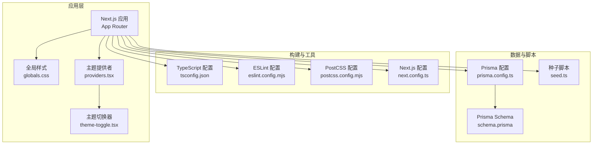
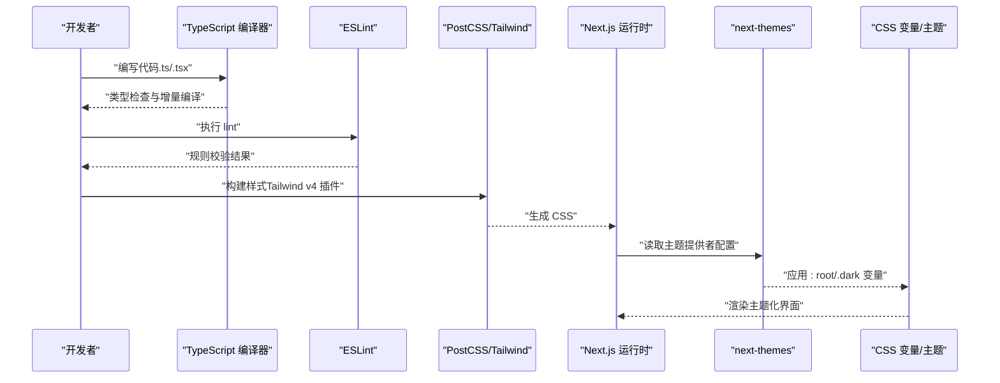
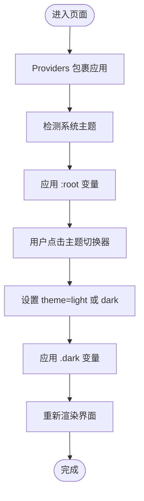
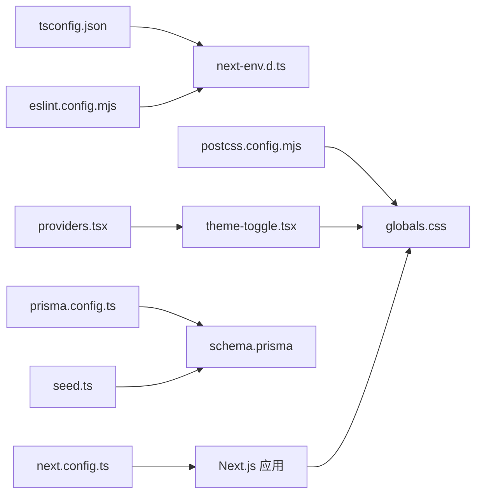

# 配置和定制

<cite>
**本文引用的文件**
- [next.config.ts](file://next.config.ts)
- [tsconfig.json](file://tsconfig.json)
- [postcss.config.mjs](file://postcss.config.mjs)
- [eslint.config.mjs](file://eslint.config.mjs)
- [package.json](file://package.json)
- [src/app/globals.css](file://src/app/globals.css)
- [src/components/theme-toggle.tsx](file://src/components/theme-toggle.tsx)
- [src/components/providers.tsx](file://src/components/providers.tsx)
- [prisma.config.ts](file://prisma.config.ts)
- [prisma/schema.prisma](file://prisma/schema.prisma)
- [prisma/seed.ts](file://prisma/seed.ts)
- [next-env.d.ts](file://next-env.d.ts)
</cite>

## 目录
1. [简介](#简介)
2. [项目结构](#项目结构)
3. [核心组件](#核心组件)
4. [架构总览](#架构总览)
5. [详细组件分析](#详细组件分析)
6. [依赖关系分析](#依赖关系分析)
7. [性能考虑](#性能考虑)
8. [故障排查指南](#故障排查指南)
9. [结论](#结论)
10. [附录](#附录)

## 简介
本文件面向“配置与定制”目标，系统梳理并解释本项目的各类配置文件及其作用，涵盖 Next.js 配置、TypeScript 配置、PostCSS/Tailwind 配置、ESLint 配置、Prisma 数据库配置与脚本，以及主题与样式的定制方式。同时提供可操作的最佳实践、常见场景解决方案、性能优化建议、安全注意事项与部署相关配置要点，并给出配置冲突与兼容性问题的排查思路。

## 项目结构
该项目采用 Next.js App Router 结构，前端样式通过 Tailwind CSS 与自定义 CSS 变量实现主题化；数据库层使用 Prisma；开发工具链包括 ESLint、TypeScript、PostCSS 与 Tailwind v4 插件；包管理脚本统一通过 npm scripts 管理。

图表来源
- [next.config.ts:1-18](file://next.config.ts#L1-L18)
- [tsconfig.json:1-35](file://tsconfig.json#L1-L35)
- [postcss.config.mjs:1-8](file://postcss.config.mjs#L1-L8)
- [eslint.config.mjs:1-19](file://eslint.config.mjs#L1-L19)
- [prisma.config.ts:1-15](file://prisma.config.ts#L1-L15)
- [prisma/schema.prisma:1-86](file://prisma/schema.prisma#L1-L86)
- [prisma/seed.ts:1-108](file://prisma/seed.ts#L1-L108)
- [src/app/globals.css:1-628](file://src/app/globals.css#L1-L628)
- [src/components/providers.tsx:1-13](file://src/components/providers.tsx#L1-L13)
- [src/components/theme-toggle.tsx:1-27](file://src/components/theme-toggle.tsx#L1-L27)

章节来源
- [package.json:1-49](file://package.json#L1-L49)

## 核心组件
- Next.js 配置：用于图片远程源白名单与实验性功能占位，确保生产环境图片加载安全与未来扩展空间。
- TypeScript 配置：启用严格模式、增量编译、路径别名与 React JSX 编译，配合 Next.js 类型生成文件。
- PostCSS/Tailwind：Tailwind v4 插件集成，结合 CSS 变量与暗色模式类名实现主题切换。
- ESLint：基于 eslint-config-next 的 Core Web Vitals 与 TypeScript 规则，覆盖 App Router 场景。
- Prisma：数据源、迁移路径与 Schema 定义，配合种子脚本初始化演示数据。
- 主题与样式：通过 CSS 变量与 :root/.dark 切换，配合 next-themes 提供主题持久化与系统偏好检测。

章节来源
- [next.config.ts:1-18](file://next.config.ts#L1-L18)
- [tsconfig.json:1-35](file://tsconfig.json#L1-L35)
- [postcss.config.mjs:1-8](file://postcss.config.mjs#L1-L8)
- [eslint.config.mjs:1-19](file://eslint.config.mjs#L1-L19)
- [prisma.config.ts:1-15](file://prisma.config.ts#L1-L15)
- [prisma/schema.prisma:1-86](file://prisma/schema.prisma#L1-L86)
- [src/app/globals.css:1-628](file://src/app/globals.css#L1-L628)
- [src/components/providers.tsx:1-13](file://src/components/providers.tsx#L1-L13)
- [src/components/theme-toggle.tsx:1-27](file://src/components/theme-toggle.tsx#L1-L27)

## 架构总览
下图展示从开发到构建的关键配置交互，以及主题与样式在运行时的生效路径。

图表来源
- [tsconfig.json:1-35](file://tsconfig.json#L1-L35)
- [eslint.config.mjs:1-19](file://eslint.config.mjs#L1-L19)
- [postcss.config.mjs:1-8](file://postcss.config.mjs#L1-L8)
- [src/app/globals.css:1-628](file://src/app/globals.css#L1-L628)
- [src/components/providers.tsx:1-13](file://src/components/providers.tsx#L1-L13)
- [src/components/theme-toggle.tsx:1-27](file://src/components/theme-toggle.tsx#L1-L27)

## 详细组件分析

### Next.js 配置（next.config.ts）
- 图片远程源白名单：允许 HTTPS 协议的任意主机，便于加载外部图片资源。
- 实验性配置：保留空对象，为后续 Next.js 版本升级预留空间。
- 适用场景：多图床、CDN 或第三方媒体资源加载。

章节来源
- [next.config.ts:1-18](file://next.config.ts#L1-L18)

### TypeScript 配置（tsconfig.json）
- 编译目标与库：ES2017 与 DOM/ES 扩展，适配现代浏览器与 Next.js。
- 严格模式与增量编译：提升类型安全与开发体验。
- 模块解析：bundler 模式与路径别名 @/*，简化导入路径。
- React JSX：使用 react-jsx，配合 Next 13+ App Router。
- 类型生成：包含 .next/types/**/*.ts 与 next-env.d.ts，确保 IDE 与类型推断完整。
- 排除：排除 node_modules，避免第三方包污染类型检查。

章节来源
- [tsconfig.json:1-35](file://tsconfig.json#L1-L35)
- [next-env.d.ts:1-7](file://next-env.d.ts#L1-L7)

### PostCSS 与 Tailwind 配置（postcss.config.mjs）
- 插件：集成 @tailwindcss/postcss，启用 Tailwind v4 的原生能力。
- 与全局样式协作：在 globals.css 中通过 @import "tailwindcss" 引入 Tailwind 基础样式与指令。

章节来源
- [postcss.config.mjs:1-8](file://postcss.config.mjs#L1-L8)
- [src/app/globals.css:1-628](file://src/app/globals.css#L1-L628)

### ESLint 配置（eslint.config.mjs）
- 规则来源：基于 eslint-config-next 的 core-web-vitals 与 typescript 规则集。
- 忽略项覆盖：显式覆盖默认忽略目录（如 .next、out、build），确保 App Router 目录被检查。
- 适用场景：保证 App Router、Server Components、Client Components 的一致性与性能指标达标。

章节来源
- [eslint.config.mjs:1-19](file://eslint.config.mjs#L1-L19)

### Prisma 配置与数据模型（prisma.config.ts, schema.prisma, seed.ts）
- 配置：指定 schema 路径、迁移目录与数据源 URL（优先环境变量，回退本地 SQLite）。
- 模型：User、Post、AiConfig、ChatSession、ChatMessage、SiteConfig，包含索引与外键约束。
- 种子：初始化管理员用户与若干演示文章，便于快速启动与演示。

章节来源
- [prisma.config.ts:1-15](file://prisma.config.ts#L1-L15)
- [prisma/schema.prisma:1-86](file://prisma/schema.prisma#L1-L86)
- [prisma/seed.ts:1-108](file://prisma/seed.ts#L1-L108)

### 主题与样式定制（globals.css、providers.tsx、theme-toggle.tsx）
- CSS 变量：在 :root 与 .dark 中定义背景、前景、主色、阴影等变量，形成明暗双主题。
- 组件提供者：ThemeProvider 设置 attribute="class"、defaultTheme="system"、禁用过渡闪烁。
- 主题切换器：根据当前主题显示太阳/月亮图标，点击切换 light/dark。
- 样式风格：包含 iOS 风格卡片、玻璃拟态、按钮、搜索框、聊天气泡等组件化样式。

图表来源
- [src/components/providers.tsx:1-13](file://src/components/providers.tsx#L1-L13)
- [src/components/theme-toggle.tsx:1-27](file://src/components/theme-toggle.tsx#L1-L27)
- [src/app/globals.css:1-628](file://src/app/globals.css#L1-L628)

章节来源
- [src/app/globals.css:1-628](file://src/app/globals.css#L1-L628)
- [src/components/providers.tsx:1-13](file://src/components/providers.tsx#L1-L13)
- [src/components/theme-toggle.tsx:1-27](file://src/components/theme-toggle.tsx#L1-L27)

## 依赖关系分析
- 构建与类型：TypeScript 与 Next.js 类型生成文件共同保障类型安全。
- 样式管线：PostCSS → Tailwind v4 插件 → CSS 输出。
- Lint：ESLint 基于 eslint-config-next，覆盖 Next.js App Router 场景。
- 数据层：Prisma CLI 与客户端配合，迁移与生成由 npm scripts 驱动。
- 主题：next-themes 与 CSS 变量协同，实现系统主题检测与手动切换。

图表来源
- [tsconfig.json:1-35](file://tsconfig.json#L1-L35)
- [next-env.d.ts:1-7](file://next-env.d.ts#L1-L7)
- [eslint.config.mjs:1-19](file://eslint.config.mjs#L1-L19)
- [postcss.config.mjs:1-8](file://postcss.config.mjs#L1-L8)
- [src/app/globals.css:1-628](file://src/app/globals.css#L1-L628)
- [next.config.ts:1-18](file://next.config.ts#L1-L18)
- [prisma.config.ts:1-15](file://prisma.config.ts#L1-L15)
- [prisma/schema.prisma:1-86](file://prisma/schema.prisma#L1-L86)
- [prisma/seed.ts:1-108](file://prisma/seed.ts#L1-L108)
- [src/components/providers.tsx:1-13](file://src/components/providers.tsx#L1-L13)
- [src/components/theme-toggle.tsx:1-27](file://src/components/theme-toggle.tsx#L1-L27)

章节来源
- [package.json:1-49](file://package.json#L1-L49)

## 性能考虑
- 缓存策略：Next.js 15+ 默认不缓存 fetch 与路由处理器，需显式设置 revalidate 等参数，避免陈旧数据与不必要的网络请求。
- 图片优化：通过 next/image 与 remotePatterns 白名单控制来源，减少跨域与安全风险。
- 构建优化：TypeScript 启用增量编译与严格模式，缩短编译时间并提升稳定性。
- 样式体积：Tailwind v4 插件按需生成，建议配合 purge/tree-shaking 工具进一步瘦身。
- 数据查询：Prisma 查询添加索引（如 Post.slug、ChatSession.userId），减少慢查询。
- 主题切换：使用 CSS 变量与类名切换，避免重排与重绘开销。

章节来源
- [next.config.ts:1-18](file://next.config.ts#L1-L18)
- [tsconfig.json:1-35](file://tsconfig.json#L1-L35)
- [prisma/schema.prisma:1-86](file://prisma/schema.prisma#L1-L86)

## 故障排查指南
- ESLint 报错未覆盖 App Router 目录
  - 症状：pages 目录之外的文件未被检查。
  - 解决：确认 eslint.config.mjs 中已覆盖默认忽略项，或在项目根目录新增配置文件以覆盖默认行为。
  - 参考：[eslint.config.mjs:1-19](file://eslint.config.mjs#L1-L19)
- TypeScript 类型缺失或报错
  - 症状：.next/types 下类型文件未生成或类型不匹配。
  - 解决：确保 tsconfig.json 包含 next-env.d.ts 与 .next/types/**/*.ts；重启语言服务或重新生成类型。
  - 参考：[tsconfig.json:1-35](file://tsconfig.json#L1-L35)，[next-env.d.ts:1-7](file://next-env.d.ts#L1-L7)
- PostCSS/Tailwind 样式未生效
  - 症状：Tailwind 指令无效或样式未生成。
  - 解决：确认 postcss.config.mjs 中存在 @tailwindcss/postcss 插件；在 globals.css 中正确引入 tailwind 指令。
  - 参考：[postcss.config.mjs:1-8](file://postcss.config.mjs#L1-L8)，[src/app/globals.css:1-628](file://src/app/globals.css#L1-L628)
- 主题切换无效果
  - 症状：切换主题后颜色不变。
  - 解决：确保 Providers 在应用根部包裹；检查 attribute="class" 是否生效；确认 CSS 变量在 :root 与 .dark 中定义。
  - 参考：[src/components/providers.tsx:1-13](file://src/components/providers.tsx#L1-L13)，[src/app/globals.css:1-628](file://src/app/globals.css#L1-L628)
- 图片加载失败
  - 症状：外部图片无法加载。
  - 解决：在 next.config.ts 的 remotePatterns 中添加允许的协议与主机；确保使用 HTTPS。
  - 参考：[next.config.ts:1-18](file://next.config.ts#L1-L18)
- 数据库连接错误
  - 症状：Prisma 无法连接数据库。
  - 解决：检查 DATABASE_URL 环境变量；确认 prisma.config.ts 中 datasource.url 的来源顺序（环境变量优先）。
  - 参考：[prisma.config.ts:1-15](file://prisma.config.ts#L1-L15)，[prisma/schema.prisma:1-86](file://prisma/schema.prisma#L1-L86)

## 结论
本项目通过标准化的 Next.js、TypeScript、PostCSS/Tailwind、ESLint 与 Prisma 配置，实现了类型安全、样式一致与主题可控的开发体验。遵循本文提供的最佳实践与排障建议，可在保持高性能与安全性的同时，灵活扩展主题、样式与数据模型。

## 附录

### 常见配置场景与解决方案
- 自定义主题色板
  - 方案：在 :root 与 .dark 中新增变量，或在 CSS 中使用 CSS 变量覆盖默认值。
  - 参考：[src/app/globals.css:1-628](file://src/app/globals.css#L1-L628)
- 添加新的图片源
  - 方案：在 next.config.ts 的 remotePatterns 中追加协议与主机。
  - 参考：[next.config.ts:1-18](file://next.config.ts#L1-L18)
- 调整 ESLint 规则
  - 方案：在 eslint.config.mjs 中合并自定义规则数组，或覆盖默认忽略列表。
  - 参考：[eslint.config.mjs:1-19](file://eslint.config.mjs#L1-L19)
- 启用 Prisma 本地开发数据库
  - 方案：设置 DATABASE_URL 指向 SQLite 或 PostgreSQL；或使用默认 file:./dev.db。
  - 参考：[prisma.config.ts:1-15](file://prisma.config.ts#L1-L15)，[prisma/schema.prisma:1-86](file://prisma/schema.prisma#L1-L86)
- 初始化演示数据
  - 方案：执行 npm 脚本 seed，自动创建管理员与示例文章。
  - 参考：[package.json:1-49](file://package.json#L1-L49)，[prisma/seed.ts:1-108](file://prisma/seed.ts#L1-L108)

### 安全配置要点
- 图片来源白名单：仅允许 HTTPS 外链，降低中间人攻击与恶意资源风险。
- 数据库凭据：通过环境变量注入 DATABASE_URL，避免硬编码。
- 密码存储：使用 bcrypt 等安全算法对密码进行哈希处理。
- API 密钥加密：AiConfig 表中对敏感信息进行加密存储，配合 IV 与密钥管理。

章节来源
- [next.config.ts:1-18](file://next.config.ts#L1-L18)
- [prisma/schema.prisma:1-86](file://prisma/schema.prisma#L1-L86)
- [prisma/seed.ts:1-108](file://prisma/seed.ts#L1-L108)