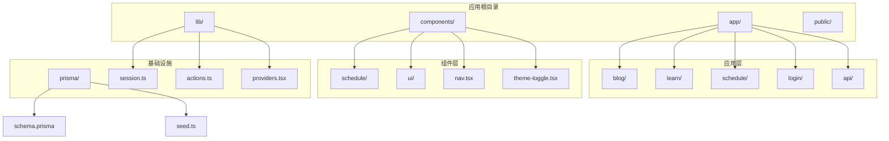
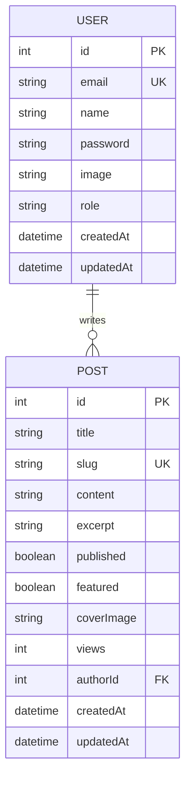
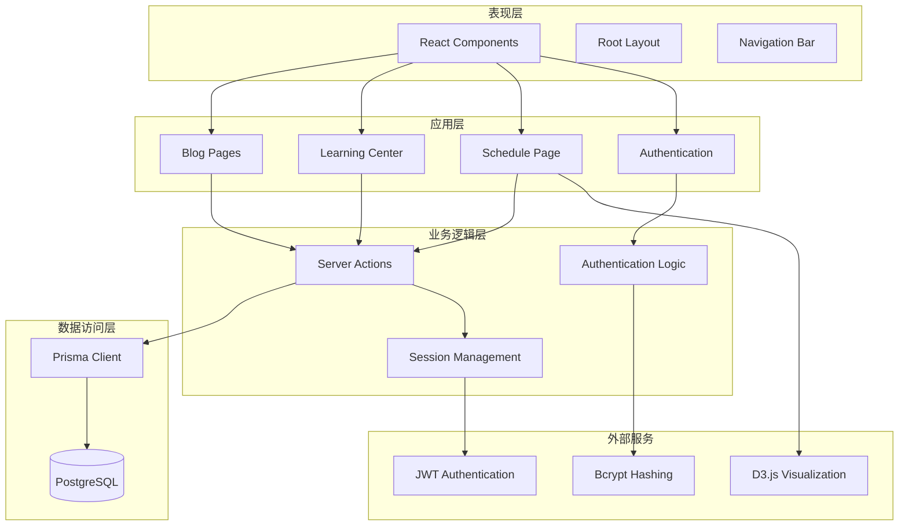
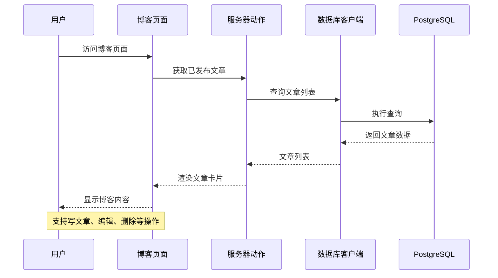
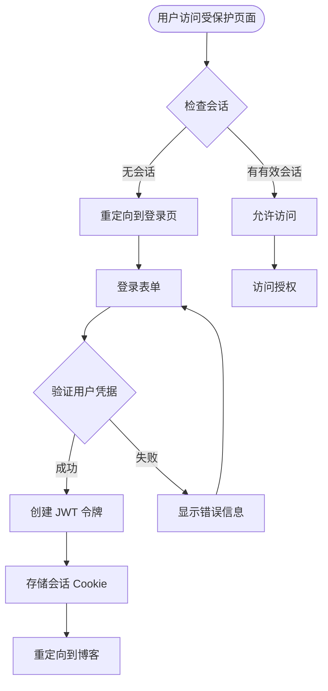
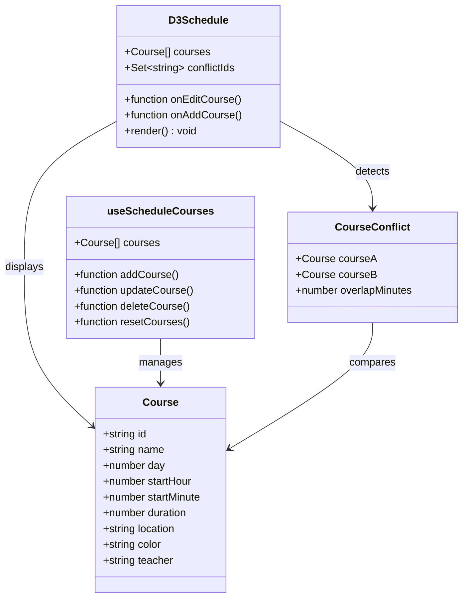
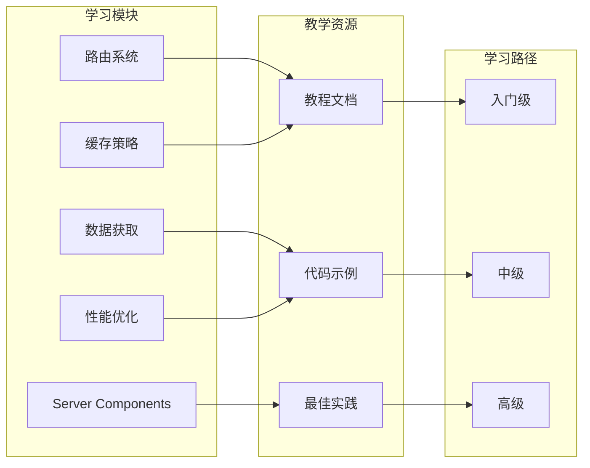

# 项目概述

<cite>
**本文档引用的文件**
- [README.md](file://README.md)
- [package.json](file://package.json)
- [src/app/layout.tsx](file://src/app/layout.tsx)
- [prisma/schema.prisma](file://prisma/schema.prisma)
- [src/lib/prisma.ts](file://src/lib/prisma.ts)
- [src/components/providers.tsx](file://src/components/providers.tsx)
- [src/components/nav.tsx](file://src/components/nav.tsx)
- [src/app/blog/page.tsx](file://src/app/blog/page.tsx)
- [src/app/schedule/page.tsx](file://src/app/schedule/page.tsx)
- [src/components/schedule/D3Schedule.tsx](file://src/components/schedule/D3Schedule.tsx)
- [src/lib/actions.ts](file://src/lib/actions.ts)
- [src/lib/session.ts](file://src/lib/session.ts)
- [src/app/learn/page.tsx](file://src/app/learn/page.tsx)
- [src/app/login/page.tsx](file://src/app/login/page.tsx)
- [prisma/seed.ts](file://prisma/seed.ts)
</cite>

## 目录
1. [简介](#简介)
2. [项目结构](#项目结构)
3. [核心组件](#核心组件)
4. [架构概览](#架构概览)
5. [详细组件分析](#详细组件分析)
6. [依赖关系分析](#依赖关系分析)
7. [性能考虑](#性能考虑)
8. [故障排除指南](#故障排除指南)
9. [结论](#结论)

## 简介

NextBlog 是一个基于 Next.js 16.2.6 的全栈博客系统，集成了博客文章管理、用户认证、学习中心和课程表可视化等核心功能。该项目采用现代化的 Web 技术栈，提供了完整的教学资源和实用工具，旨在帮助开发者深入理解 Next.js 15+ 的核心概念和最佳实践。

### 项目目标

- **教育导向**：通过实际的博客系统实现，教授 Next.js 15+ 的核心特性和最佳实践
- **功能完整**：提供从基础博客到高级功能的完整解决方案
- **技术前沿**：展示最新的 Next.js 生态系统技术和开发模式
- **实用性强**：包含可直接使用的组件和工具，如课程表可视化

### 核心功能特性

- **博客文章管理**：完整的 CRUD 操作，支持富文本内容和媒体资源
- **用户认证系统**：基于 JWT 的安全认证机制，支持会话管理和权限控制
- **学习中心模块**：系统化的 Next.js 教学内容，涵盖路由、数据获取、性能优化等主题
- **课程表可视化**：基于 D3.js 的交互式课程表，支持冲突检测和实时更新
- **响应式设计**：采用 Tailwind CSS 实现的现代化 UI 设计

## 项目结构

项目采用 Next.js 15+ App Router 的文件系统路由架构，具有清晰的功能模块划分：



**图表来源**
- [src/app/layout.tsx:1-42](file://src/app/layout.tsx#L1-L42)
- [src/components/nav.tsx:1-79](file://src/components/nav.tsx#L1-L79)

### 目录结构说明

- **src/app/**: Next.js 应用程序的核心路由和页面
- **src/components/**: 可复用的 React 组件
- **src/lib/**: 核心业务逻辑和工具函数
- **prisma/**: 数据库模式定义和种子数据
- **public/**: 静态资源文件

**章节来源**
- [src/app/layout.tsx:1-42](file://src/app/layout.tsx#L1-L42)
- [package.json:1-42](file://package.json#L1-L42)

## 核心组件

### 数据模型架构

项目采用简洁而强大的数据模型设计，支持博客系统的核心需求：



**图表来源**
- [prisma/schema.prisma:10-39](file://prisma/schema.prisma#L10-L39)

### 技术栈选型

项目采用了经过验证的技术组合，确保了开发效率和运行性能：

- **前端框架**: Next.js 16.2.6 + React 19.2.4
- **UI 框架**: Tailwind CSS 4.x
- **数据库 ORM**: Prisma 6.19.3
- **可视化库**: D3.js 7.9.0
- **图标系统**: Lucide React 1.16.0
- **认证方案**: JWT + bcryptjs
- **类型系统**: TypeScript 5.x

**章节来源**
- [package.json:13-26](file://package.json#L13-L26)
- [package.json:27-40](file://package.json#L27-L40)

## 架构概览

系统采用分层架构设计，实现了关注点分离和模块化组织：



**图表来源**
- [src/lib/actions.ts:1-151](file://src/lib/actions.ts#L1-L151)
- [src/lib/session.ts:1-79](file://src/lib/session.ts#L1-L79)
- [src/lib/prisma.ts:1-16](file://src/lib/prisma.ts#L1-L16)

### 核心设计原则

1. **分层架构**: 清晰的层次分离，便于维护和扩展
2. **模块化设计**: 功能模块独立，降低耦合度
3. **类型安全**: 完整的 TypeScript 类型定义
4. **性能优化**: 合理的数据缓存和渲染策略
5. **用户体验**: 响应式设计和流畅的交互体验

## 详细组件分析

### 博客系统组件

博客系统是项目的核心功能模块，提供了完整的文章管理能力：



**图表来源**
- [src/app/blog/page.tsx:1-89](file://src/app/blog/page.tsx#L1-L89)
- [src/lib/actions.ts:60-74](file://src/lib/actions.ts#L60-L74)

#### 关键特性

- **文章展示**: 响应式网格布局，支持封面图片和摘要显示
- **作者信息**: 显示作者姓名、阅读量和发布时间
- **权限控制**: 仅登录用户可以创建和编辑文章
- **SEO 友好**: 自动生成友好的 URL 结构

**章节来源**
- [src/app/blog/page.tsx:1-89](file://src/app/blog/page.tsx#L1-L89)
- [src/lib/actions.ts:60-74](file://src/lib/actions.ts#L60-L74)

### 用户认证系统

认证系统采用现代的 JWT 方案，提供了安全可靠的用户管理：



**图表来源**
- [src/lib/session.ts:36-65](file://src/lib/session.ts#L36-L65)
- [src/lib/actions.ts:13-24](file://src/lib/actions.ts#L13-L24)

#### 安全特性

- **JWT 令牌**: 基于 HS256 算法的安全令牌
- **密码哈希**: 使用 bcrypt 进行安全的密码存储
- **会话管理**: 自动过期和安全的 Cookie 设置
- **权限验证**: 支持用户和管理员角色

**章节来源**
- [src/lib/session.ts:1-79](file://src/lib/session.ts#L1-L79)
- [src/lib/actions.ts:13-54](file://src/lib/actions.ts#L13-L54)

### 课程表可视化组件

课程表模块是项目最具创新性的功能，结合了 D3.js 的强大可视化能力和 React 的组件化优势：



**图表来源**
- [src/components/schedule/D3Schedule.tsx:6-545](file://src/components/schedule/D3Schedule.tsx#L6-L545)

#### 核心功能

- **交互式课程表**: 基于 SVG 的 D3.js 可视化
- **冲突检测**: 智能的时间冲突识别和警告
- **实时更新**: 当前时间指示器和自动刷新
- **本地存储**: 使用 localStorage 保存用户偏好设置
- **统计面板**: 提供课程数量、课时统计等信息

**章节来源**
- [src/app/schedule/page.tsx:1-324](file://src/app/schedule/page.tsx#L1-L324)
- [src/components/schedule/D3Schedule.tsx:1-545](file://src/components/schedule/D3Schedule.tsx#L1-L545)

### 学习中心模块

学习中心提供了系统化的 Next.js 教学内容，涵盖了现代 Web 开发的核心概念：



**图表来源**
- [src/app/learn/page.tsx:4-35](file://src/app/learn/page.tsx#L4-L35)

#### 教学特色

- **模块化设计**: 每个主题独立成章，便于按需学习
- **实践导向**: 结合理论讲解和实际代码示例
- **最新技术**: 覆盖 Next.js 15+ 的最新特性和变化
- **循序渐进**: 从基础概念到高级应用的学习路径

**章节来源**
- [src/app/learn/page.tsx:1-93](file://src/app/learn/page.tsx#L1-L93)

## 依赖关系分析

项目依赖关系体现了清晰的架构层次和模块边界：

```mermaid
graph TB
subgraph "运行时依赖"
NextJS[Next.js 16.2.6]
React[React 19.2.4]
D3[D3.js 7.9.0]
Prisma[Prisma Client 6.19.3]
Tailwind[Tailwind CSS 4]
end
subgraph "开发依赖"
TypeScript[TypeScript 5]
ESLint[ESLint 9]
PrismaDev[Prisma CLI 6.19.3]
TailwindDev[@tailwindcss/postcss]
end
subgraph "业务依赖"
Bcrypt[bcryptjs 3.0.3]
JWT[jose 6.2.3]
Lucide[lucide-react 1.16.0]
Markdown[react-markdown 10.1.0]
Zod[zod 4.4.3]
end
NextJS --> React
NextJS --> Prisma
NextJS --> D3
NextJS --> Tailwind
Prisma --> PrismaDev
TypeScript --> ESLint
NextJS --> Bcrypt
NextJS --> JWT
NextJS --> Lucide
NextJS --> Markdown
NextJS --> Zod
```

**图表来源**
- [package.json:13-26](file://package.json#L13-L26)
- [package.json:27-40](file://package.json#L27-L40)

### 依赖管理策略

- **版本锁定**: 使用精确版本号确保环境一致性
- **安全更新**: 定期更新依赖包以获得安全修复
- **性能考量**: 选择轻量级但功能完整的替代方案
- **生态兼容**: 优先选择 Next.js 生态系统内的成熟解决方案

**章节来源**
- [package.json:1-42](file://package.json#L1-L42)

## 性能考虑

项目在多个层面进行了性能优化，确保良好的用户体验：

### 渲染优化

- **静态生成**: 合理使用静态生成和增量静态再生
- **代码分割**: 自动代码分割，减少初始加载时间
- **图像优化**: 使用 Next.js Image 组件进行智能优化
- **字体优化**: 通过 next/font 实现高效的字体加载

### 数据访问优化

- **查询优化**: Prisma 查询的索引和优化
- **缓存策略**: 合理的客户端和服务端缓存
- **批量操作**: 减少数据库往返次数
- **懒加载**: 图片和组件的延迟加载

### 前端性能

- **虚拟滚动**: 大列表的虚拟化处理
- **事件防抖**: 输入和搜索的防抖处理
- **内存管理**: 合理的组件卸载和清理
- **Bundle 优化**: Tree shaking 和代码压缩

## 故障排除指南

### 常见问题诊断

#### 数据库连接问题

**症状**: 应用启动时报数据库连接错误
**解决方案**:
1. 检查 DATABASE_URL 环境变量配置
2. 验证数据库服务状态
3. 确认网络连接和防火墙设置
4. 运行 `npx prisma migrate dev` 初始化数据库

#### 认证相关问题

**症状**: 登录失败或会话过期
**解决方案**:
1. 验证 SESSION_SECRET 环境变量设置
2. 检查浏览器 Cookie 设置
3. 确认密码哈希算法兼容性
4. 查看服务器日志获取详细错误信息

#### 性能问题

**症状**: 页面加载缓慢或内存泄漏
**解决方案**:
1. 使用浏览器开发者工具分析性能瓶颈
2. 检查组件渲染次数和重新渲染原因
3. 优化数据库查询和索引
4. 实施适当的缓存策略

### 开发调试技巧

- **日志记录**: 在开发环境中启用详细的日志输出
- **错误边界**: 实现 React 错误边界捕获组件错误
- **性能监控**: 使用 React Profiler 分析组件性能
- **网络调试**: 利用浏览器网络面板监控 API 调用

**章节来源**
- [src/lib/prisma.ts:1-16](file://src/lib/prisma.ts#L1-L16)
- [src/lib/session.ts:1-79](file://src/lib/session.ts#L1-L79)

## 结论

NextBlog 项目成功地展示了现代 Next.js 应用开发的最佳实践，通过一个功能完整的博客系统，涵盖了从基础概念到高级特性的各个方面。项目不仅提供了实用的功能，更重要的是为开发者提供了一个学习和参考的完整案例。

### 项目优势

- **教育价值高**: 完整的教学内容和实践示例
- **技术先进**: 采用最新的 Next.js 15+ 技术栈
- **架构清晰**: 合理的设计模式和模块化组织
- **易于扩展**: 良好的代码结构便于功能扩展
- **生产就绪**: 包含认证、数据库、性能优化等生产环境必需功能

### 学习成果

通过分析和使用这个项目，开发者可以：
1. 深入理解 Next.js 15+ 的核心概念和工作原理
2. 掌握现代 Web 应用开发的最佳实践
3. 学习如何构建可扩展的全栈应用程序
4. 了解数据库设计和 ORM 使用的正确方式
5. 掌握前端性能优化和用户体验设计

该项目为 Next.js 开发者提供了一个宝贵的参考模板，无论是初学者还是有经验的开发者都能从中获得有价值的见解和实践经验。